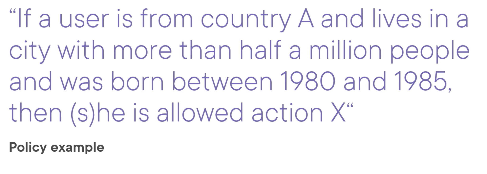
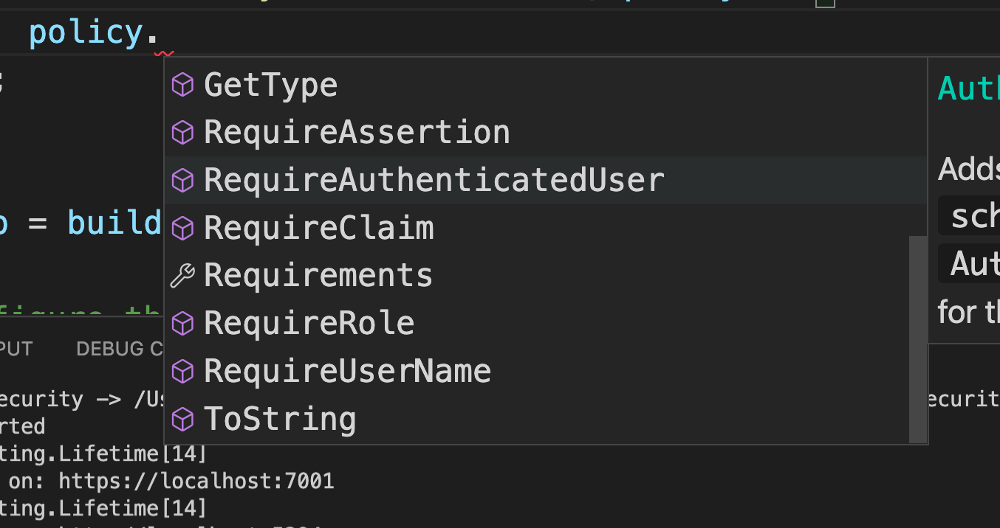
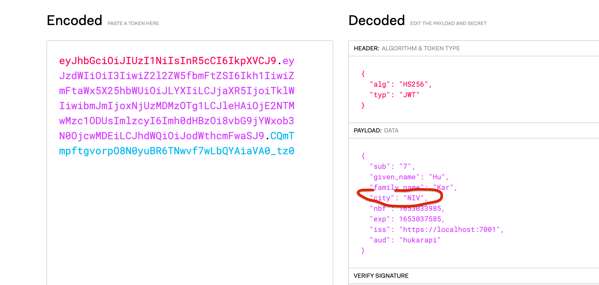
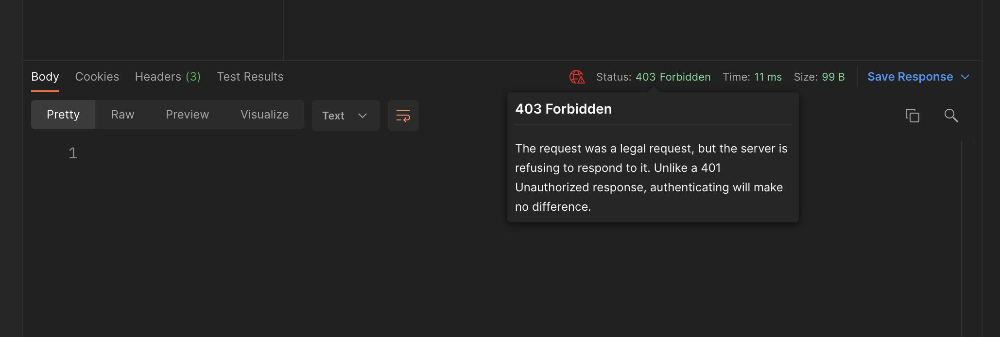

# 06 Les `Authorization Policies`

On peut construire une couche d'autorisation avec les `Authorization Policies`.

L'idée est de définir une politique d'autorisation avec des règles complexes d'accès.


## `ABAC` / `CBAC` / `PBAC`

Ce sont des acronymes pour désigner la même chose : un accès basé sur le attributs, les `Claim`.

La politique combine un ensemble de `Claim` ensemble.

`ABAC` : Attribute-Based Access Control

`CBAC` : Claim-Based Access Control

`PBAC` : Policy-Based Access Control

On peut définir des règles très compliquées facilement :




## `RBAC`

C'est l'alternative : Role-Based Access Control


## Création d'une `Policy`

On utilise `options.AddPolicy` :

```cs
builder.Services.AddAuthorization(options => {
    options.AddPolicy("MustBeFromBxl", policy => {
        policy.RequireAuthenticatedUser();
        policy.RequireClaim("city", "BXL");
    });
});
```

Une `policy` se compose de plusieurs `requirements` :



Il faut bien sûr avoir le `Claim` en question :

`AuthenticateController`

```cs
var claimsForToken = new List<Claim>();
// ...
claimsForToken.Add(new Claim("city", "NIV"));
```

Ici la valeur est placée de manière artificielle mais elle devrait venir de `user.City` par exemple.


On l'utilise ensuite dans le `Controller` :

```cs
[ApiController]
[Authorize(policy: "MustBeFromBxl")] // <=
[Route("[controller]")]
public class RobotController : ControllerBase
{
    // ...
```


### Résultat

On reçoit ce `Token` après demande d'identification :



Si la ville ne correspond pas on obtient : `403 Forbidden` (interdit)




