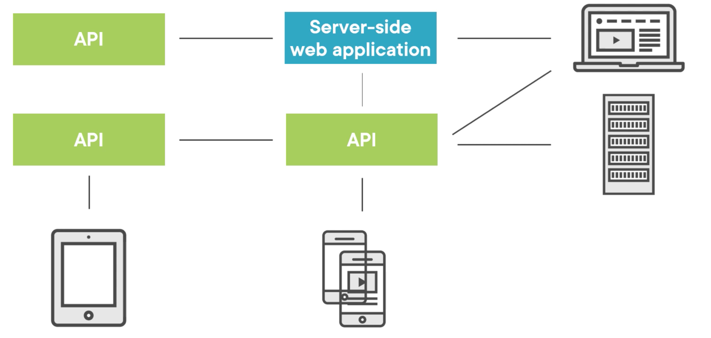
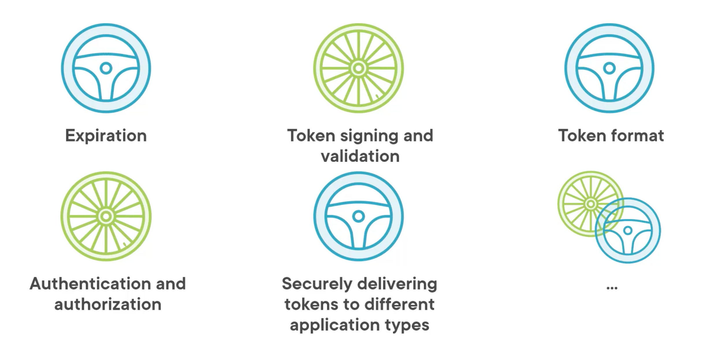
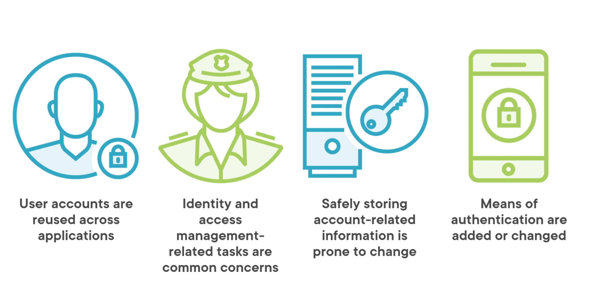

# 01 On commence !

## Historique

### Au départ

Il y a quelque temps on avait deux types d'applications:

- `client lourd : Thick Client`

On utilisait simplement l'authentification de `Windows`

- `Applications web côté serveur : Server Side Web App`

On utilisait un `formulaire` d'authentification

Ce n'était par orienté architecture-service.

Rien de trop compliqué, on pouvait aussi utiliser les Cookies pour passer des informations de `login`.

### `Service-Based` Applications

- `WCF` utilisait `WS-Security` pour une communication `server-server` dans le même domaine.

- `IP-Level configuration` (`Firewall`)
  On pouvait gérer les authorisation au niveau de `IP` pour qu'un serveur `A` soit autorisé pour un serveur `B`.

### `SAML 2.0`

Est un protocole encore utilisé surtout pour les `Server-Side Web App` dans un environnement d'entreprise.

Ce protocole fonctionne surtout pour des `app` dans un même domaine, dans un réseau sous contrôle de l'entreprise.

### `API`

Cette fois les `applications` ne se trouvent pas forcement dans l'enceinte de la compagnie, mais peuvent être externe à son propre domaine. Les utilisation et les clients sont multiples.

#### `username/password`

On a commencé par envoyer le `username/password` à chaque requête, mais il a été prouvé que ce n'était pas une bonne idée.

#### `Token-Based` security

La communication est basée sur l'envoie de `Token` entre le `Client` et le `Serveur`.

Mais comment doivent-il être créés et envoyés ?

C'est à ce moment qu'apparaît `Json Web Token`, on envoie son `username/password` une seule fois puis c'est un `Token` qui se charge de continuer l'authentification.

Ce système contenu d'être utilisé, mais il reste le problème de passer son `username/password` à un `Tiers`.

De plus à chaque nouvelle application on doit réinventer la roue en implémentant l'utilisation de `Token`:

La complexité su système ne peut que générer des erreurs dans l'implémentation.

Même si l'implémentation est sans erreurs, il reste la maintenance compliquée, car régulièrement de nouvelles failles sont découvertes.

On doit résoudre deux problèmes :

1. Ne pas utiliser les `credentials` d'un utilisateur au niveau `Application`.
   On a besoin d'un composant central gérant cette problématique : `Central Identity Provider`
2. On doit pouvoir être sûr que le `Token` est suffisament sécurisé pour gérer l'`authentification` et les `authorisation` pour n'importe quel type d'`Application`.

## `Central Identity Provider`

Avant nous devions gérer la problèmatique du `Login` dans l'application :

- Page de connexion
- Gestion des `password`
- Reset des `password`
- ...

Aujourd'hui nous n'avons plus besoin de le faire et nous ne devrions pas.

C'est de la responsabilité du `Identity Provider`: `IDP` d'authentifier l'utilisateur et, si nécessaire, de manière sécurisé prouver l'identité pour une `application`.

### `IAM` : `Identity and Access Management`

- Enregistrement et management des utilisateurs
- Débloquer les utilisateurs
- Gérer les politiques et les remise à zéro des mots de passe

Ce sont des tâches fastidieuse (`tedious`) et sujetes au changement.

Il est alors intéressant de laisser ces responsabilités à un `Provider` centralisé et de pouvoir réutiliser le `service` à travers plusieurs `applications`.

Les `password` ne sont pas une affaire facile. Les mécanismes d'encryption peuvent être `brute-forcé`.

Le `Key stretching algorithms` en encryptant peut-être `10 000` fois le même `password` décourage les attaques de `Brute Force`.

Pour ce faire des algorithme comme `Argon2` ou `bcrypt` sont couramment utilisés.

De nouveau algorithme verront certainement prochainement le jour, ce serait compliqué à gérer sur diverse `DB` de nos diverses `applications`.

De plus l'utilisateur doit pouvoir s'authentifier de plusieurs manières.

On peut vouloir ajouter un deuxième et un troisème facteur d'authentification basé sur la possession (`Itsme`) ou un certificat (`eid card`).

`Active Directory` est un exemple de ce type de `Identity Provider`.

## `OAuth2` : `Authorization`

`OAuth2` est un protocole ouvert (`Open Protocol`) pour permettre une autorisation sécurisé dans une méthode simple et standard pour le web, les mobiles et les applications desktop.

Une `application cliente` peut demander un `access token` pour accéder à une `API`. 

`OAuth2` définie comment une `application cliente` peut en toute sécurité obtenir une `autorisation`.

Les `endpoint locaux` (`homegrown endpoint`) sont remplacés par des `endpoints` suivant le standard `OAuth2`.

Ce standard définie comment utiliser cet `endpoint` pour différents types d'`applications clientes`.

`Duende.IdentityServer` ou `Azure Active Directory` implémente le standard `OAuth`.

Cet `access token` est seulement prévu pour fonctionner avec une `API`.

## `OpenID Connect`

`OpenID Connect` est une couche `Identity` au-dessus du protocol `OAuth2`.

Une `application cliente` peut demander un `identity token` (après avoir demandé un `access token`).

Cet `identity token` est utilisé pour se logger (`sign in`) sur l'`application cliente`.

`OpenID Connect` est un protocole supérieur: il étant et va plus loin que `OAuth2`.

Dès que l'on travail avec des utilisateurs, il faut utiliser `OpenId Connect`.

`OIDC` n'est pas seulement pour des applications basé sur une `API`.