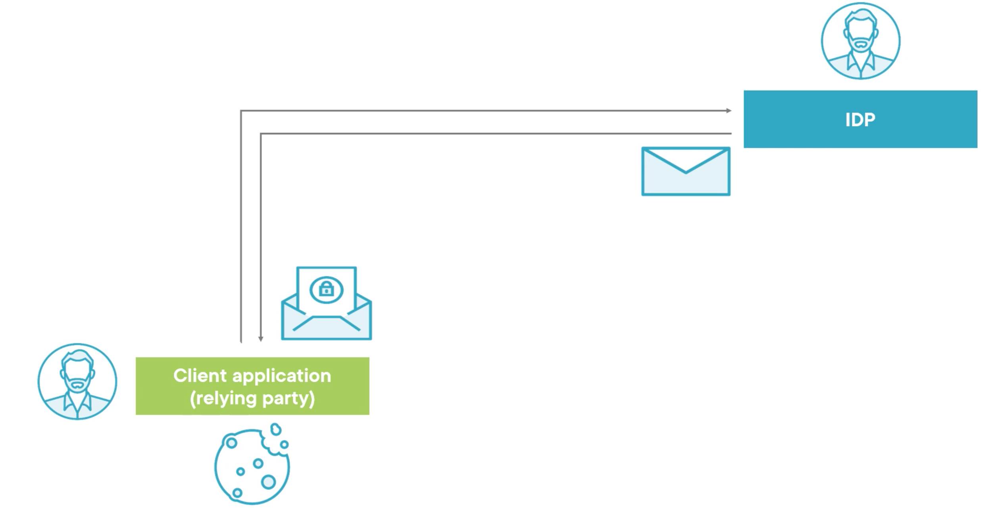
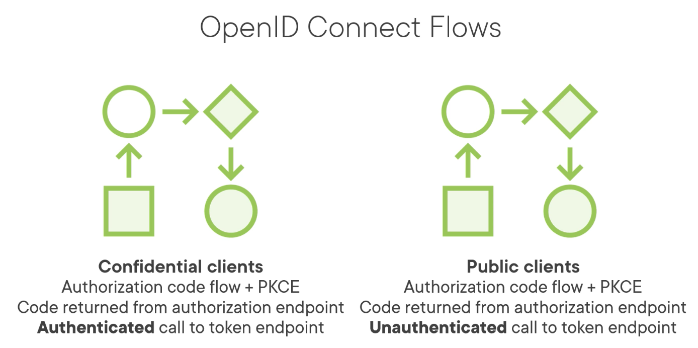

# 02 `OpenID Connect` : `Identity`

## Comment fonctionne `OpenID Connect`

On est concentré sur l'`identity` avec le `identity token`, il n'y a pas pour l'instant de `access token`.

- Un `utilisateur` se connecte à une `application cliente`
- Elle le redirige vers un `Identity Provider` : `IDP` pour savoir qui il est
- Celui-ci (`Microsoft`, `Google`) propose une interface de connection à l'`utlisateur`, par exemple un formulaire `username`/`password` pour qu'il prouve qui il est
- Si la personne est `autentifiée` par le `IDP` celui-ci renvoie un `identity token` à l'`application cliente`, ce `token` contient l'`identité vérifié` de l'`utilisateur`
- Dans une application `ASP.NET` cet `identity token` va servir à créer un `ClaimsIdentity`
- l'`application cliente` gère l'autentification en enregistrant un `cookie` encrypté d'après le `ClaimsIdentity`

## Types de `Client`

Il y a deux types de `Client`, `Clients confidentiels` et `Client publique`

### `Confidential clients`

Il est capable de maintenir la confidentialités de ses `credentials` : `clientid` et `clientsecret`.

Il s'exécute côté serveur, comme une application `asp MVC` par exemple.

Ces applications peuvent être authentifiées en toute sécurité.

Ce sont les `Server-Side Web Apps`.

### `Public Client`

Il n'est pas capable de maintenir la confidentialité de ses `Credentials` : `clientid` et `clientsecret`.

Il vit sur le périphérique de l'utilisateur.

Ces `applications clientes` ne peuvent pas être authentifié en toute sécurité.

Ce sont les application `javascript` ou `WebAssembly` (et les applications `Mobile`).

## `OpenID Connect` Flow

Un ensemble de requêtes et réponses `HTTP` qui détermine comment le code et/ou les `tokens` sont délivrés au `Client` en toute sécurité.

Dans les cas les plus simple, cela consiste en une requête et une réponse, mais la pluspart du temps ce sont plusieurs requêtes et plusieurs réponses.

## `Endpoints`

Les différents types de `Client` et/ou d'`exigences` (`requirements`) ammène à différentes variations du `Flow`.

Les `Flows` utilisent des `Endpoints` au niveau du `Identity Provider` et du `Client`.

Cela remplace les anciens `Endpoints locaux` (`homegrown endpoints`).

### `Authorization endpoint` au niveau du `Identity Provider` : `IDP`

Utilisé par l'`application cliente` pour obtenir l'authentification (`identity token`) et/ou l'autorisation (`access token`), grâce à une redirection.

> ### `TLS` : `Transport Layer security` (le remplaçant de `SSL`)
>
> `TLS`(`HTTPS`) est une exigence pour `OpenID Connect`: `OIDC`.
>
> De base, les `tokens` ne sont pas cryptés.
>
> `OpenID Connect` s'appuie sur la couche transport pour assurer le cryptage.

### `Redirection endpoint` au niveau du `client`

Utilisé par l'`Identity Provider` pour retourner le code et les `tokens` à l'`application cliente`.

### `Token endpoint ` (`IDP`)

Utilisé par l'`application cliente` pour demander les `tokens` (sans redirection) au `IDP`. C'est traditionnellemnt une requête `POST`.

La requête peut être authentifié pour les `confidential client` ou pas pour les `public client`.

Il existe d'autres `endpoints` mais ceci sont suffisant pour expliquer le `Flow`.

## Types de `Flow`

Trois `flows` importants sont définis par `OpenID Connect`:

- `Authorization Code Flow`
- `Implicit Flow`
- `Hybrid Flow`

On peut considérer `Implicit Flow` et `Hybrid Flow` comme obsolètes.

Pour les deux types de `Client`, `Confidential Clients` et `Public Clients`, les bonne pratiques suggèrent d'utiliser `Authorization Code Flow` avec `PKCE`.

Ce `Flow` porte ce nom car il retourne un `Code` de son `Authorization Endpoint`.

### `Authorization Code`

Il a une courte durée de vie, l'utilisation unique des `Credentials`, utilisé pour vérifier que l'`utilisateur` qui est loggué au niveau du `Identity Provider` est le même que celui qui a commencé le `Flow` au niveau de l'`application cliente`.

Dans ce `Flow` les `Tokens` sont retournés depuis le `Token Endpoint`.

Si le `Flow` est `Authenticated` (`Confidential Clients`) il autorise un accès long (`long-life access`) grâce au `refresh token`.

Pour le `public clients`, qui ne peut pas stocké des `Credentials` de manière sécurisé, il n'est pas intéressant d'envoyer une `Authoticated Request`.

Du coup le `Long-Live Access` est restreint, un `refresh token` est possible, mais seulement une seule fois.

> ## `OpenId Connect` pour les `Public Client`
>
> Pour les applications `front` comme `Angular`, `React`, `Blazor WASM`, la tendance veut que la sécurité soit gérée plutôt côté serveur que côté client.
>
> Le `Flow` est géré au niveau de l'`application hébergente`(`hosting application`).
>
> Voire le pattern `BFF` (`Backend For Frontend`).

## Choisir un `Flow`

Rien n'empêche techniquement de choisir tel ou tel `Flow`, mais choisir le mauvais ouvre un trou de sécurité.

> Le truc avec la sécurité, c'est que plein d'approche vont fonctionner, mais la plupart d'entre elle ne sont pas de bonne idée.
