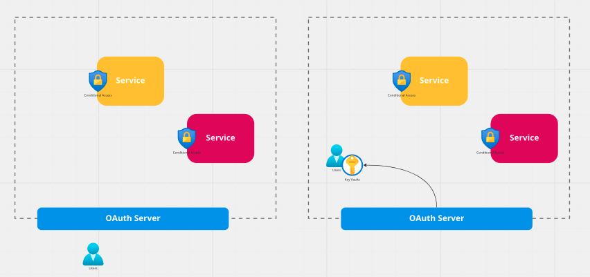
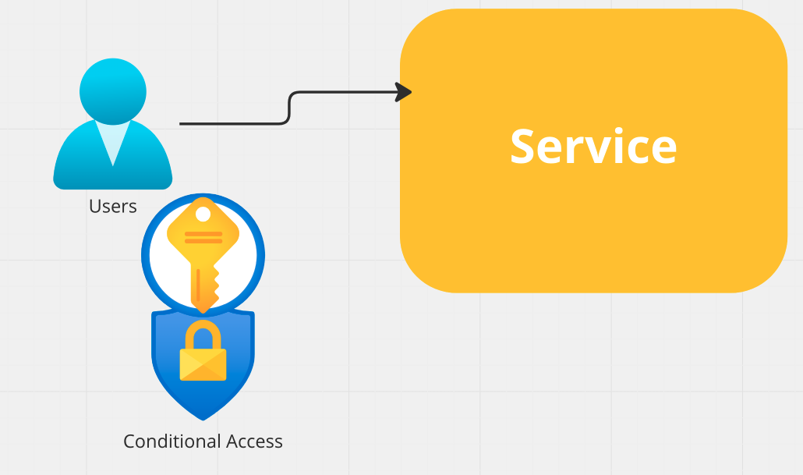
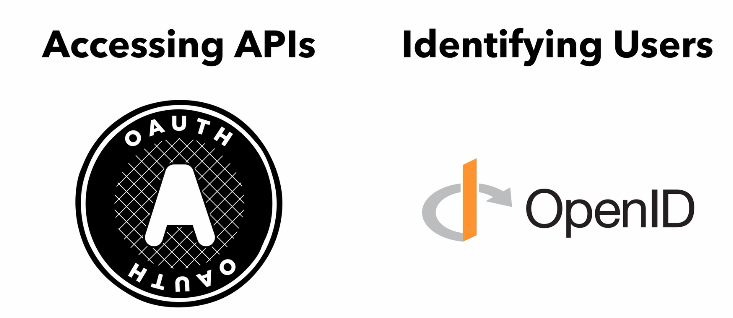

# 01 Introduction a `OAuth`

## Historique

Avant `OAuth`, une application envoyait simplement un `username` et un `password` à une `API`.

Cela pose un problème, celui de donner ses `credentials` à tout un tas d'application.

Dans les années 2000 chaque fournisseur d'`API` a tenté de résoudre ce problème individuellement.

Les développeurs chargés de résoudre ce problème se sont réunis et en 2007 on a eu une première norme `Oauth 1`.

L'utilisation de `API keys` n'était pas sécurisée pour les téléphones mobiles.

`OAuth 2` a été pensé pour être plus agréable à utilisé et résout les problèmes avec les `mobiles`.

`OAuth 2` est sortie en `2012`, mais le travail continu.

## Login password classique

Le problème est que l'on est pas sûr de l'identité de la personne connectée, une usurpation en cours de route est toujours possible. On ajoute alors des facteurs d'authentification, si on a plusieurs services (applications) on doit le faire partout. Dès qu'on modifie quelque chose à la sécurité de `loggin` on doit de nouveau modifier l'ensemble de son parc. Cela ne `scale` pas correctement.

Avec `OAuth` chaque application redirige un utilisateur vers un serveur `OAuth` pour se `logger` et le redirige ensuite vers l'`application` en lui passant un `token`.

L'utilisateur se connecte et donne son `password` sur le serveur `OAuth` et non plus à l'`application`. L'`application` n'a plus la responsabilité de gérer les `password`ni de multiplier les facteurs d'authentification elle-même

 

## `OpenId Connect`

`OAuth` est pensé au départ pour qu'une `application` ait accès à une `API`.  Il n'y a pas besoin de savoir qui est l'utilisateur de l'`application`.

Le serveur `OAuth` est le seul demandant les `credentials` de l'utilisateur, il lui remet ensuite un `access token`.

les `services` (`applications`) n'ont pas besoin de connaître l'identité de l'`utilisateur`, du moment qu'il possède l'`access token`.

Il n'y a rien dans `OAuth` qui communique les informations sur l'`utilisateur`.

Sin on a besoin de connaître quelque chose sur l'`utilisateur`, c'est là que `OpenID Connect` intervient.

`OpenID Connect` est une extension de `OAuth` qui permet au serveur `OAuth` de communiquer des donnée sur l'`utilisateur` en retour à l'`application` appelante.

`OpenID Connect` va utilisé un `id token` là où `OAuth` va utiliser un `access token`.

C'est l'`id token` qui contiendra les informations sur l'`utilisateur`.

