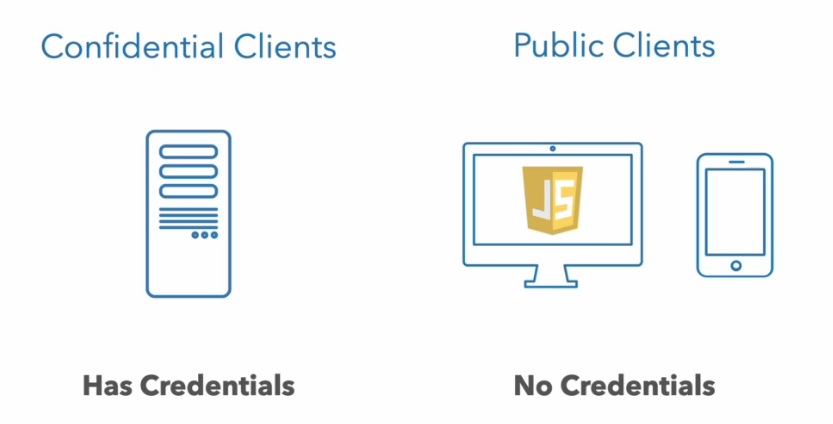
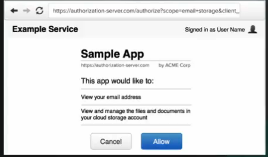
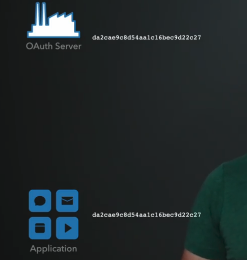
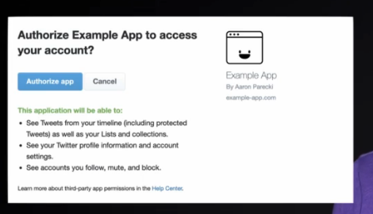
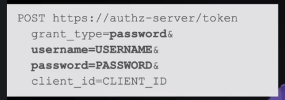

# 02 Concepts de `sécurité`

## Les rôles dans `OAuth`

Il y a quatre rôles:

1. L'`utilisateur`, c'est la personne possédant l'`account`
2. Le `périphérique` (`device`), cela peut être un téléphone, le navigateur qui fait tourner ou accède à  une `application`
3. L'`application`, tournant sur le `périphérique`ou accessible via `internet`
4. `API`, c'est là où sont les données et elle est accédée par l'`application`

Les termes officiels dans la spécification `OAuth` sont:

1. `Resource owner` : `utilisateur` 
2. `User Agent` : `device` ou `périphérique`
3. `OAuth Client` : `application`
4. `Resource server` : `API`

## `+ 1` => `Authorization Server`

Son travail est de gérer l'accès à l'`API` qu'il protège.

La façon d'y arriver est d'emmener l'`utilisateur` à se logguer sur l'`authorization server` et de créer un `access token` et de le donner à cette `app`. De cette façon l'`app` n'a jamais à voire le `password` de l'utilisateur.

L'`app` utilise alors l'`access token` pour faire une requête sur l'`API`, ce qui signifie que l'`API` a un moyen de valider cet `access token`.

## `Application` Types

`OAuth` définie deux `Client Type`:

1. `Confidential Client`
2. `Public Client`

`Confidential Client` a des `credentials` souvent sous la forme d'un `client secret`.

- `client secret`
- `Private Key JWT`
- `mTLS`
- ...

Un `utilisateur` ne peut pas avoir accès au serveur d'un `Confidential Client` et donc n'a pas accès à son `client secret` non plus.

Le `client secret` n'est pas visible pour l'`utilisateur`.

Ce sont des choses normales pour des `app` tournant sur un serveur `web`.

Par contre pour `SPA` il n'est pas possible d'avoir de `secret`, n'importe qui peut consulter le `code` de l'`app`.

Pour les `mobiles` c'est un peu plus compliqué d'accéder au `code`, mais certain outils permettent d'extraire les données des fichiers binaires.

La règle est que si l'`application` tourne sur un périphérique (`device`) dont l'`utilisateur` a le contrôle, le `Client` ne peux pas avoir de `credentials`.

Sans les `credentials` le serveur `OAuth` ne peut pas savoir si c'est l'`app` réel ou quelque chose d'autre qui prétend être l'`app` réel qui envoie une requête.

Le serveur `OAuth` doit avoir des politiques différentes suivant le type de `Client` qui envoie la requête.

Par exemple un `Confidential Client` qui est aussi le `First Party Client` (au lieu de `third party client`) peut passer l'écran de consentement:

Et ce parce que l'`authorization server` peut être sûr que seul l'`app` réel peut finir avec l'`access token` après que le `flow` soit complété.

Pour un `First Party Public Client`, un attaquant pourrait immiter l'`app` réel en copiant son `client id` et commencer un `flow`. Et en contrôlant l'`URL` de redirection, il pourrait finir avec l'`access token` destiné à l'`app` réel.

L'`authorization server` va aussi gérer différement suivant le type de `Client` comment inclure un `refresh token` et comment gérer la durée de vie.

Le cas le plus commun pour `Confidential Client` d'avoir des `credentials` est d'utiliser un `client secret`.

Mais ce n'est pas la meilleur façon de faire, il vaut mieux utiliser une paire de clé `public/private`.

## Le consentement de l'`utilisateur`

Le but d'un serveur `OAuth` est de protégé les données d'un `utilisateur`.

Un écran de consentement consiste à demander à l'`utilisateur` s'il est sûr de vouloir autoriser l'`app` à accéder à son `account`.

Cette écran se nomme `consent screen` et est essentiel à `OAuth` pour garantir la protection des données.

### Récupérer le `password`

Un moyen de faire est que l'application collecte elle-même le `password` de l'`utilisateur` et l'envoie au serveur d'`autorisation` et reçoive en retour l'`access token`.

La requête est un simple  `HTTP POST` :

`grant type` : type d'accès.

C'est un problème si l'`utilisateur` donne son `password` à une `app` tiers.

La spécification avertie de ne pas authoriser une `third party app` a utiliser le `password grant`.

Si c'est maintenant le `first party client` qui utilise le `password grant`. Du point de vue du `authorization server` votre travail est de protéger les ressources, d'être certain