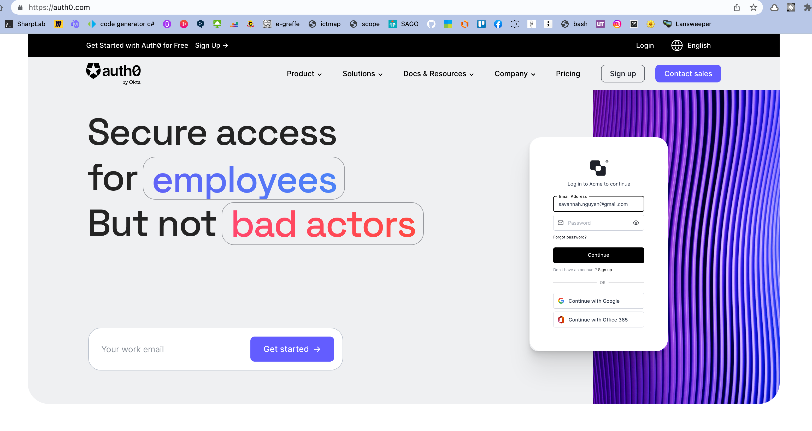
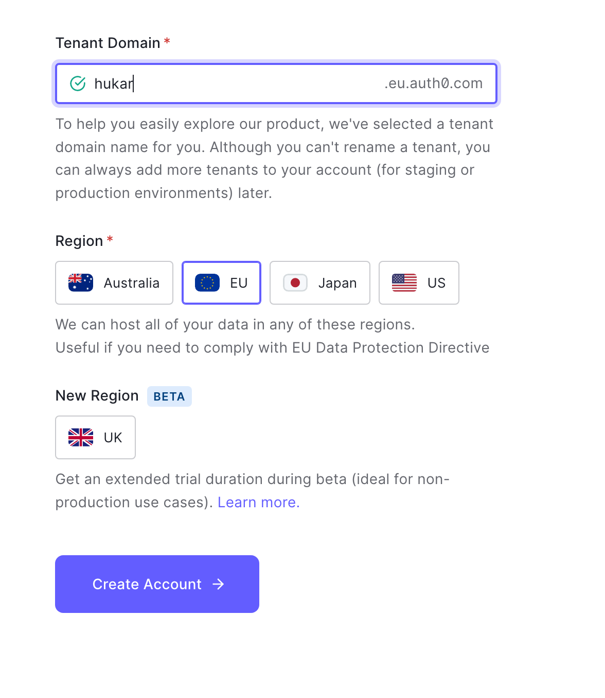
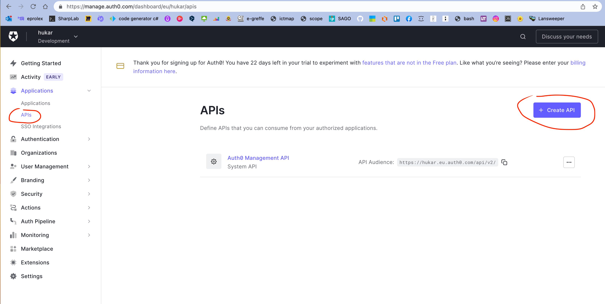
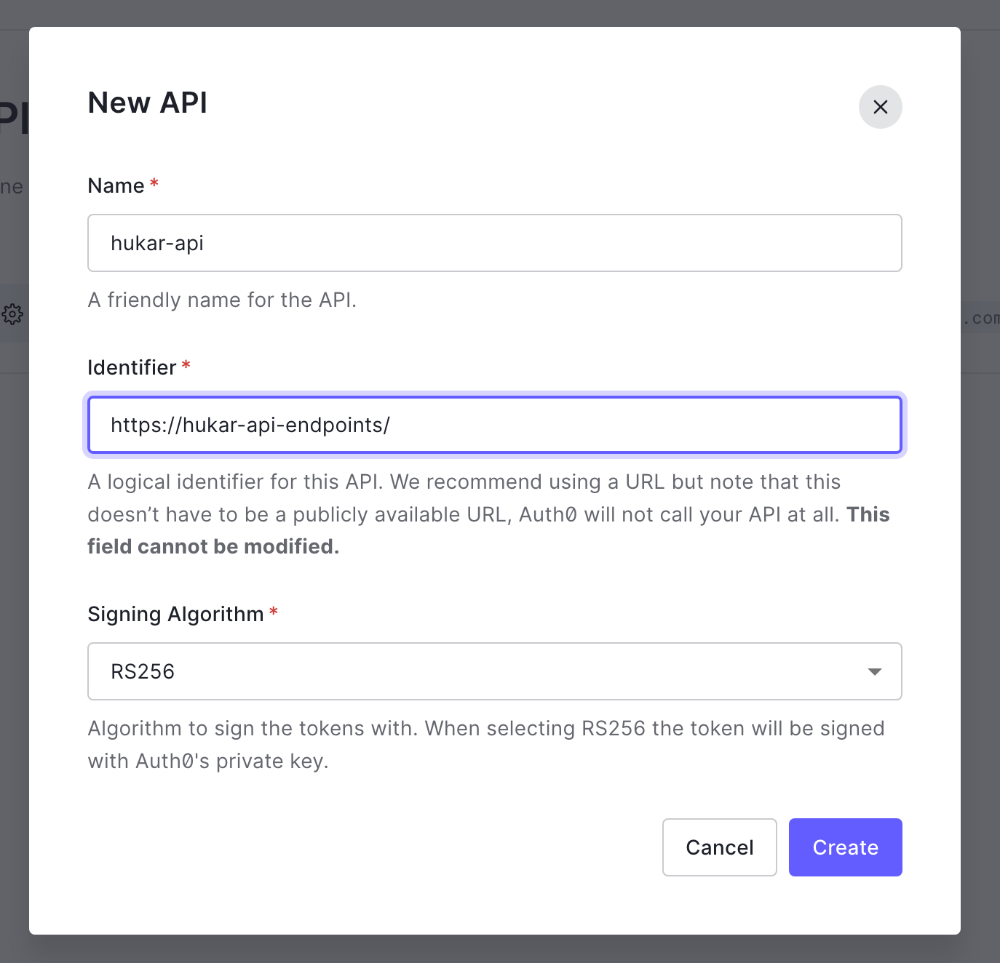
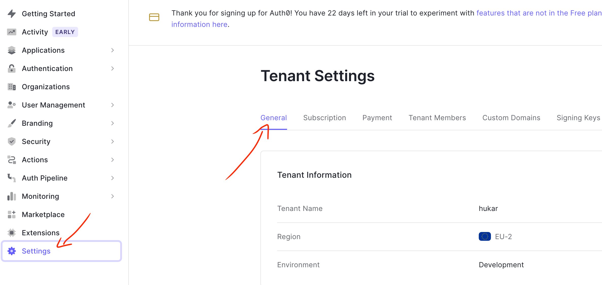
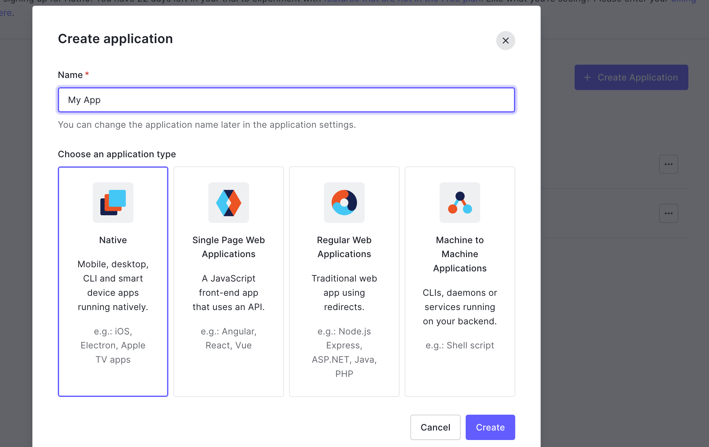
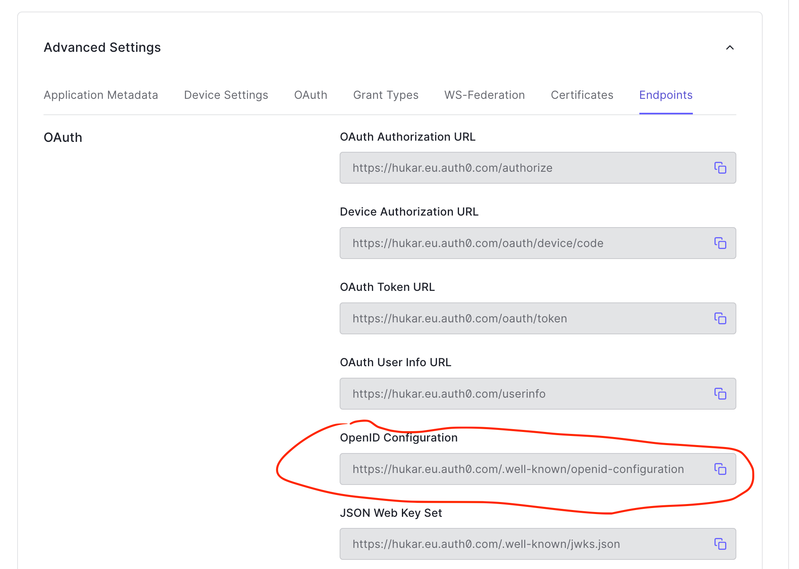
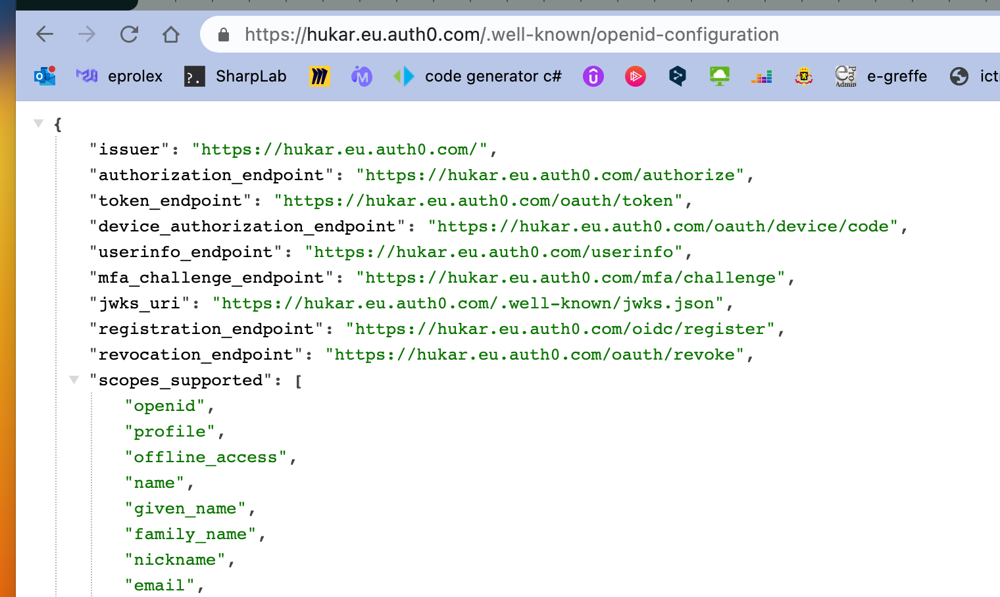

# 03 Créer un compte `OAuth`

Exercice de https://oauth.school/exercise/introduction/


## créer un compte `auth0`



Je me suis inscris avec mon compte `Google`.




## Créer une `API`






## Définir mon `Default Audience`

C'est mon `endpoint`.



En descendant plus bas :


Je copie-colle l'`URL` de mon `API`. Puis `Save` bien sûr.


## `Oauth server Issuer URI`

Il faut créer une application (n'importe laquelle).



Puis aller dans `Settings` puis `advanced settings` :



On copie et introduis l'`url` de `OpenId Configuration` dans le navigateur:



La première ligne est le `issuer` (l'`emetteur`):

```
"issuer": "https://hukar.eu.auth0.com/"
```


