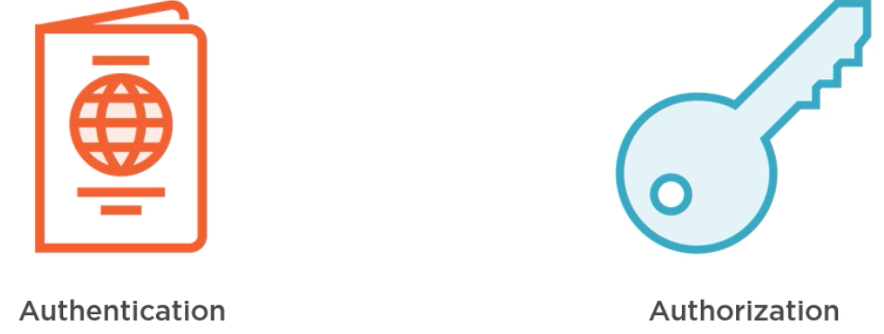

# 01 Concepts de base

`Claims` : les revendications => revendiquer (clamer) un droit.

## Authentification et Autorisation

### Authentification

Déterminer l'identité  `Identity`.

On a besoin de preuve.

Pour une application la preuve est le `password`.

Une fois authentifié les `Claims` sont révélées à l'application.

Les `Claims` peuvent être toutes informations liées à votre `Identity`.

Elle peut s'implémenter grâce au `Cookie`, à la librairie `Identity` ou avec des `Identrity provider` (`OpenId Connect`).

### Autorisation

Il faut d'abord être authentifié.

L'authentification vous permet d'entrer dans un hôtel mais pas d'accéder aux chambres.

C'est la clé d'accès, qui elle vous donne le droit d'aller dans votre chambre, dans la piscine, mais pas dans les autres chambres : vous n'êtes pas autorisé.

C'est un accès limité.