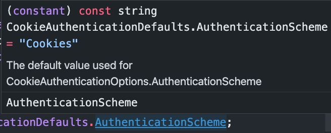
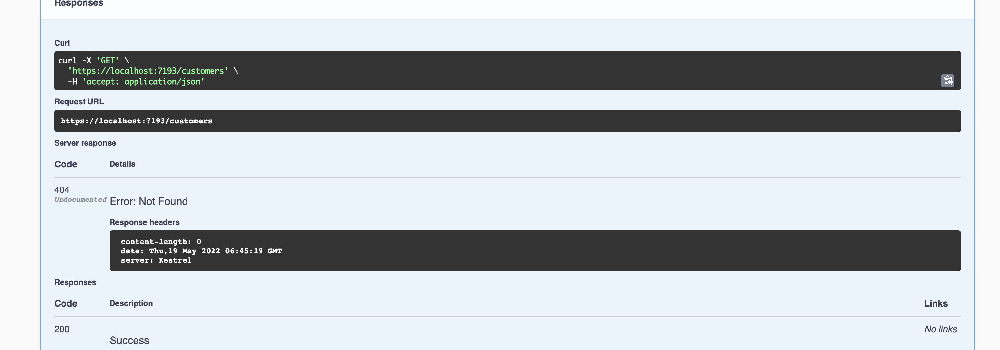

# 02 Authentification avec `Cookie` : `Authorize`


## Ajout de l'authentification par `Cookie`

### Ajouter le service : `Program.cs`

```cs
builder.Services.AddAuthentication()
    .AddCookie();
```

On peut définir un nom à mon services d'authentification :

```cs
builder.Services.AddAuthentification()
    .AddCookie("MySchemeCookieAuth");
```

Si on ne met rien on garde le nom du `scheme` par défaut.

On doit le passer à `AddAuthentication` sans utiliser de `magic string`  :

```cs
builder.Services.AddAuthentication(CookieAuthenticationDefault.AuthenticationScheme)
    .AddCookie();
```



On voit que `CookieAuthenticationDefault.AuthenticationScheme` vaut simplement `"Cookies"`.

> ## ! Pour minimal API
>
> On dirait qu'il faut aussi ajouter le service :
>
> ```cs
> builder.Services.AddAuthorization();
> ```
>
> 

### Ajouter le `Middleware` : `Program.cs`

Il faut toujours mettre `UseAuthentication` et `UseAuthorization` avant les `Endpoints`

( en `minimal api` avant les `MapSomething`).

Il faut utiliser `UseAuthorization` de paire avec `UseAuthentication`.

```cs
app.UseAuthentication();
app.UseAuthorization();

app.MapCustomer();
```


## `[Authorize]` attribute

On peut placer cet `Attribute` sur un `controller` ou sur une `Action` de `Controller`.

Avec `Minimal API` on peut utiliser l'attribut ou une méthode :

```cs
app.MapGet("customer/{id}", [Authorize](int id) => $"customer {id}");
```

ou

```cs
app.MapGet("customer/{id}", (int id) => $"customer {id}")
            .RequireAuthorization("CookieScheme");
```

> ### ! `[Authorize]` se place avant `async` sinon on a une erreur :
>
> ```cs
> app.MapGet(
>     "/customers",  
>     [Authorize] async (IRepository db) => await db.GetAll()
> );
> ```
>
> 

On obtient un résultat `Not Found` :




### On peut sécuriser par défaut tous les `Controllers` :

```cs
builder.Services
    .AddControllerWithViews(o => o.Filters.Add(new AuthorizeFilter()));
```

Ou toutes les `Razor Pages` :

```cs
builder.Services.AddRazorPages()
    .AddMvcOptions(o => o.Filters.Add(new AuthorizeFilter()));
```

On a l'effet inverse avec `[AllowAnonymous]` qui permet à une personne non authentifié d'accéder à la ressource.