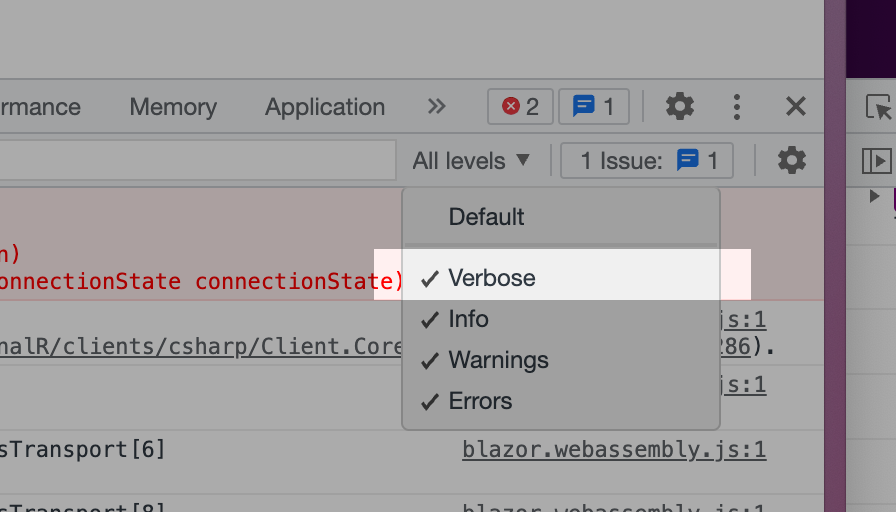

# 02 Ajouter du `Logging`


## Les niveaux de `Logging`

| LogLevel    | Value | Description                                                  |
| ----------- | ----- | ------------------------------------------------------------ |
| Trace       | 0     | Contient le message le plus détaillé.<br />Ce message peut contenir des données sensible de l'application.<br />Ce message est désactivé par défaut et ne doit pas être utilisé en production |
| Debug       | 1     | Pour le debbug et le développement.                          |
| Information | 2     | Flux des informations générales de l'application.            |
| Warning     | 3     | Inclus les erreurs ou les événement inattendus ne provoquant pas le crash de l'application. |
| Error       | 4     | Pour les erreurs et les exceptions qui ne sont pas gérées. Représente un echec au niveau d'une action, pas le crash de l'application. |
| Critical    | 5     | Pour les échecs qui réclame une attention immédiate : perte de données, plus d'espace disque. |
| None        | 6     | Aucun message de `logging`                                   |


## Ajouter du `Logging` côté client : `ConfigureLogging`

```cs
@using Microsoft.Extensions.Logging
@inject ILoggerProvider LoggerProvider

protected override void OnInitialized()
{
    hubConnection = new HubConnectionBuilder()
        .ConfigureLogging(logging => logging
             .AddProvider(LoggerProvider)             
             .SetMinimalLevel(LogLevel.Trace) // valeur par défaut du logger 
        )
        .WithUrl("http://localhost:5042/chathub")
        .Build();
```

`ConfigureLogging` prend une `action` en argument.

C'est la méthode `SetMinimumLevel` qui permet de sélectionner le niveau de `Logging`.

 `LoggerProvider` permet d'écrire dans la console du navigateur.

> ## Les `Logs` ne sont pas complets
>
> Il faut vérifier que le navigateur montre bien tous les `Logs` :
>
> 
>
> 


## Logging côté `server`

Le plus simple est d'ajouter ceci dans `appsettings.json` ou `appsettings.Devlopment.json` :

```json
{
  "Logging": {
    "LogLevel": {
      "Default": "Information",
      "Microsoft.AspNetCore": "Warning",
      "Microsoft.AspNetCore.SignalR": "Trace",
      "Microsoft.AspNetCore.Http.Connections": "Trace"
    }
  }
}
```

