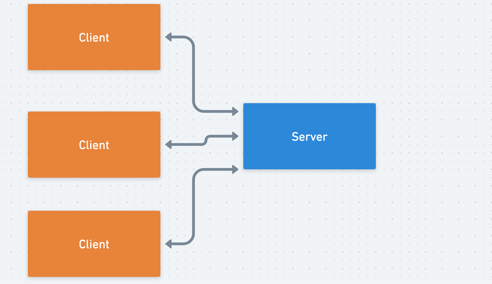
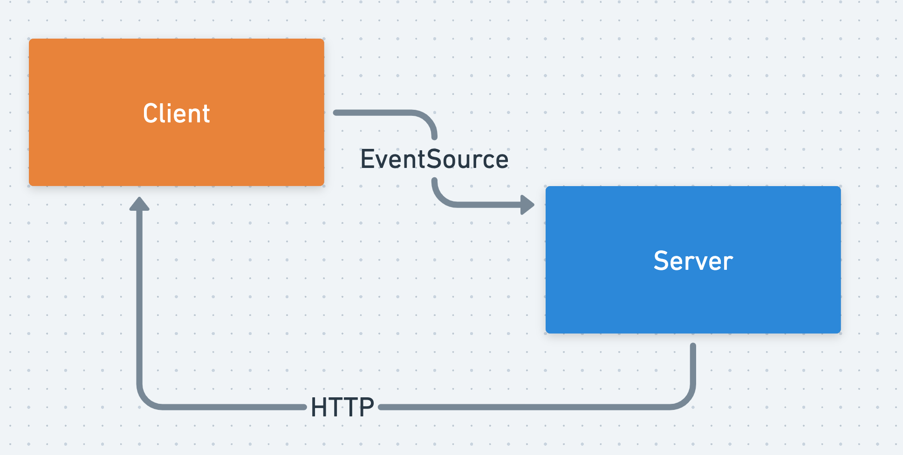
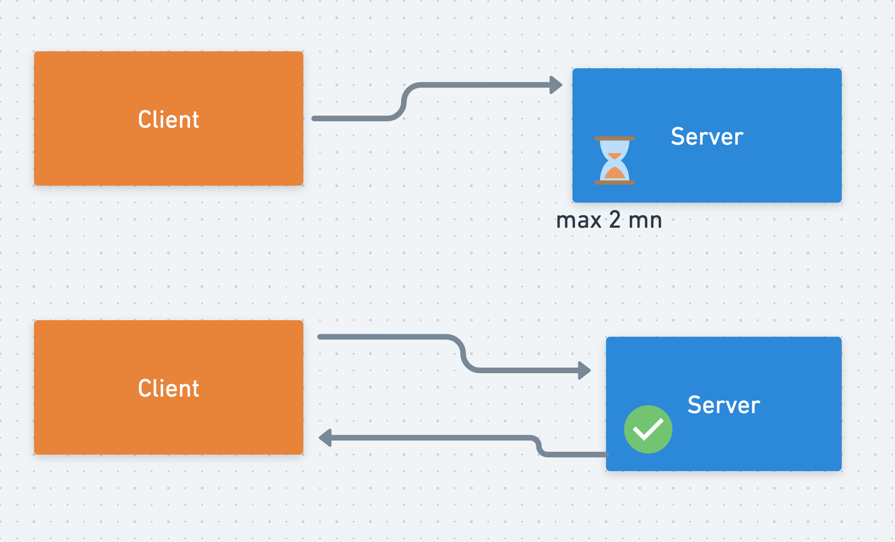
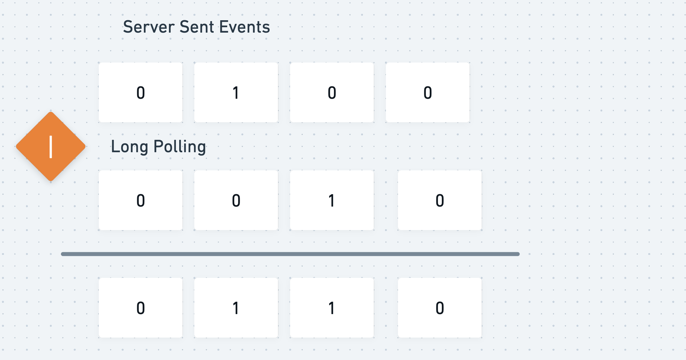
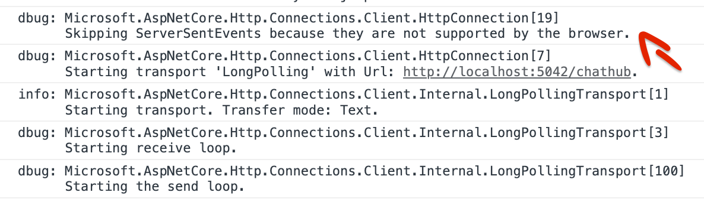
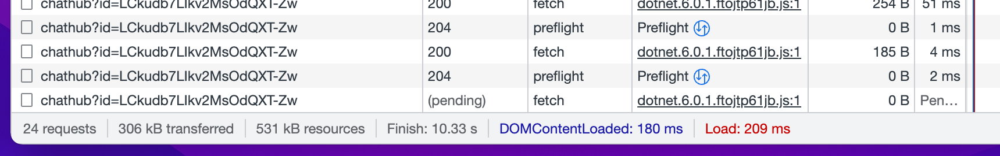

# 03 Les protocoles de transport

`SignalR` peut utiliser `3` différents protocoles de transport :

-  WebSocket

-  Server Sent Events `SSE`

-  Long Polling

## `WebSocket`

`WebSocket` crée des `Pipes` bilatéraux (`Socket`) entre le les clients et le serveur :



`WebSocket` est le meilleur choix possible, il arrive que certain navigateurs ne supporte pas ce protocole.


## `Server-Sent Events`

C'est un ancien protocole (`Netscape`), il ne crée pas un canal bilatéral mais utilise des `EventSource` avec `HTTP`.



Si un navigateur ne supporte pas `WebSocket`, alors c'est `Server-Sent Events` qui est utilisé par `SignalR`.


## `Long Polling` : longue attente

C'est le pire scénario, il n'y a ni `WebSocket`, ni `Server-Sent Events`.

C'est le plus ancien protocole, il ouvre une connexion et la referme lorsque le `Server` a quelque chose à envoyer :



Le temps maximum d'attente (`Time Out`) est généralement fixé à `2 mn`.

La connexion est réétablie automatiquement dès qu'une réponse arrive.


## Résumé

### `WebSocket`

- Pros : une connexion toujours disponible
- Cons : Le `Pool` de `Socket` peut être épuisé si on a plusieurs utilisateurs avec plusieurs onglets connectés


### `Server-Sent Events`

- Pros : Bonne solution de remplacement si les `WebSockets` ne sont pas disponible
- Cons : Le `Client` ne peut pas utiliser les `EventSource` pour envoyer un message


### `Long Polling`

- Pros : Cela fonctionne sur n'importe quel navigateur
- Cons : Un cycle constant de connexion/deconnexion n'est pas idéal. C'est lent.


## Modifier le type de Transport

### Côté `Blazor`

Dans un `Component.razor`

```cs
hubConnection = new HubConnectionBuilder()
            .WithUrl("http://localhost:5042/chathub", HttpTransportType.ServerSentEvents | HttpTransportType.LongPolling)
            .ConfigureLogging(logging => logging
                .AddProvider(LoggerProvider)
                .SetMinimumLevel(LogLevel.Debug)
            )
            .Build();
```

C'est dans `WithUrl` que l'on peut ajouter des `HttpTransportType`.


### Côté `Web Api`

Dans `program.cs`

```cs
app.MapHub<ViewHub>("/chathub", options => {
    options.Transports = HttpTransportType.ServerSentEvents | HttpTransportType.LongPolling;
    
});
```

`|` un opérateur de `bit` qui additione :




### Résultat



On voit que `ServerSentEvents` ne semble pas supporté par le navigateur (`???`).

`SignalR` switch alors sur `LongPolling`.



La caractéristique de ce protocole est de lancer régulièrement une requête restant ouverte (en attente : `pending`).

Dans mon test l'attente est de `1.5 mn` avant de relancer une requête.


### Deconnexion de `WebSocket` dans `index.html` (`Blazor`)

On peut déconnecter en `Javascript` les `WebSocket` :

```html
	// ...
	<script>
        WebSocket = undefined;
    </script>
</head>
```

> `???` Comme plus haut, `Server Sent Events` ne parrait pas disponible et `SignalR` switch sur `Long Polling`.


