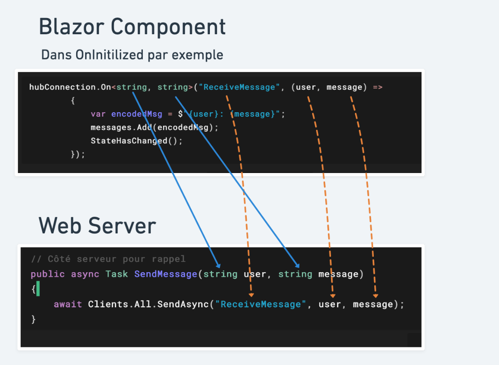
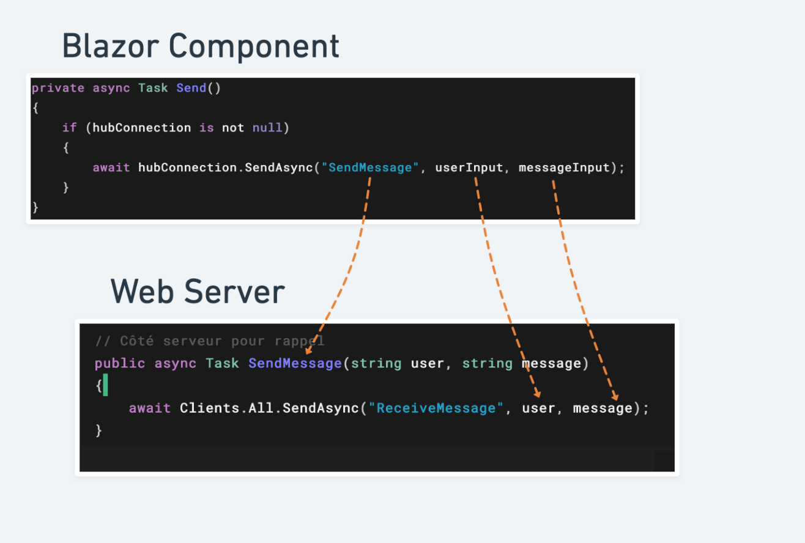
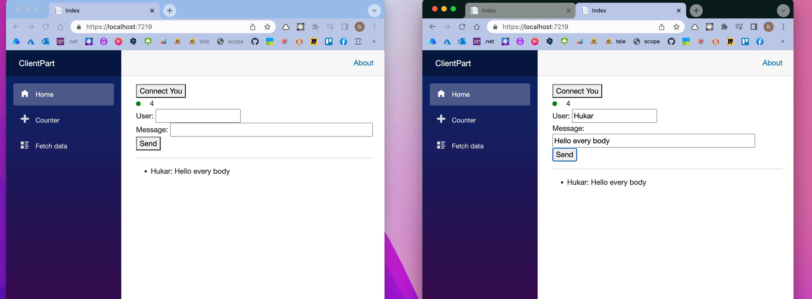
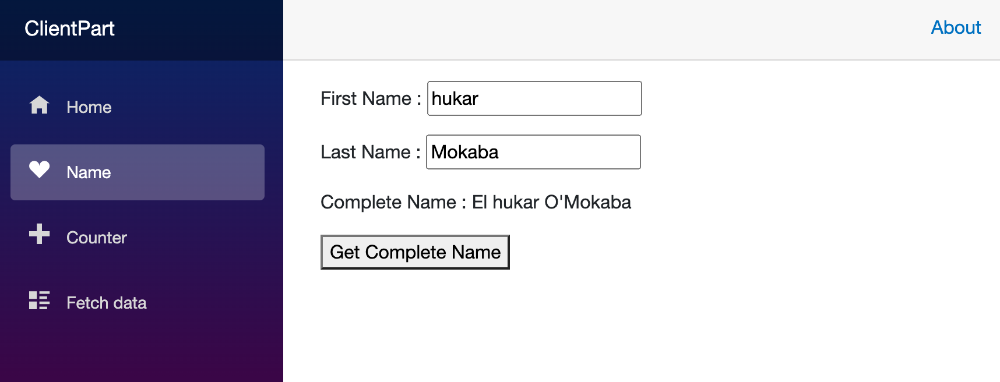

# 05 Client `.Net`

## Côté `Client` : `Blazorwasm`

```bash
dotnet new blazorwasm -o ClientPart
```

```bash
cd ClientPart
dotnet add package Microsoft.AspNetCore.SignalR.Client
```


## Mise en place : `HubConnectionBuilder`

```cs
@page "/"
@using Microsoft.AspNetCore.SignalR.Client
@implements IAsyncDisposable
    
    // ...

@code {
    private HubConnection? hubConnection;
    
    // ...
    
    protected override void OnInitialized()
    {  
        hubConnection = new HubConnectionBuilder()
            .WithUrl("http://localhost:5042/chathub")
            .Build();
```


### S'abonner aux événements : `hubConnection.On<T, P>`

```cs
hubConnection.On<string, string>("ReceiveMessage", (user, message) =>
        {
            var encodedMsg = $"{user}: {message}";
            messages.Add(encodedMsg);
            StateHasChanged();
        });
```

On doit préciser les types de ce qui sera reçu : `On<string, string>`.

En premier argument on a le nom de l'événement `"ReceiveMessage"`.

En deuxième une `Lambda` récupérant les valeurs envoyées avec l'événement.

Pour rafraîchir l'affichage il faut utiliser `StateHasChanged`.




### Démarer la connexion : `hubConnection.StartAsync`

```cs
<button @onclick="StartConnection">Connect You</button>

private async Task StartConnection()
{        
    if(hubConnection is not null && !IsConnected)
    {
        await hubConnection.StartAsync();
    }
    else
    {
        Console.WriteLine("The connection is already open");
    }
}
```

Code pour `IsConnected` : `hubConnection.State`

```cs
public bool IsConnected =>
        hubConnection?.State == HubConnectionState.Connected;
```


### Envoyer un message au `Hub` : `hubConnection.SendAsync`

```cs
private async Task Send()
{
    if (hubConnection is not null)
    {
        await hubConnection.SendAsync("SendMessage", userInput, messageInput);
    }
}
```

Le premier argument `"SendMessage"` est le nom d'une `Method` du `Hub` (côté serveur).

### `hub.SendAsync("HubMethodName", payload1, payload2)`

Ensuite on passe les données pour les paramètres de cette méthode :

```cs
// Côté serveur pour rappel
public async Task SendMessage(string user, string message)
{
    await Clients.All.SendAsync("ReceiveMessage", user, message);
}
```




### Disposer proprement de `Signalr` : `DisposeAsync`

Au début du composant on avait :

```cs
@implements IAsyncDisposable
```

On a donc à la fin du `Blazor Component` ce code :

```cs
@code{
    // ...
    
    public async ValueTask DisposeAsync()
    {
        if (hubConnection is not null)
        {
            await hubConnection.DisposeAsync();
        }
    }
}
```


### Résumé

```cs
// On importe SignalR
@using Microsoft.AspNetCore.SignalR.Client
@implements IAsyncDisposable   

// On déclare notre connexion
private HubConnection? hubConnection;

// On initialise la connexion
hubConnection = new HubConnectionBuilder()
    .WithUrl("http://localhost:5042/chathub")
    .Build();

// On s'abonne à un événement serveur
hubConnection.On<int>("ViewCountUpdate", (count) => {
    counter = count;
    StateHasChanged();
});

// On démarre la connexion
await hubConnection.StartAsync();

// On envoie un message au serveur "NotifyWatching" étant une méthode du Hub
await hubConnection.SendAsync("NotifyWatching", userInput, messageInput);

// On ferme proprement la connexion
await hubConnection.DisposeAsync();
```




## Invoquer une fonction du `Hub` : `InvokeAsync<T>`

On peut invoquer une fonction du `Hub` afin d'exécuter du code.

Ce code peut prendre des paramètres et retourner une valeur :

`Hub`

```cs
public class NameHub : Hub
{
    public string CompleteName(string firstName, string lastName){
        string completeName = $"El {firstName} O'{lastName}";

        return completeName;
    } 
}
```


`Client Blazor`

```cs
private async Task GetCompleteName()
{
    if(hubConnection is not null)
    {
        CompleteName = await hubConnection.InvokeAsync<string>("CompleteName", FirstName, LastName);
    }  
}
```




