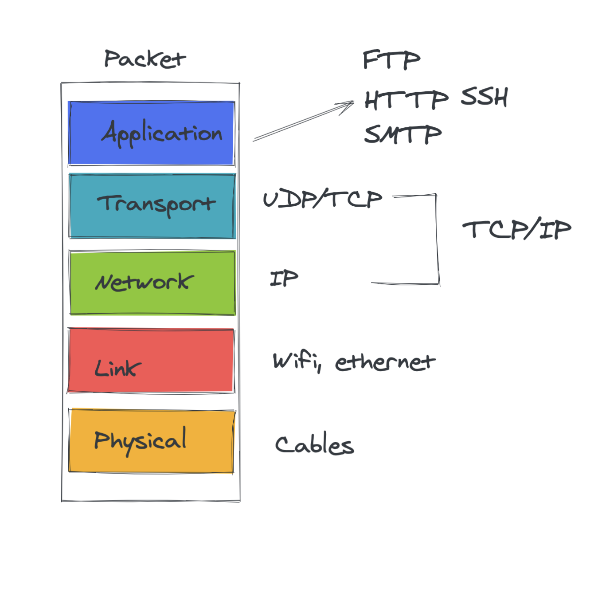
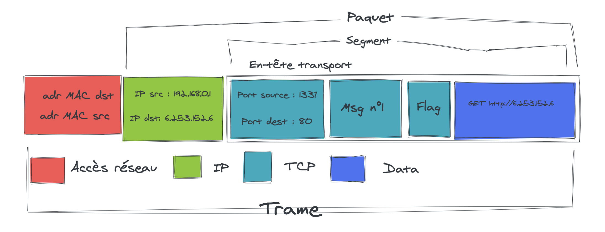
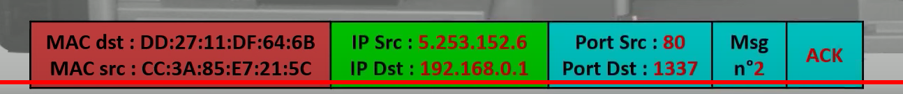
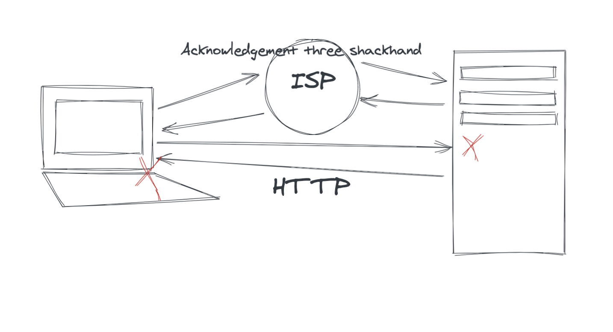
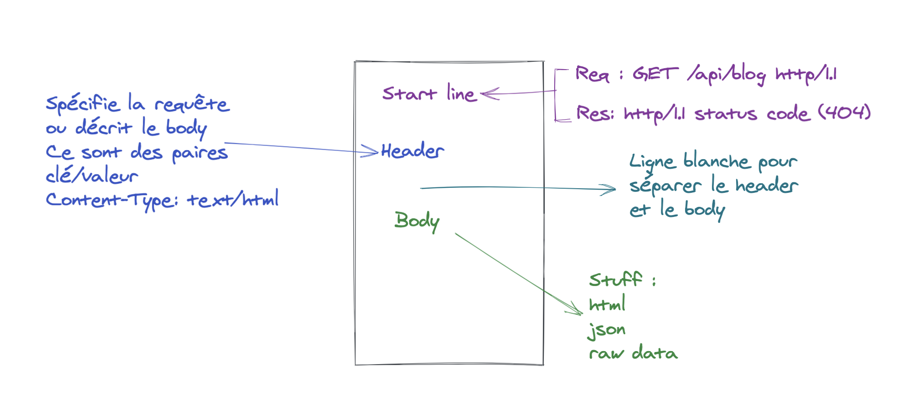

# 01 Intro

## `TCP` et `UDP`



Seul les trois couches les plus hautes intéressent le développeur.

`TCP` découpe les données en petits paquets et les envoie sur le réseau.

Sur le client un programme `TCP` réordonne les petits paquets.

Il vérifie aussi que tous les paquets soient arrivé et soit en bon état.

### `TCP` Transmission Control Protocol

### `IP` Internet Protocol 

Une application internet est identifiée grace à son `port`.  

Dans `TCP` le paquet est apellé `segment`.



### Accusé de reception

Une enveloppe vide va revenir vers le serveur de départ comme accusé de reception (`acknowledgment` : `ACK`).



Les adresses source et destination sont inversées, le flag est mis à `ACK`, il n'y a pas de `Data`.

Le numéro du message est passé à `2`.

## `UDP` User Datagramme Protocol

- plus léger que `TCP` = 8 bytes
- Sans connexion
- Non-fiable
- Uniforme : continu d'envoyer ses données quoi qu'il arrive (même si toutes les données sont perdues)
- Très rapide


## `TCP` Transmission Control Protocol

- Basé sur une connexion : 3 way handshake = 3 poignées de main
- Fiable : 
  - accusé de reception
  - Retransmission de la donnée si besoin
  - Les paquets sont ordonnés
- Mécanisme de contrôle de la congestion du réseau

> #### ! les ports de 0 à 1023 sont réservé pour des applications bien précise

## `HTTP` HyperText Transfert Protocol

- Efficace : `HTTP` est connecté seulement quand c'est nécessaire
- `Stateless` : pas de dialogue la réponse dépend uniquement de la requête présente (sans souvenir) `une requête = une réponse` et c'est tout !


### `ISP` Internet Service Provider



Il y a d'abord la demande de connexion puis la requête `HTTP` -> `fin`

Puis la réponse `HTTP` -> `fin` de la connexion `TCP`.


## Anatomie `HTTP`



### Utilisation de `curl`

```bash
culr -v www.google.com
```

```bash
# Requête
> GET / HTTP/1.1
> Host: www.google.com
> User-Agent: curl/7.64.1
> Accept: */*
>
```

```bash
# réponse
< HTTP/1.1 200 OK
< Date: Mon, 11 Jan 2021 08:59:38 GMT
< Expires: -1
< Cache-Control: private, max-age=0
< Content-Type: text/html; charset=ISO-8859-1
< P3P: CP="This is not a P3P policy! See g.co/p3phelp for more info."
< Server: gws
< X-XSS-Protection: 0
< X-Frame-Options: SAMEORIGIN
< Set-Cookie: NID=206=Oocn-eDWyenQK2l7ZkwG8nb4MaCOfT3OHuWEyjonqNf9euoHvY_MknF4QX5zsinEtz5h7Q8KXMY55YCzzddYU5WnU3xRvaB659Vxo63yaDMWmeWDUNMeV9xhfevkImpD3dnKC9GTvksewlKPy8IAAb9ngVhWLtyV3QS0W3FF1gM; expires=Tue, 13-Jul-2021 08:59:38 GMT; path=/; domain=.google.com; HttpOnly
< Accept-Ranges: none
< Vary: Accept-Encoding
< Transfer-Encoding: chunked
< 
<!doctype html><html itemscope="" # ...
```


```bash
$ curl -v www.google.com/apgstrsf
```

Requête :

```bash
> GET /apgstrsf HTTP/1.1 # start line METHOD PATH PROTOCOL
> Host: www.google.com # header
> User-Agent: curl/7.64.1
> Accept: */*
> # blank line
```

Réponse :

```bash
< HTTP/1.1 404 Not Found # start line PROTOCOL STATUS CODE + STATUS
< Content-Type: text/html; charset=UTF-8 # header
< Referrer-Policy: no-referrer
< Content-Length: 1569
< Date: Mon, 11 Jan 2021 09:05:25 GMT
< # blank line
<!DOCTYPE html> # body
<html lang=en>
  <meta charset=utf-8> # ...
```

