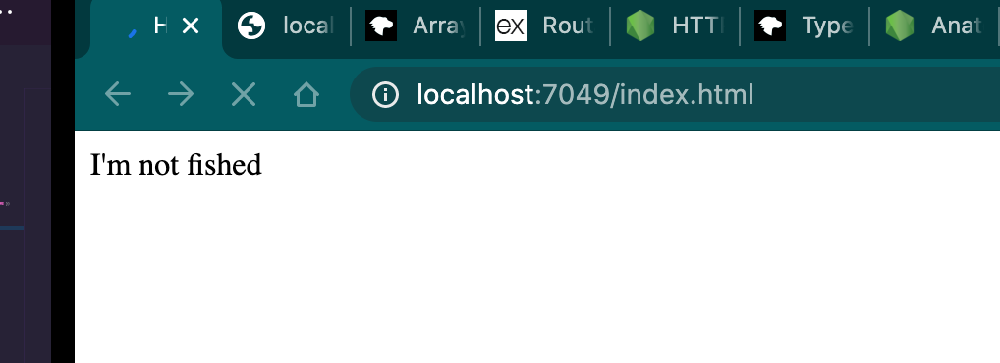

# Création d'un serveur `Nodejs`

`Nodejs` s'occupe de la `start line` de la réponse `HTTP`.

Nous devons nous occuper du `header` et du `body`.

```js
const http = require('http')

const server = http.createServer((req, res) => {
    const user = {
        name: 'coco',
        message: 'Hello !!! 🐒',
        accent: 'é&@ùàèï',
    }
    const link = {// ... }
    const listObj = [ //... ]

    let payload = 'nothing ...'

    switch (req.url) {
        case '/user':
            payload = user
            break
        case '/link':
            payload = link
            break
        case '/listObj':
            payload = listObj
            break
    }

    // res.setHeader('Content-Type', 'application/json')
    res.writeHead(208, 'HUKAR IS HERE', { 'Content-Type': 'application/json' })
    res.end(JSON.stringify(payload))
})

server.listen(7049, console.log('the server is listenning in PORT:7049'))

```

`res.writeHead(statusCode: number, customMessage, headers: obj)`

`customMessage` est le message texte dans la `start line` après le code numérique.

`res.setHeader(key, value)` pour ajouter un `header` précis.

`res.write(payload)`

`res.end()` signale qu'on ferme la connexion (toutes les données et headers sont envoyés)

`req.url` permet de récupérer l'`url` de type `/user` de la requête.

## Test de notre mini-api

```bash
curl -v localhost:7049/user
```

```bash
*   Trying ::1...
* TCP_NODELAY set
* Connected to localhost (::1) port 7049 (#0)
> GET /user HTTP/1.1
> Host: localhost:7049
> User-Agent: curl/7.64.1
> Accept: */*
> 
< HTTP/1.1 208 HUKAR IS HERE
< Content-Type: application/json
< Date: Mon, 11 Jan 2021 11:09:30 GMT
< Connection: keep-alive
< Keep-Alive: timeout=5
< Transfer-Encoding: chunked
< 
* Connection #0 to host localhost left intact
{"name":"coco","message":"Hello !!! 🐒","accent":"é&@ùàèï"}
* Closing connection 0
```

On voit le `customMessage` dans la `start line` : ` 208 HUKAR IS HERE`


## Gestion des fichiers statiques

Modules utilisés:

```js
const http = require('http')
const fs = require('fs')
const path = require('path')
```

```js
const server = http.createServer((req, res) => {
    const url = req.url
```

On récupère l'`url`

```js
    const file = path.join(__dirname, 'public', url.slice(1))
    console.log(file)
```
`url.slice(1)` permet de retirer `/` de l'`url`récupérée (`/user` => `user`).

```js
    const fileExist = fs.existsSync(file)
    console.log(fileExist)
```
`fs.existsSync(filePath): bool` permet de vérifier qu'un fichier existe, c'est une méthode synchrone. 


```js
    const ext = path.extname(file)
    console.log(ext)
```

On récupère l'extension du fichier avec `path.extname(filePath)`.

```js
    let typeMIME = 'text/plain'

    switch (ext) {
        case '.html':
            typeMIME = 'text/html'
            break
        case '.css':
            typeMIME = 'text/css'
            break
        case '.ico':
            typeMIME = 'image/x-icon'
            break
    }
    res.writeHead(200, 'HUKAR IS HERE', { 'Content-Type': typeMIME })
```
Suivant l'extension, on va attribuer un type `MIME` adequat


```js
    if (fileExist) {
        const rs = fs.createReadStream(file)
        rs.pipe(res)    
```
On va créer un `stream` en lecture sur le fichier et le `pipe`avec la `response` qui est un `stream` en écriture.

#### `readStream.pipe(writeStream)`


```js
    } else {
        res.writeHead(404, "HUKAR ISN'T HERE", {
            'Content-Type': 'text/plain; charset=UTF-8',
        })
        res.end('404 cot cot cot 🐔')
    }
})
```
Sinon c'est une erreur 404.

#### Remarque: 

comme notre `type MIME` est `text/plain`, il faut ajouter un `charset`pour afficher correctement les `emoji` ou les accents.


## `res.end()`

Si on ne termine pas la connexion `HTTP`, le navigateur attendra infiniment :

```js
				const rs = fs.createReadStream(file)
        res.on('finish', () => console.log('finish: the response has been sent'))
        res.on('close', () =>
            console.log('close: response is completed or connexion was terminated')
        )
        // rs.pipe(res)
        res.write(`I'm not fished`)
```



Un petit cercle bleu tourne indéfiniment.

Si la connexion est coupée par le navigateur seul le message de l'événement `close` sera affiché :

```bash
the server is listenning in PORT:7049
/Users/kms/Documents/programmation/express-rob-bunch/node101/public/index.html
true
.html
close: response is completed or connexion was terminated
```

Si tout se passe correctement l'événement `finish` sera envoyé et puis `close`.

```bash
/Users/kms/Documents/programmation/express-rob-bunch/node101/public/style.css
true
.css
finish: the response has been sent
close: response is completed or connexion was terminated
```

Bien entendu les événement sont aussi déclenchés avec `res.end()`.

#### Conclusion

`rs.pipe(ws)` ferme automatiquement la connexion.

