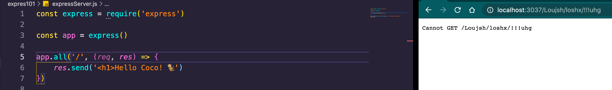
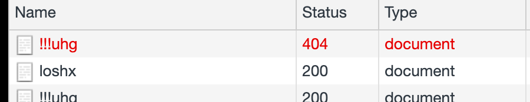
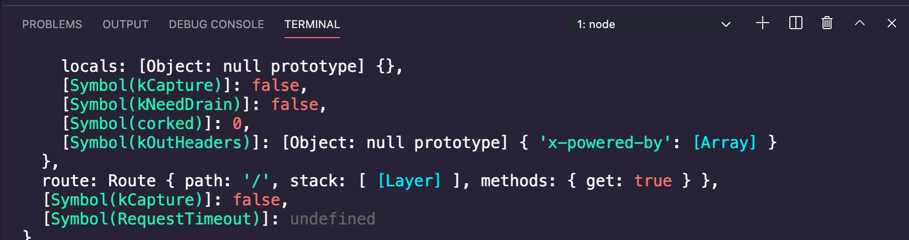
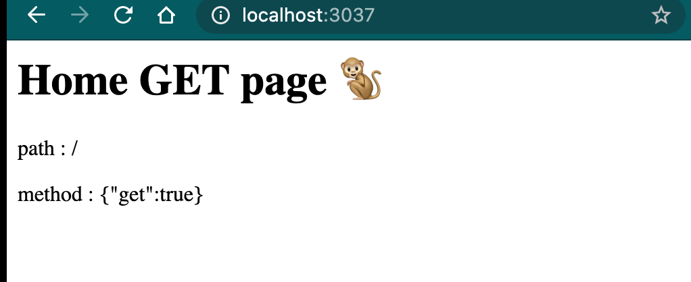
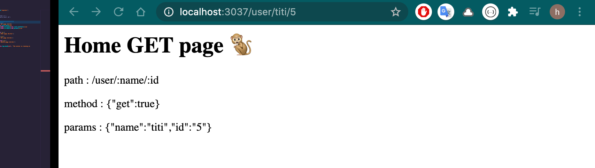
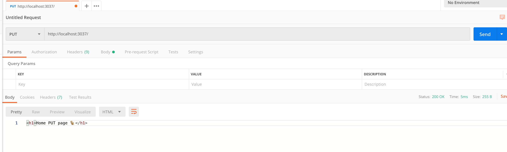

# 03 Express `101`

Express est une infrastructure web middleware et de routage.

## expressServer

```bash
# On a besoin d'un package.json
npm init
npm i express
```


C'est un `third party module` (contrairement à `http` qui par exemple est un module natif de `Nodejs`).

```js
const express = require('express')
const app = express()  // crée une application express
```

Dans le module `Express` `require` charge une fonction `createApplication` et on l'exécute à la deuxième ligne.

## `app.all(route, callback)`

```js
app.all('*', (req, res) => {
  // Express gère les headers basiques (status code, MIME type)
  // Express gère la fin de connexion (res.end())
  res.send('<h1>This is the home page</h1>')
})

app.listen(3037, console.log.bind(null, `the server is running on PORT:3037`))
```

`Express` utilise `app.send` pour envoyer du contenu.

`app.all` accepte toutes les méthodes (`get`, `post`, `delete`, `put`, ... )

### `304` Unchanged

**Chrome** demande la page et `Express` répond que c'est la même (système de cache basique).

### ! `Express` fournit une erreur `404` automatique





## Routing dans `express`

```js
const express = require('express')
const app = express()

// app a beaucoup de méthodes HTTP verbes get, post, put, delete
app.all('/', (req, res) => {
  res.send('<h1>Home page</h1>')
})


app.get('/', (req, res) => {
    res.send('<h1>Home GET page 🐒</h1>')
})
app.post('/', (req, res) => {
    res.send('<h1>Home POST page 🐒</h1>')
})
app.put('/', (req, res) => {
    res.send('<h1>Home PUT page 🐒</h1>')
})
app.delete('/', (req, res) => {
    res.send('<h1>Home DELETE page 🐒</h1>')
})


app.listen(3037, console.log.bind(null, `the server is running on PORT:3037`))
```

`HEAD` verbe quand il n'y a pas de `body` (pour `CORS` par exemple).

`PUT` remplace la ressource : update

### ! Par défaut les navigateurs envoie des requête GET

Si on `console.log` la requête, on voit à la fin une propriété `route` :



On récupère donc ici le `path` et la `method` :

```js
app.get('/', (req, res) => {
    console.log(req)
    res.send(`<h1>Home GET page 🐒</h1>
        <p>path : ${req.route.path}</p>
        <p> method : ${JSON.stringify(req.route.methods)}</p>
    `)
})
```



### `req.route`

```js
app.get('/user/:name/:id', (req, res) => {
    console.log(req.route)
```


À quoi correspond `stack` ?

### `req.params`

```js
app.get('/user/:name/:id', (req, res) => {
    console.log(req.params)
```




## Tester les différentes `methods` `HTTP` : `Postman`




## Static Files

### `Node 101`

```js
const http = require('http')
const path = require('path')
const fs = require('fs')

// dossier statique
const public = path.join(__dirname, 'public')

const publicExists = fs.existsSync(public)

if (!publicExists) {
    fs.mkdirSync(public)
}

const app = http.createServer((req, res) => {
    const file = path.join(__dirname, 'public', req.url)

    // regarder si le fichier existe
    const fileExists = fs.existsSync(file)

    if (fileExists) {
                
        // établir le type MIME
        let typeMIME = 'text/plain'
      	const ext = path.extname(file)
        switch (ext.slice(1)) {
            case 'html':
                typeMIME = 'text/html'
                break
            case 'css':
                typeMIME = 'text/css'
                break
            case 'png':
                typeMIME = 'image/png'
                break
            case 'ico':
                typeMIME = 'image/x-icon'
                break
        }

        // ajouter le header
        res.writeHead(200, 'HUKAR THE MARVELOUS', { 'Content-Type': typeMIME })

        const rs = fs.createReadStream(file)
        rs.pipe(res)
    } else {
        res.writeHead(404, 'HUKAR NO HAPPY', { 'Content-Type': typeMIME })
        res.write('Document Not Found')
        res.end()
    }
})

app.listen(3030)
```

### `express 101`

`app` a une méthode `use`.

`use` prend un argument : c'est le `middleware` qu'on veut utiliser.

```js
const express = require('express')

app.use(express.static('public'))

const app = express()
app.listen(3030, console.log.call(this, 'Server is running on PORT:3030'))
```

L'erreur `404`, les type `MIME` et le `status` sont gérés par le `middleware` : `serve-static`.

Dans `node_modules/express/lib/express.js` on a :

```js
exports.static = require('serve-static');
```

On peut déclarer plusieurs dossiers statique :

```js
app.use(express.static('public'))
app.use(express.static('img'))
```

Du coup le dossier `img` agit comme une nouvelle racine :

```html
<html lang="en">
    <head>
        <title>Statique Files</title>
        <link rel="stylesheet" href="css/styles.css" />
    </head>
    <body>
        <h1>Sonic my Hedgehog 2 in Express Static Files</h1>
        <p>
            
        </p>
    </body>
</html>
```

On a le dossier `css` dans `public` et les images directement dans `img`.

Ni `img`, ni `public` ne font partis du chemin, ces dossiers sont à la racine.


## Envoyer une page `html` : `sendFile(pathFile)`

```js
const path = require('path')
const express = require('express')

const app = express()
app.use(express.static('public'))

app.all('/', (req, res) => {
    res.sendFile(path.join(__dirname, 'node.html'))
})
app.all('*', (req, res) => {
  res.send('<h1> Sorry but you are lost</h1>')
})

app.listen(3030, console.log.bind(null, '... running on 3030'))
```

Les routes sont lues de haut en bas.

`'*'` *match* toutes les routes, sauf les routes placé avant.

`app.all` route pour toutes les méthodes `HTTP`.