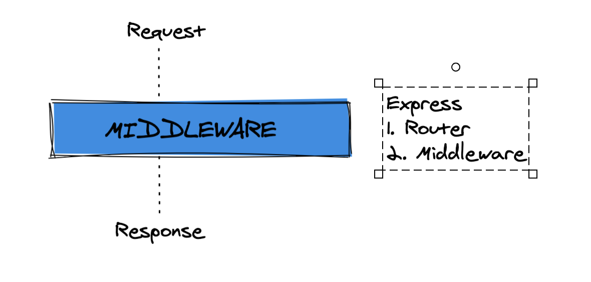

# 04 `Middleware`

`Express` est deux choses : un routeur et un `middleware` de framework web.

## `middleware` pour `Express`

Un `middleware` `Express` est une fonction qui a accès à la requête, la reponse et `next`.

### `function myMiddleware(req, res, next)`

