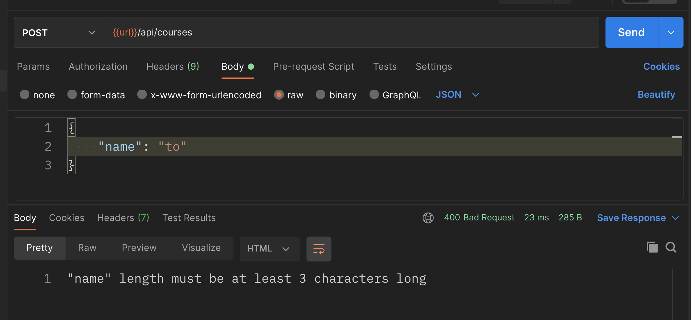
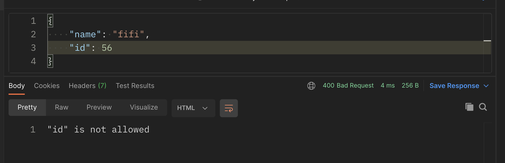
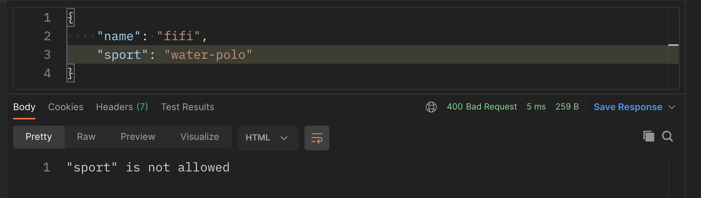

# 01 Rest - Express

## `Re`presentational `S`tate `T`ransfer

````bash
http://vidly.com/api/customers
````

Un `endpoint` expose une `resource`.

```bash
npm init --yes
npm i express
```


## `index.js`

```js
const express = require('express')
const app = express()

app.get()
app.post()
app.put()
app.delete()
```

## `get`

```js
app.get('/', (req, res) => {
    res.send("hello world")
})

app.get('/api/courses', (req, res) => {
    res.send([1,2,3])
})

app.listen(3000, () => console.log('listening on port 3000'))
```


## `GET /api/customers/:id`

```js
const courses = [
    { id: 1, name: 'course 1'},
    { id: 2, name: 'course 2'},
    { id: 3, name: 'course 3'},
]

app.get('/api/courses/:id', (req, res) => {
    const id = req.params.id
    const course = courses.find(c => c.id == id)
    
    if(!course) {
        return res.status(404).send('the course with the given ID was not found')
    }
    
    res.send(course)
})
```


## `req.params`

```js
// /api/post/:year/:month
app.get('/api/post/:year/:month', (req, res) => {
    console.log(req.params)
})
```

```
http://localhost:3000/api/post/2021/03
```

```js
{
    year: "2021",
    month: "03"
}
```


## `Query parameters`

Les utilisés pour des informations optionnelles, le type de trie par exmeple :

```
http://localhost/3000/api/post/2021/02?sortBy=name
```

```js
const sortBy = req.query.sortBy
```


## `POST`

```js
app.post('/api/courses', (req, res) => {
    const course = {
        id: courses.length + 1,
        name: req.body.name
    }
    
    courses.push(course)
    
    res.status(201) // created
    res.send(course)
})
```

`req.body` contient les données envoyées par le client.

Par défaut le `body` n'est pas accessible dans `Express`.

On doit le rendre disponible :

```js
app.use(express.json()) // middleware
```


## Input Validation : `Joi`

```js
app.post('/api/courses', (req, res) => {
    if ( !req.body.name || req.body.name.length < 3) {
        // 400 Bad Request
        res.status(400).send('Name is required and should be minimum 3 characters long')
    }
})
```

Cette validation *à la main* peut vite devenir fastidieuse, on va utiliser un package spécialisé.


### Utilisation de `joi`

```bash
npm i joi
```

```js
const Joi = require('joi')
```

Par convention pour une classe on met une capitale au nom du `package`.

```js
const schema = Joi.object({
    a: Joi.string()
});
```
```js
const { error, value } = schema.validate({ a: 'a string' })
```


Il faut définir un schéma :

```js
app.post('/api/course', (req, res) => {
    const schema = Joi.object({
        name: Joi.string().min(3).required()
    })
    const result = schema.validate(req.body)
    
    res.send(result)
})
```

```
POST name: "aa"
```

```json
{
    "value": {
        "name": "aa"
    },
    "error": {
        "_original": {
            "name": "aa"
        },
        "details": [
            {
                "message": "\"name\" length must be at least 3 characters long",
                "path": [
                    "name"
                ],
                "type": "string.min",
                "context": {
                    "limit": 3,
                    "value": "aa",
                    "label": "name",
                    "key": "name"
                }
            }
        ]
    }
}
```

On voit qu'une erreur est générée.

```
POST name: "Bob"
```

```json
{
    "value": {
        "name": "Bob"
    }
}
```

Il n'y a plus d'erreur.


### Méthode entière

```js
app.post('/api/courses', (req, res) => {
    const newCourse = req.body
    const schema = Joi.object({
        name: Joi.string().min(3).required()
    })

    const result = schema.validate(req.body)

    if(result.error) {
        return res.status(400).send(result.error.details[0].message)
    }

    newCourse.id = courses.length + 1

    courses.push(newCourse)
    
    // 201 Created
    res.status(201).send(result)
})
```



### Remarque

Le schéma est restrictif, il ne peut recevoir que un `name` :






## `PUT`

```js
app.put('/api/course/:id', (req, res) => {
    // look for the course
    // if doesn't exist, return 404 - Not Found
    
    // validate
    // if invalid, return 400 - Bad Request
    
    // update course
    // return the updated course
})
```

### Implémentation

On va extraire la logique de validation dans une fonction :

```js
function validateCourse(course) {
    const schema = Joi.object({
        name: Joi.string().min(3).required()
    })
    return schema.validate(req.body)
}
```

`PUT`

```js
app.put('/api/courses/:id', (req, res) => {
    const id = req.params.id
    const course = courses.find(c => c.id == id)

    if(!course) {
        return res.status(404).send(`course with id : ${id} doesn't exist`)
    }

    const { error } = validateCourse(req.body)

    if(error) {
        return res.status(400).send(error.details[0].message)
    }

    course.name = req.body.name
    res.send(course)
})
```


## `DELETE`

```js
app.delete('/api/courses/:id', (req, res) => {
    // look up the course
    const course = courses.find(c => c.id === parseInt(req.params.id))
    if(!course) {
        return res.status(404).send
    }
    // delete
    const index = courses.indexOf(course)
    course.splice(index, 1)
    // return the course deleted
    res.send(course)
})
```

Ma méthode `DELETE` :

```js
app.delete('/api/courses/:id', (req, res) => {
    const id = req.params.id
    const index = courses.findIndex(c => c.id == id)

    if(index == -1) {
        return res.status(404).send(`course ${id} doesn't exist`)
    }

    const deletedCourse = courses.splice(index, 1)

    res.send(deletedCourse)
})
```

