# Override page

## package

utilisation de `Framer Base Kit` pour les boutons.

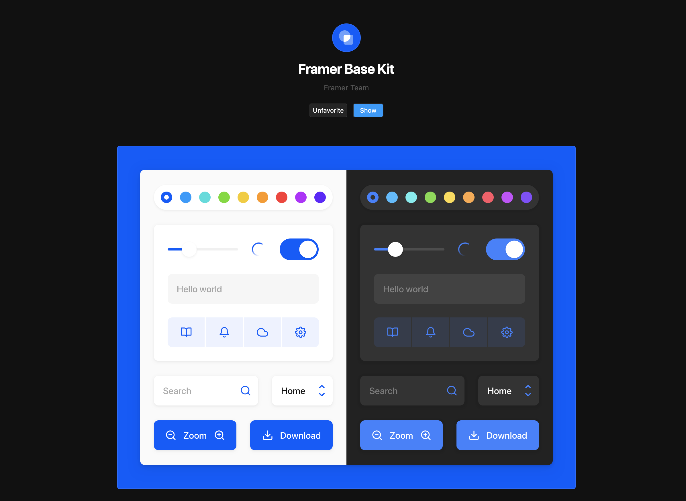

## Créer un component

Chaque `page` va être un `component`.

Ce `component` est construit avec un `frame` et un `text`.

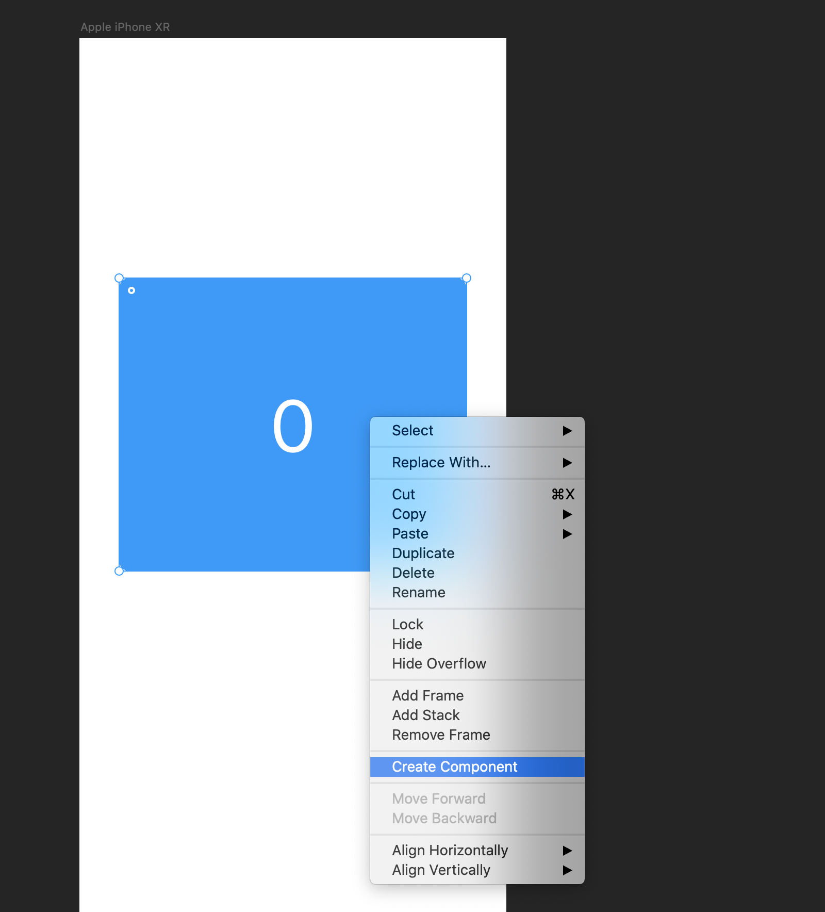

On peut après avoir des instances :

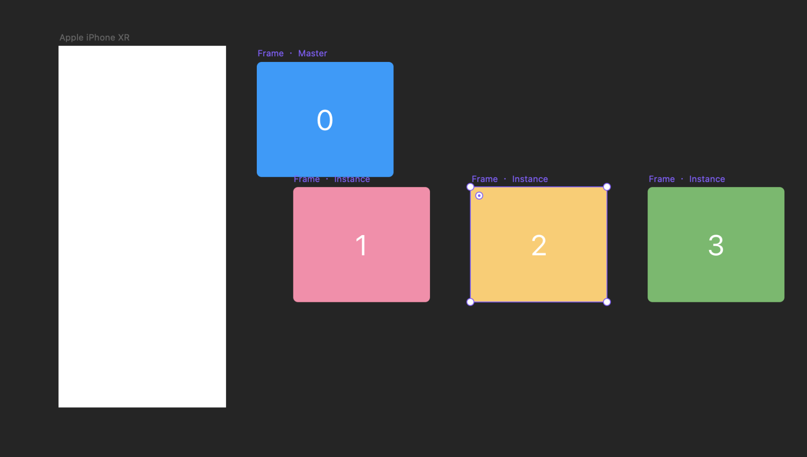

Ne pas oublier de cocher dans le `master` la case pour overrider le texte :

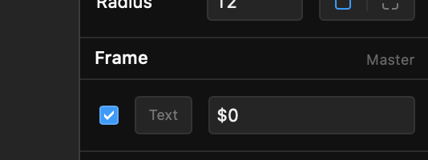

On crée ensuite un élément `page` :

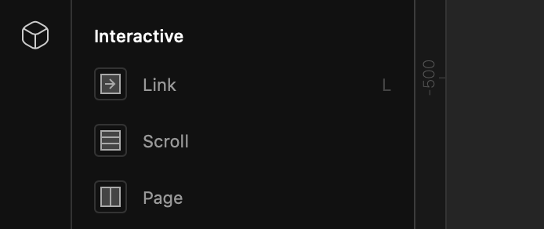

On relie cet élément aux quatre composant page :

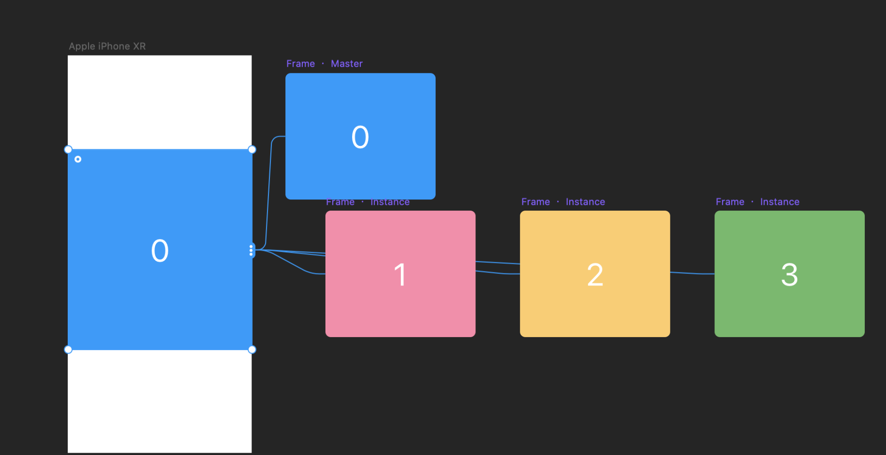

On règle la taille de l'élément `page` et on met `width` et `height` sur `auto` plutôt que `stretch` qui déforme les composant de `page`.


J'ai aussi réglé la gouttière `gap` sur `14 px`.

## Override Code

Le fichier `app.tsx` sera notre fichier pour le code.

```tsx
import { Override } from "framer";

export function Page(): Override {
  return {};
}
```

On crée un `Override` nommé `Page`.

Dans l'interface on l'assigne à notre élément `page`.

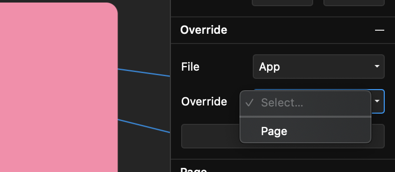

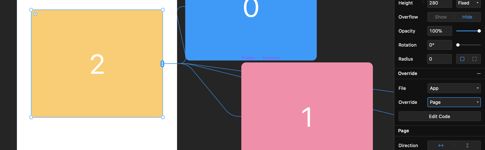

Cela rend ainsi accessible les propriétés dans le code.

## `currentPage`

On peut changer la page courante d'un élément `page` grâce à la propriété `currentPage`.

## Interface

Utilisation des boutons de `Framer Base Kit`.

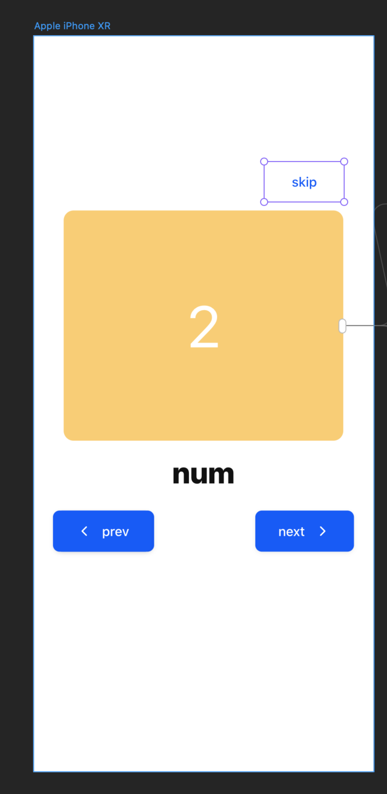

## Tous les `override`

```tsx
import { Override } from "framer";

export function Page(): Override {
  return {
    currentPage: 3,
  };
}

export function PageNumber(): Override {
  return {};
}

export function RightButton(): Override {
  return {};
}

export function LeftButton(): Override {
  return {};
}

export function SkipButton(): Override {
  return {};
}
```

De même dans l'interface graphique pour chaque composant.

## Détecter les changement de page `onChangePage`

```tsx
export function Page(): Override {
  return {
    currentPage: 3,
    onChangePage: (current, previous) => {
      console.log(current, previous);
    },
  };
}
```

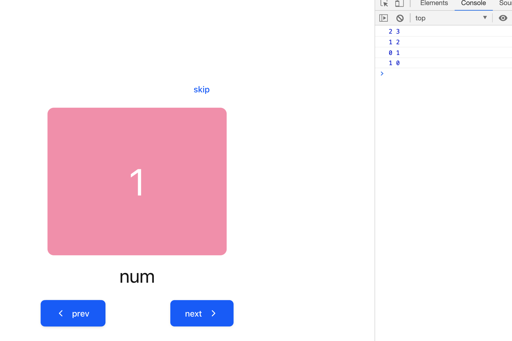

On peut lancer la démo dans le navigateur et ainsi profiter des `devtools` de Chrome.

## Utilisation de `Data`

`Data` permet de créer un `state`.

Toutes modifications du `state` re-dessine la vue (`React`).

```js
import { Override, Data } from "framer";

const state = Data({
  page: 0,
  min: 0,
  max: 3,
});
```

## affichage du numéro de page

Pour afficher le numéro de page, on va utiliser le `state` et la propriété `text` de l'élément `PageNumber`.

```tsx
import { Override, Data } from "framer";

const state = Data({
  page: 0,
  min: 0,
  max: 3,
});

export function Page(): Override {
  return {
    currentPage: state.page,
    onChangePage(current, previous) {
      console.log(current, previous);
      state.page = current;
    },
  };
}

export function PageNumber(): Override {
  return {
    text: state.page,
  };
}
```

la `Page` informe le `state` du changement de page, et `PageNumber` le récupère de ce même `state`.

## les boutons

On utilise la propriété `disabled` pour désactiver le bouton.

On défini un `min` et un `max` dans le `state`.

L'événement est `onClick`.

```tsx
export function RightButton(): Override {
  return {
    disabled: state.page === state.max,
    onClick() {
      if (state.page < state.max) {
        state.page += 1;
      }
    },
  };
}

export function LeftButton(): Override {
  return {
    disabled: state.page === state.min,
    onClick() {
      if (state.page > state.min) {
        state.page -= 1;
      }
    },
  };
}

export function SkipButton(): Override {
  return {
    disabled: state.page === state.max,
    onClick() {
      if (state.page < state.max) {
        state.page = 3;
      }
    },
  };
}
```

## Les propriétés d'un élément : `Page`

Pour récupérer les propriété d'un élément on passe l'objet `props` à la fonction :

```tsx
export function Page(props): Override {
```

On va regarder cet objet :

```js
console.log(props);
```

`props` est un `wrapper` où on doit descendre pour trouver les propriétés :

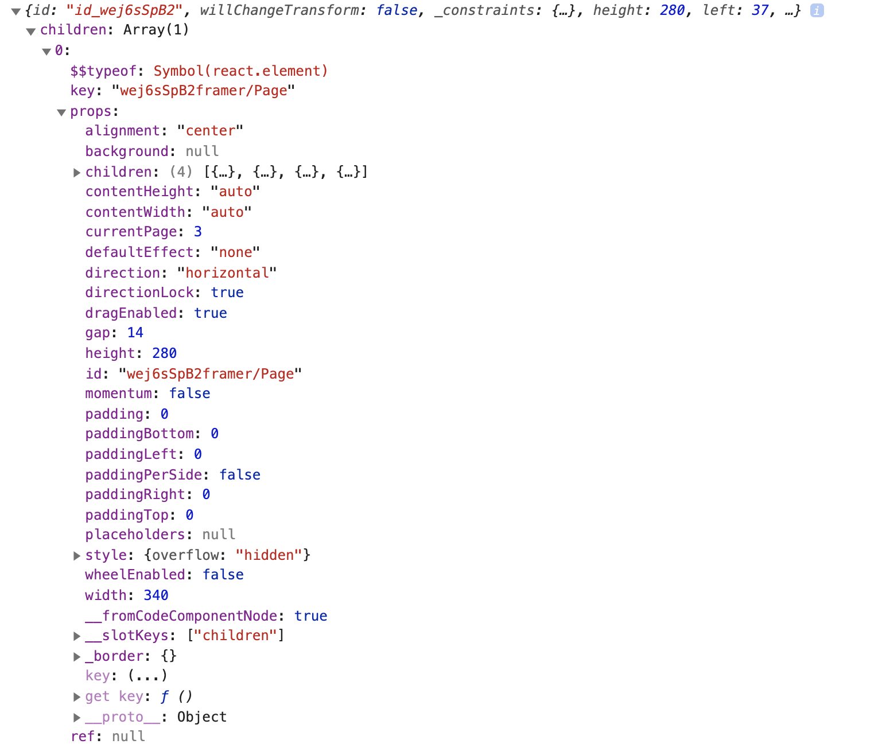

```tsx
const component = props.children[0];
```

## récupérer le nombre de pages
