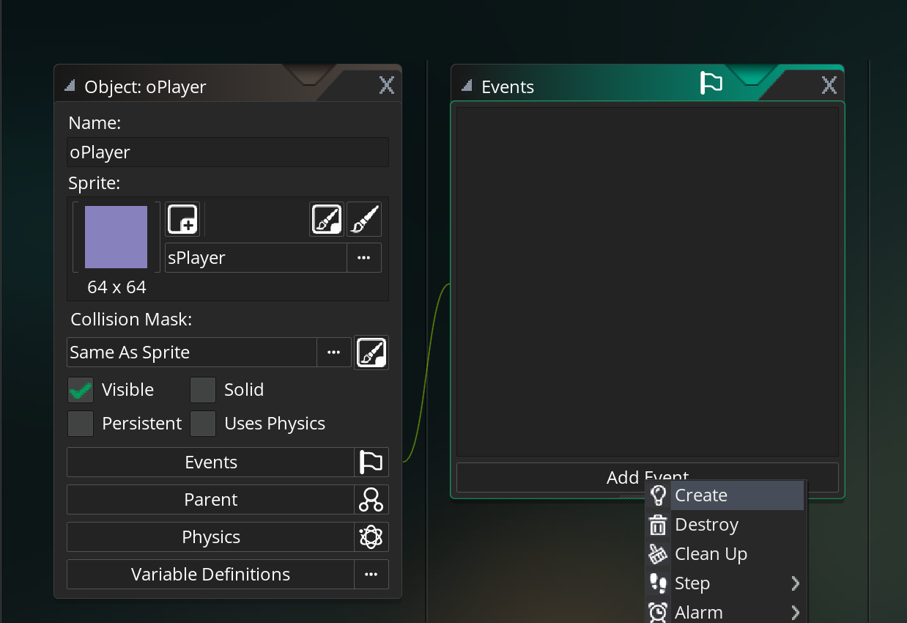
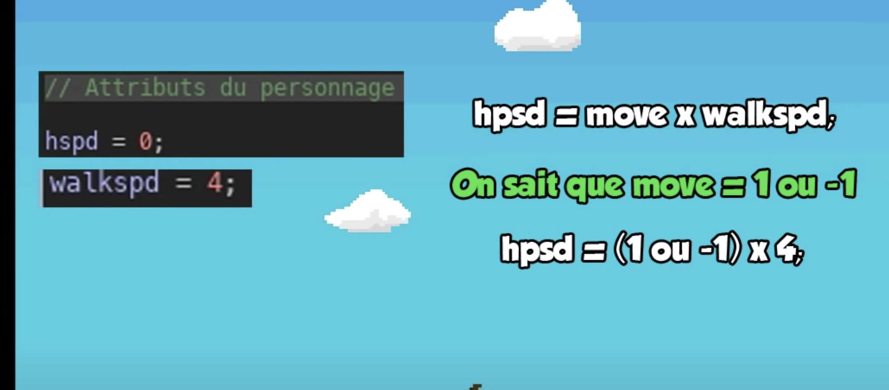
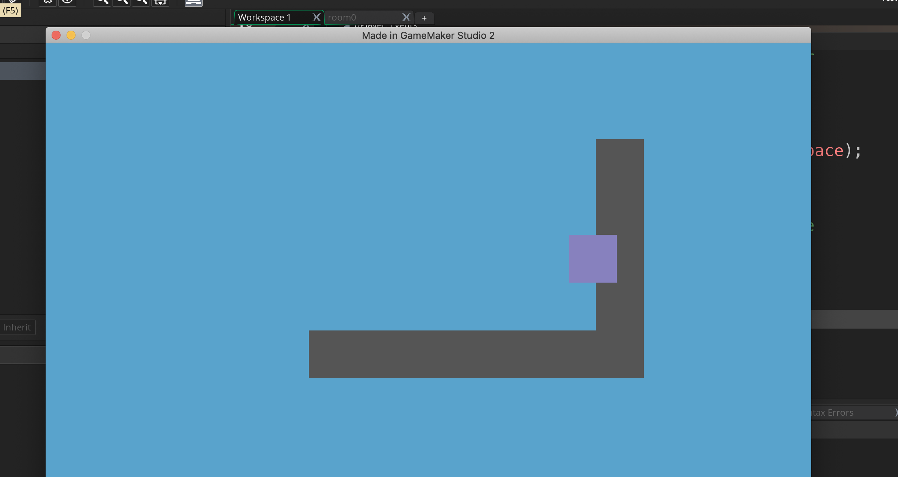

# 01 Créer un jeu de plateforme avec `Gamemaker`

Inspiration : `shaun spalding`

Utilisation du Game Maker Language.

## `create sprite` et `create object`

Il faut créer un sprite sPlayer puis un objet oPlayer.

Idem pour le mur, sMur puis oMur

## `Room`

Il faut changer la couleur de fond et ajouter deux calques, un pour le mur et l'autre pour le player.

## `Add Event`

### `create` est tout ce que possède l'objet au lancement de la scène : les conditions initiales.



```c
hspd = 0;
vspd = 0;
grav = 0.5;
walkspd = 4;
```

### `step` tout ce qui va se passer à chaque frame du jeu.

```c
/// @description Insert description here
// You can write your code in this editor

// Contrôle clavier du personnage
press_right = keyboard_check(vk_right);
press_left = keyboard_check(vk_left);
press_jump = keyboard_check_pressed(vk_space);

// mouvement du personnage

// move vaut 1 quand on va vers la droite
// et -1 vers la gauche
var move = press_right - press_left;

// vitesse du personnage
hspd = move * walkspd;

x = x + hspd;
```



À ce stade on peut déplacer son carré de gauche à droite :



### Gestion des collisions

```c
// ...

// vitesse du personnage
hspd = move * walkspd;
// gravité
vspd = vspd + grav;

// gestion des collisions horizontales
if(place_meeting(x + hspd, y, oMur)) {
	while(!place_meeting(x + sign(hspd), y, oMur)) {
		x = x + sign(hspd);
	}

	hspd = 0;
}

x = x + hspd;

// collisions verticales
if(place_meeting(x, y + vspd, oMur)) {
	while(!place_meeting(x, y + sign(vspd), oMur)) {
		y = y + sign(vspd);
	}

	vspd = 0;
}

y = y + vspd;
```
