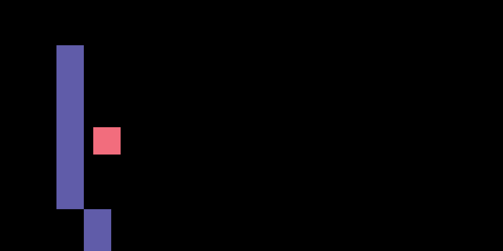
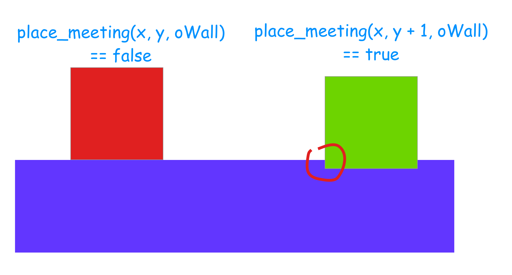

# 01 Les basics

`f12` nettoyer l'écran.

`sprite` juste un dessin.

`object` possède la logique.

## Room

`mouse` + `option` dessiner avec un objet.

## event

`create` quand l'objet est créé.

`gravity` est une variable de Gamemaker (`builtin variable`).

`step` == `frame` c'est ce qui arrive à chaque `step`.

## Nombre d'image par seconde => 60


## Mouvement horizontal

```c
key_right = keyboard_check(vk_right);
key_left = keyboard_check(vk_left);
key_jump = keyboard_check_pressed(vk_space);


// 1 right | -1 left
var move = key_right - key_left;

//horizontal speed = direction (move) * walk speed
hsp = move * walksp;

// x et y sont des propriétés builtin de l'objet
x = x + hsp;
```

`var` variable locale : est détruite lorsque l'événement est fini (ici `event step`).

## Collision horizontale : `place_meeting(x, y, object)`

```c
// horizontal collision

if(place_meeting(x + hsp, y, oWall)) {
	while(!place_meeting(x + sign(hsp), y, oWall)) {
		x = x + sign(hsp);
	}
	hsp = 0;
}
x = x + hsp;
```

La boucle `while` gère les cas où on se retrouve à quelque pixel du mur mais que si on avance de la vitesse, on entre en collision.

Par exemple si on avance de 4 pixels est qu'on se trouve à 3 pixels, on a besoin de la boucle while pour se coller au mur.

Si j'implémente un rebond, je me retrouve dans cette situation :

```c
if(place_meeting(x + hsp, y, oWall)) {
	//while(!place_meeting(x + sign(hsp), y, oWall)) {
	//	x = x + sign(hsp);
	//}
	hsp = - sign(hsp) * 9; // ici un rebond de 9 pixels
}
x = x + hsp;
```



Mon objet ne se colle plus à la paroi.

Je doit utiliser la boucle `while` pour y arriver, elle avance de 1 pixel jusqu'à arriver en collision.

## Gravité

`event create`

```c
grv = 0.3;
```

`event step`

```c
vsp = vsp + grv;

// ...

// vertical collision
if(place_meeting(x, y + vsp, oWall)) {
	while(!place_meeting(x, y + sign(vsp), oWall)) {
		y = y + sign(vsp);
	}
	vsp = 0;
}
y = y + vsp;
```

## Jump



```c
//jump
// I'm on the floor
if place_meeting(x, y + 1, oWall) && key_jump {
	vsp = -7;
}
```

On veut déclencher le jump que si le player est sut le sol `place_meeting(x, y + 1, oWall) == 1`.

## Code complet

`event create`

```c
hsp = 0;
vsp = 0;
grv = 0.3;
walksp = 4;
```

`event step`

```c
// player input
key_right = keyboard_check(vk_right);
key_left = keyboard_check(vk_left);
key_jump = keyboard_check_pressed(vk_space);


// movement : 1 right | -1 left
var move = key_right - key_left;

//horizontal speed = direction (move) * walk speed
hsp = move * walksp;

vsp = vsp + grv;

// horizontal collision
if(place_meeting(x + hsp, y, oWall)) {
	while(!place_meeting(x + sign(hsp), y, oWall)) {
		x = x + sign(hsp);
	}
	hsp = 0;
}
x = x + hsp;

// vertical collision
if(place_meeting(x, y + vsp, oWall)) {
	while(!place_meeting(x, y + sign(vsp), oWall)) {
		y = y + sign(vsp);
	}
	vsp = 0;
}
y = y + vsp;

//jump
// I'm on the floor
if place_meeting(x, y + 1, oWall) && key_jump {
	vsp = -7;
}
```

## Double Jump

`event create`

```c
// ...

double_jump = 1;
jump_count = 0;
```

`event step`

```c
//jump
// I'm on the floor

if(place_meeting(x, y + 1, oWall)) {
	double_jump = 1;
	jump_count = 0;
}

if  key_jump && double_jump {
	vsp = -9;
	double_jump = 1;
	jump_count = jump_count + 1;
    // en jouant sur la limite on peut avoir un triple saut, un quadruple, etc.
	if(jump_count > 1) {
		double_jump = 0;
	}
}
```
