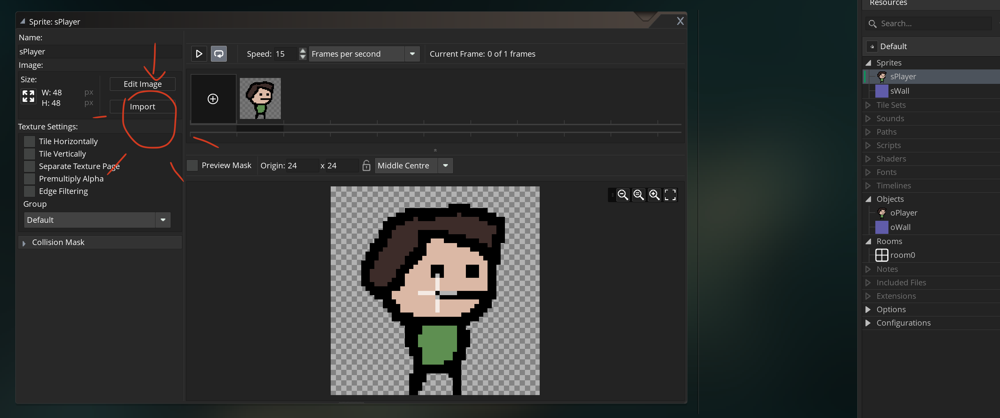
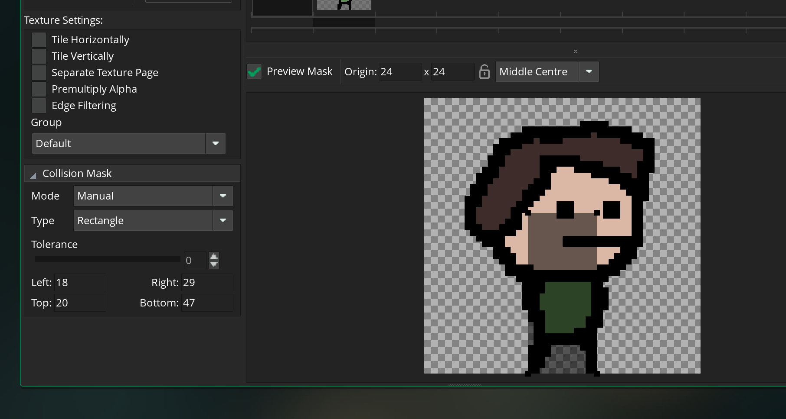
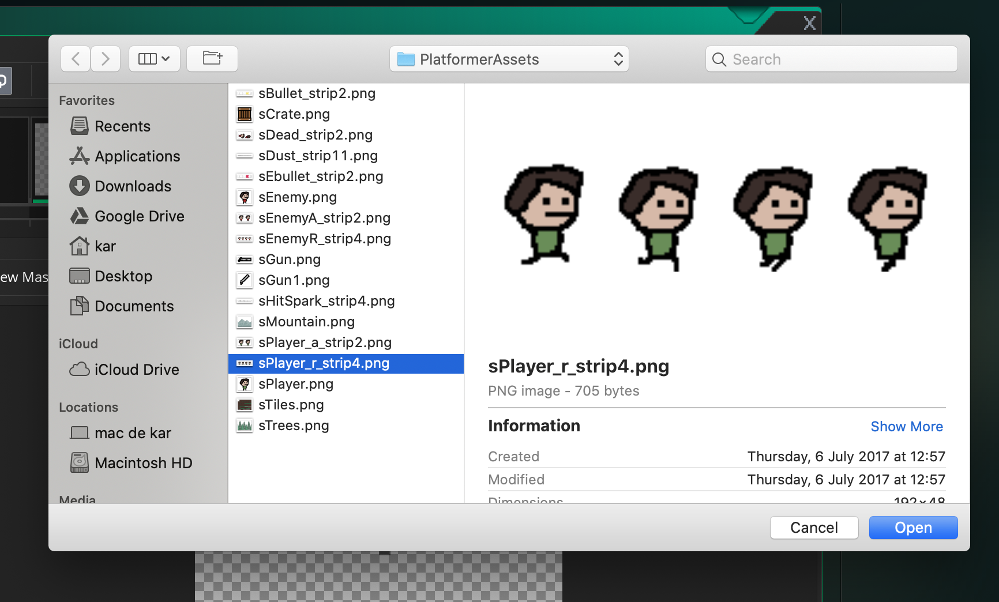
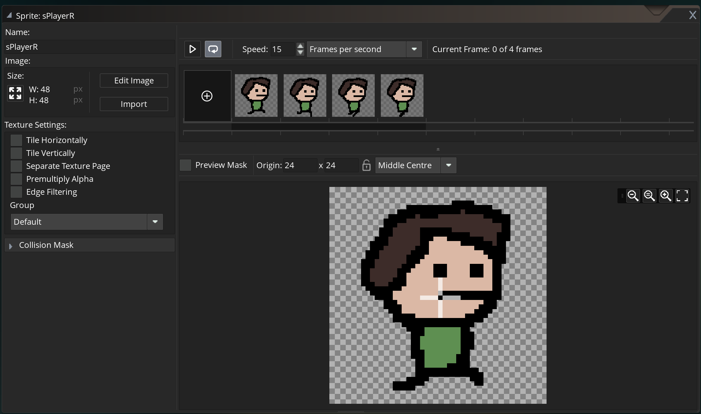
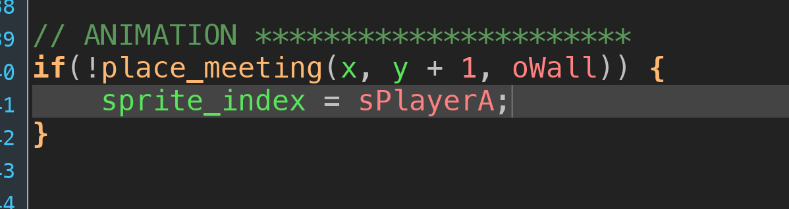
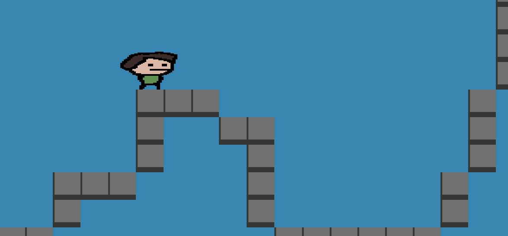

# Animer le joueur

## importer un `png`



## régler le masque de collision

Plutôt un masque plus petit que le sprite :



## Importer une image de plusieurs frame : `strip<nb>`



Ici on a `sPlayer_r_strip4.png`, le `strip4` indique de découper l'image en `4` frame :



Ce découpage est automatique.

## Définir le masque de collision pour l'objet


## Ajouter des animations

### Cela se passe dans `event step`

Tout ce qui apparaît en vert dans l'éditeur de code, correspond aux propriétés de l'objet.



`sprite_index` : le nom d'un sprite utilisé.

`image_speed` : coefficient multiplicateur du nombre d'image par seconde défini dans le sprite.

`image_index` : dans un sprite, `index` d'un frame (d'une image) en particulier.

Si le personnage ne touche pas le mur :

```c
if(!place_meeting(x, y + 1, oWall)) {

	// sprite index définie le sprite utilisé par l'objet
```

Alors l'image à utiliser est `sPlayerA` (`Aiborne`)

```c
	sprite_index = sPlayerA;
```

Il n'y a pas d'animation : `image_speed = 0`

```c
	// c'est un coefficient multiplicateur de la vitesse d'animation par défaut
	image_speed = 0;

	if(sign(vsp) > 0) {
		// image_index => c'est l'index de chaque frame
		image_index = 1;
	} else {
		image_index = 0;
	}
```

Sinon la vitesse d'animation est de 1 et le sprite est `sPlayer` à l'arrêt (`horizontal speed == 0`) et `sPlayerR` (`Run`) en mouvement.

```c
} else {
	image_speed = 1;

	if (hsp == 0) sprite_index = sPlayer; else sprite_index = sPlayerR;
}
```

## Gérer la droite et la gauche

### `image_xscale`

```c
// déformation de l'échelle sur x
image_xscale = 2;
```



Pour tourner le sprite dans l'autre direction on utilise `image_xscale = -1`.

```c
// gestion du sens du personnage
if (hsp != 0) image_xscale = sign(hsp);
```
