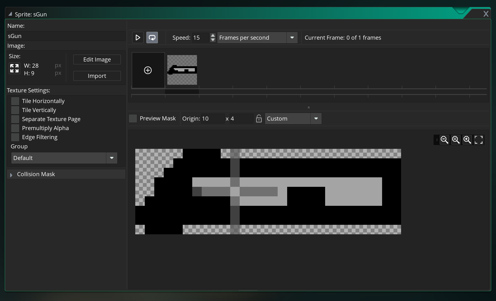
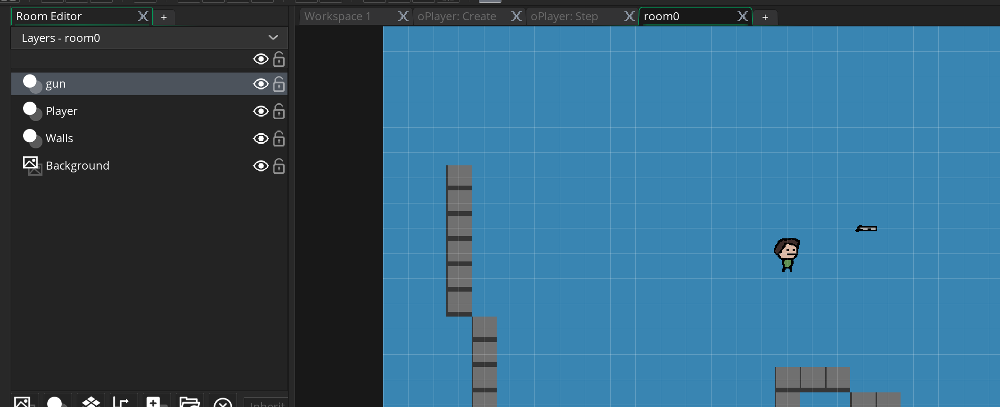
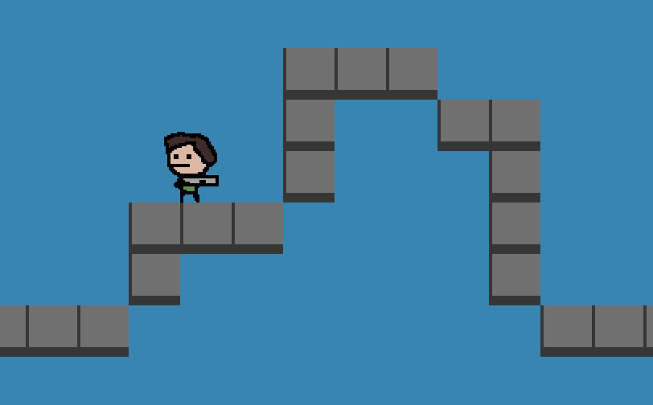
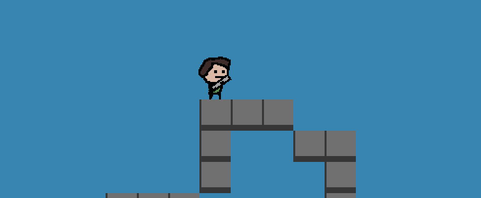
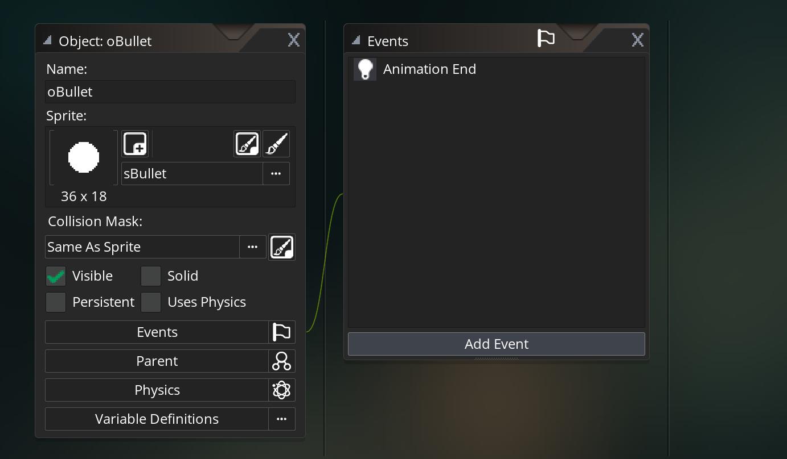

# 03 Tire et recul

On crée un sprite `sGun`.

On modifie légèrement son centre :



On crée un objet `oGun` et un calque dans la `room` qu'on nomme `gun`.



## event `BeginStep`

se déroule avant chaque `step event`.

le fait d'avoir un décalage d'un frame avec le personnage provoque une sensation de poids de l'arme.

### Positionnement de l'arme

```c
x = oPlayer.x;
y = oPlayer.y + 10; // léger décalage vers le bas
```



## Dans `event step`

### Rotation de l'arme

```c
// rotation de l'arme
image_angle = point_direction(x, y, mouse_x, mouse_y);
```

`point_direction` prend les coordonnées de deux point et renvoie l'angle formé.



### Ajouter des touches de contrôle

`||` ou `or`

```c
// player input
key_right = keyboard_check(vk_right) || keyboard_check(ord("D"));
key_left = keyboard_check(vk_left) or keyboard_check(ord("A"));
key_jump = keyboard_check_pressed(vk_up) || keyboard_check_pressed(ord("S"));
```

Attention c'est pour un clavier `qwerty`.

`ord` renvoie le code du caractère sur le clavier.

## Création de `sBullet`


### 3 phases

1. création du sprite `sBullet` (vérifier qu'il est bien en 60 fps)
2. création de l'objet `oBullet`
3. création d'un layer (instance) `Bullet`

### On ajoute un `event` à `other/animationend` :



```c
image_speed = 0;
image_index = 1;
```

On met la vitesse d'animation à zéro et sur l'image 2 (l'image 1 étant une sorte de flash).

image 1 => `image_index = 0`

image 2 => `image_index = 1`

### `event post-draw`

Cet événement intervient quand tous les éléments ont été redessinés.

Cela permet de voire la balle toucher le mur avant de disparaître :

```c
if (place_meeting(x, y, oWall)) instance_destroy();
```
