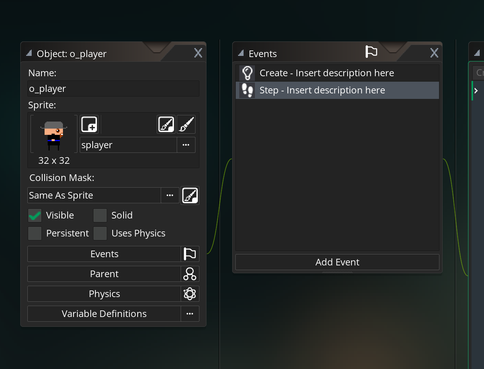

# 01 Introduction

## Player structure

1. Get Input
2. Calculate Movements
3. Apply Movements
4. Apply Animation

## Ajout d'un `event step`



`keyboard_check()` capture la touche tapée.

### Ouvrir la documentation souris dessus + `f1`.

```js
// Get Input
var left = keyboard_check(vk_left);
var right = keyboard_check(vk_right);
var down = keyboard_check(vk_down);
var up = keyboard_check(vk_up);
```
