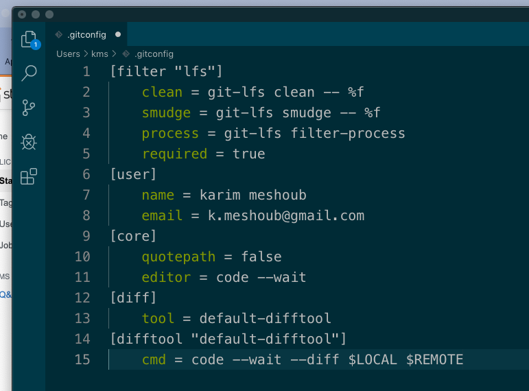

# 00 Configurer git

## Changer Vi par VsCode comme éditeur par défaut

**Vi** est l'éditeur par défaut de git.

La commande `git config --global core.editor <nom de l'éditeur>` modifie l'éditeur par défaut.

Pour **VsCode** :

```bash
git config --global core.editor "code --wait"
```

`--global` Pour tous les projets de l'utilisateur. 

`--wait` ne redonne la main au terminal que quand le fichier de **VsCode** est fermé.

`.gitconfig`

```bash
[filter "lfs"]
	clean = git-lfs clean -- %f
	smudge = git-lfs smudge -- %f
	process = git-lfs filter-process
	required = true
[user]
	name = karim meshoub
	email = k.meshoub@gmail.com
[core]
	quotepath = false
	editor = code --wait
```

### Pour utiliser VsCode pour l'outil `diff` :

Ajouter à `.gitconfig` :

```bahs
[diff]
    tool = default-difftool
[difftool "default-difftool"]
    cmd = code --wait --diff $LOCAL $REMOTE
```



### Résumé trouvée sur stackoverflow :

https://stackoverflow.com/questions/30024353/how-to-use-visual-studio-code-as-default-editor-for-git

> This leverages the new `--diff` option you can pass to VS Code to compare two files side by side.
>
> To summarize, here are some examples of where you can use Git with VS Code:
>
> - `git rebase HEAD~3 -i` allows to interactive rebase using VS Code
> - `git commit` allows to use VS Code for the commit message
> - `git add -p` followed by `e` for interactive add
> - `git difftool <commit>^ <commit>` allows to use VS Code as diff editor for changes