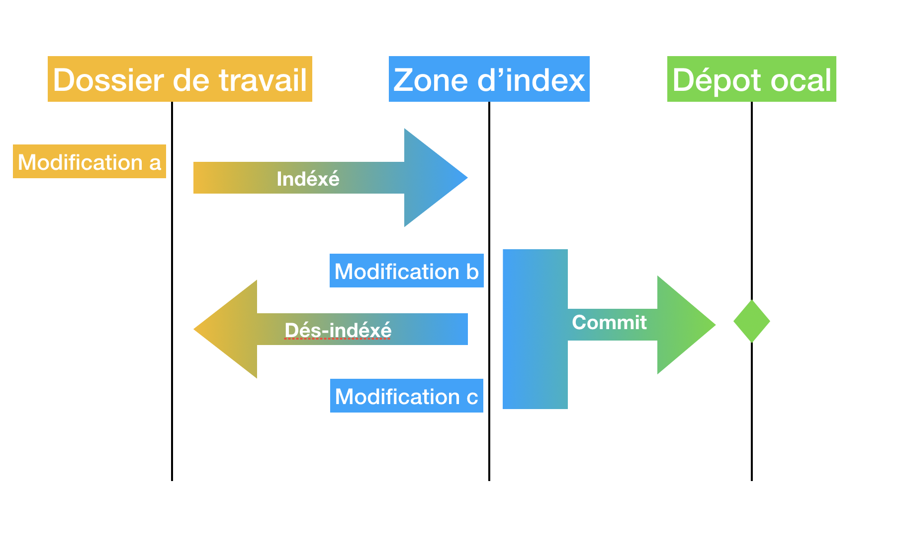
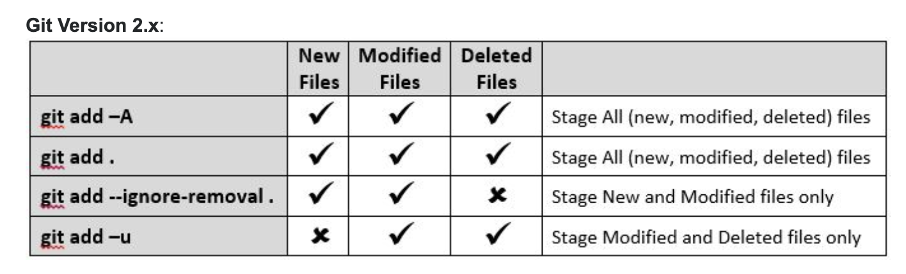
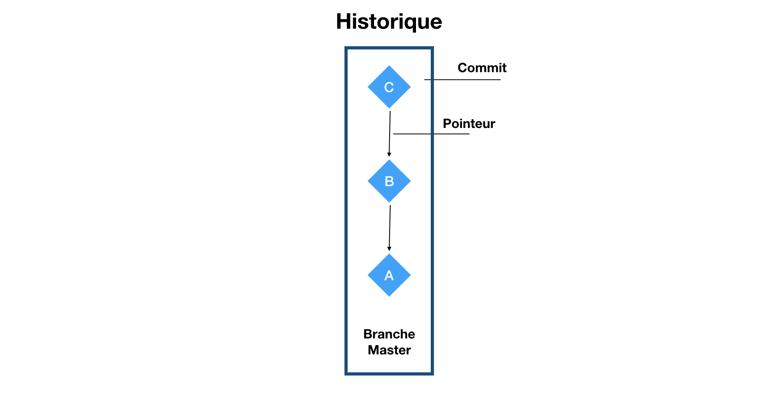
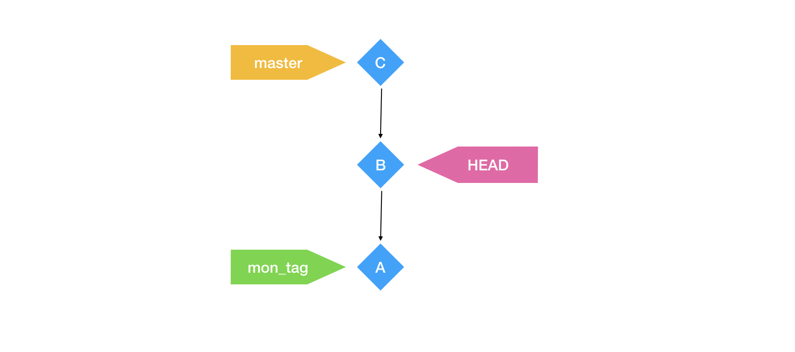

# 01 Les bases de git

## Créer un dépôt (repository)

Pour créer un dépôt on utilise la commande `git init`.

On obtient un dossier `.git` qui contiendra :

1. l'historique
2. La zone d'index
3. D'autres informations

## Indéxer ses modifications `git add`



Indéxé : `git add monfichier`

indéxé tous les fichiers du répertoire courant `git add .`

`git add *` indexe (stage) tous les fichiers sauf ceux commençant par un point

`git add -A` (all) indexe tous plus ceux détruit

`git add -u` (update)  tous sauf les nouveaux fichiers

#### 

## Désindéxer un fichier `git reset monfichier`

Enlève `monfichier` de la zone d'index.

```bash
git reset .

git status
On branch master

No commits yet

Untracked files:
  (use "git add <file>..." to include in what will be committed)

	.gitignore
	index.html

nothing added to commit but untracked files present (use "git add" to track)
```

`git reset .` inverse la commande `git add .`

## Différence par rapport à la dernière version

## `git diff monfichier` ou juste `git diff`

git travail par ligne

différence entre le répertoire de travail et l'index.

### Après un `git add`

Pour voire les différences entre la zone d'index et le dernier commit : `git diff --cached`

## Une branche

Une branche est l'ensemble chronologique des commits.

## Historique



### Un commit

- Le SHA-1 40 caractères identifiant le commit
- Les modifications
- Le commentaire
- L'auteur
- La date
- La liste des SHA-1 parent(s)

## Les tags

Les tags sont des intitulés de pointeur.

### Deux tags particuliers

`master` qui est le dernier commit de la branche master.

`HEAD` qui représente l'endroit où on se trouve.

`mon_custom_tag` reste attaché à un commit.



## `git log`

Liste les commit.

`git log -n 3` liste les trois dernier commit.

## `git show 257f25c0c4...`

Montre les modifications d'un commit

## `git checkout 257f25c0c4...`

Naviguer dans le commit.

Déplace le tag `HEAD`.

## `git checkout master`

Permet de revenir là où on en était.

## Attribuer un `tag`

1. Aller sur le commit en question avec `git checkout [sha-1]`
2. Donner un nom au tag `git tag nom_du_tag`

### Méthode sans `checkout`

```bash
git tag -a label_tag 9fceb02 -m "Message here"
```

`-a` : annotation -> `"message here"`

`-m` : message

Ou plus simple sans annotation :

```bash
git tag my_tag 0a4bd68cdff96c2c9273d8bab8b05a3c3a69c7b1
```

### Méthode avec `checkout` pour conserver la date du tag

```bash
# se rendre sur le commit
git checkout <SHA-1>
```

```bash
# récupérer la date du HEAD
git show --format=%aD | head -1
Fri, 26 Jul 2019 10:51:15 +0200
```

```bash
# modifier la valeur de la variable d'environnement
GIT_COMMITER_DATE="Fri, 26 Jul 2019 10:51:15 +0200"
```

```bash
# ajouter le tag et revenir sur master
git tag carotte

git checkout master
```


### Éffacer un tag

`git tag --delete mon_tag`

### Ajouter un message

`git tag nom_du_tag -m"mon message custom"`

### Lister les tags

`git tag`

