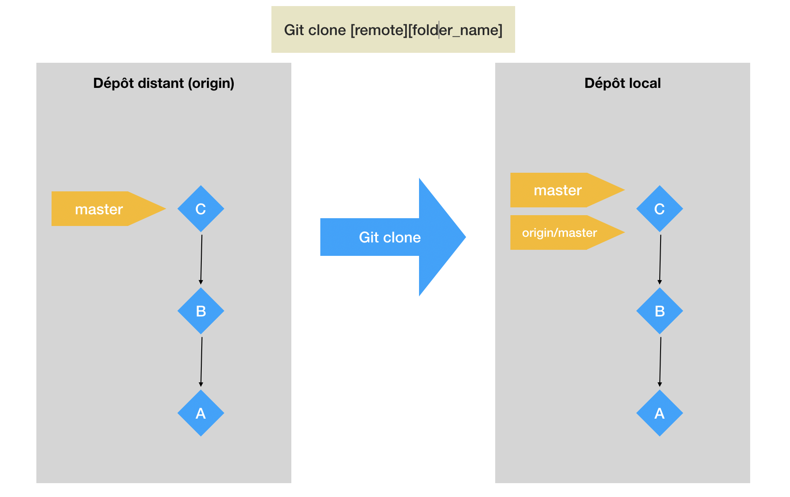
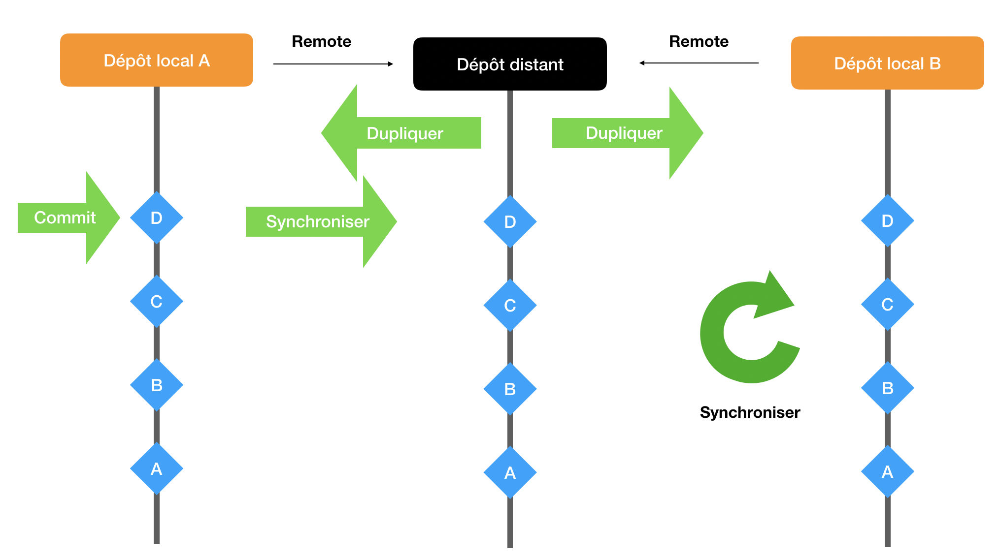
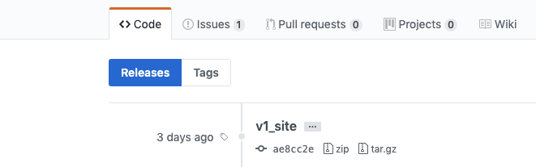
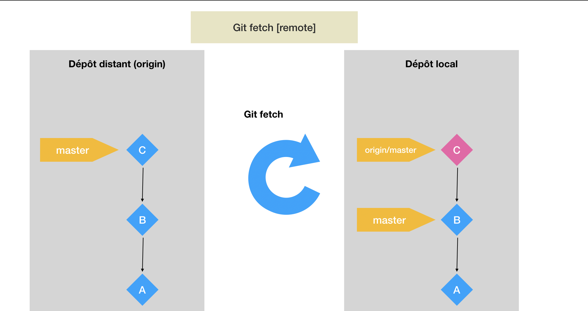
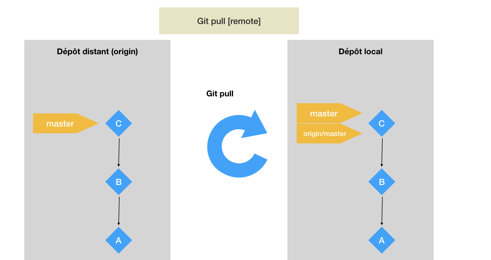

# 02 Un dépôt distant

## `git clone`

Pour clôner un dépôt distant (remote repository) on utilise la commande : 

####  `git clone [remote] [folder_name]` 

`remote` : l'adresse du repository

`Folder_name` : le dossier d'arrivée du clonage

```bash
git clone https://github.com/hukar/udemy-git-two.git depot-distant
```




## Configuration pour le dépôt local

#### `git config user.name "clone"`

Si on veut une configuration pour tous les dépôt `--global`

## Les `remote`

Pour afficher les `remote` :

#### `git remote -v`

```bash
git remote -v

origin  https://github.com/hukar/udemy-git-two.git (fetch)
origin  https://github.com/hukar/udemy-git-two.git (push)
```

Deux lignes :

`fetch` : récupérer les modifications du serveur vers le  dépôt local

`push` : envoyer les modifications locales sur le serveur distant

### Voire plus de détails d'un `remote`

#### `git remote show [nom_remote]`

```bash
git remote show origin

* remote origin
  Fetch URL: https://github.com/hukar/udemy-git-two.git
  Push  URL: https://github.com/hukar/udemy-git-two.git
  HEAD branch: master
  Remote branch:
    master tracked
  Local branch configured for 'git pull':
    master merges with remote master
  Local ref configured for 'git push':
    master pushes to master (up to date)
```


### Synchroniser deux dépôts locaux avec le `remote`



### Ajouter un dépôt distant à un dépôt existant

Dans le dépôt local :

#### `git remote add [remote_name] [remote_address]`

```bash
git remote add origin https://github.com/hukar/udemy-git-two.git

git remote -v
origin  https://github.com/hukar/udemy-git-two.git (fetch)
origin  https://github.com/hukar/udemy-git-two.git (push)
```

On retrouve ces informations dans le fichier `.git/config` :

```bash
[core]
	...
[remote "origin"]
	url = https://github.com/hukar/udemy-git-two.git
	fetch = +refs/heads/*:refs/remotes/origin/*
```

## Pousser les modifications vers un serveur

#### `git push -u [remote] [branch]`

Seulement possible si le dépôt distant est complétement vide (pas de readme).

```bash
git push -u origin master
```

Sinon il faut d'abord faire un `git pull` avec l'option `--rebase`

```bash
git pull origin master --rebase
```

`--rebase` permet de mettre deux branche sur la même ligne (mais différement de merge ??)

## tag = release

Le `push` n'envoie pas les tag (nommé release sur github).

On doit le faire explicitement avec `git push` :

```bash
git push origin v1_site
```



Maintenant le tag (release) est visible sur GitHub.

#### `git push origin nom_tag`

Pour tous les tags d'un coup :

#### `git push origin --tags`

`origin` le remote peut être implicite : `git push --tags`


## Récupérer les modifications du serveur distant

#### `git fetch [remote]`

Pour ramener le commit du dépôt distant :



#### `git pull [remote] [branch]`

Pour remettre `master` sur `origin/master`



On peut faire directement `git pull` qui contient la commande `git fetch`

