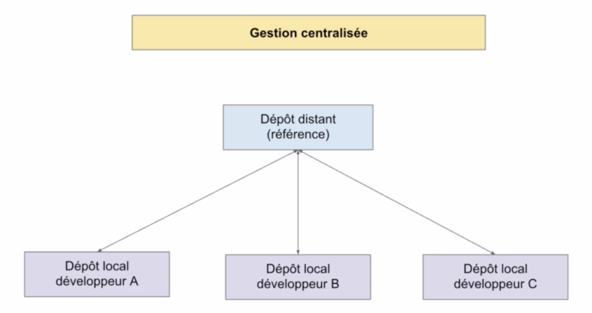
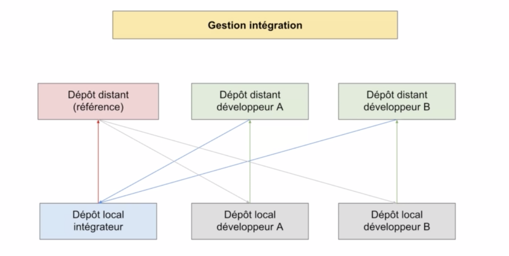
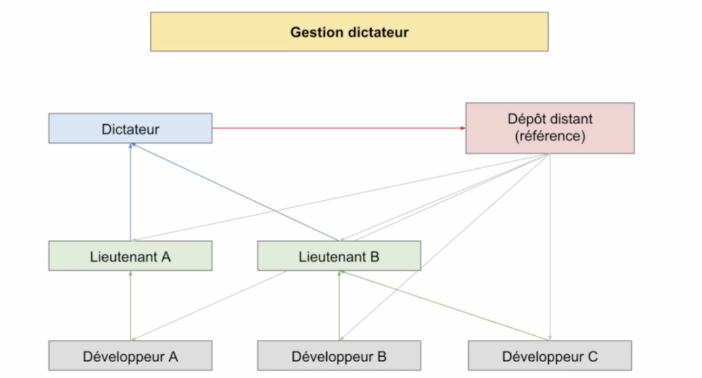

# 03 Travailler en équipe

## Gestion centralisée

Petites équipes

La plus simple et commune



## Gestion en intégration

Pour des équipes moyenne

C'est le système de pull-request de Github



C'est l'intégrateur qui valide et pousse les modifications sur le dépôt référence.

Les développeur doivent se re-synchroniser sur le dépôt après chaque `push` de l'intégrateur

## Gestion dictateur

Pour de grandes équipes.

On ajoute des lieutenant chargés d'une zone du code avant l'intégrateur (ici dictateur)



## Maitriser les modifications `git blame [file]`

### résumé de ce qu'on a déjà

#### `git diff`

Montre les différences de ce qui n'est pas encore dans la zone d'index :

```bash
git diff
diff --git a/index.html b/index.html
index f31c2e7..331ead4 100644
--- a/index.html
+++ b/index.html
@@ -32,5 +32,10 @@
             <div class="medal"></div>
             <div class="medal"></div>
     </div>
+    <div>
+        <p>
+            git show, log, diff, blame
+        </p>
+    </div>
 </body>
 </html>
\ No newline at end of file
```

#### `git diff --cached`

Montree les différence avec ce qui est dans la zone d'index :

```bash
git diff --cached
diff --git a/style.css b/style.css
index 76a5218..dee0123 100644
--- a/style.css
+++ b/style.css
@@ -32,4 +32,10 @@ p{
     background-color: orangered;
     padding: 12px;
     border-radius: 50%;
+}
+div {
+    border: solid 1px red;
+    background-color: #fbd;
+    color: #330000;
+    font-family: Verdana, Geneva, Tahoma, sans-serif;
 }
\ No newline at end of file
```

#### `git diff HEAD`

Montre toutes les différences :

```bash
git diff HEAD
diff --git a/index.html b/index.html
index f31c2e7..331ead4 100644
--- a/index.html
+++ b/index.html
@@ -32,5 +32,10 @@
             <div class="medal"></div>
             <div class="medal"></div>
     </div>
+    <div>
+        <p>
+            git show, log, diff, blame
+        </p>
+    </div>
 </body>
 </html>
\ No newline at end of file
diff --git a/style.css b/style.css
index 76a5218..dee0123 100644
--- a/style.css
+++ b/style.css
@@ -32,4 +32,10 @@ p{
     background-color: orangered;
     padding: 12px;
     border-radius: 50%;
+}
+div {
+    border: solid 1px red;
+    background-color: #fbd;
+    color: #330000;
+    font-family: Verdana, Geneva, Tahoma, sans-serif;
 }
\ No newline at end of file
```

#### `git log`

Montre tous les commit :

```bash
git log
commit d3e8be12a8e841b1e59b8baae5e684dac8ae9926 (HEAD -> master, tag: v3_site, origin/master, backup/master)
Author: karim meshoub <k.meshoub@gamil.com>
Date:   Thu Jul 4 15:58:24 2019 +0200

    #2: ajout recompense

commit 8d6f6e2d9e5ddb68f4b44ca26c5e87e22296c82a
Author: clone <k.meshoub@gamil.com>
Date:   Thu Jul 4 15:27:26 2019 +0200

    #1: ajout de locacité au readme
    
...
```

#### `git log -p`

Montre les commit et les différences pour chaque commit (historique de toutes les différences) :

```bash
git log -p
commit d3e8be12a8e841b1e59b8baae5e684dac8ae9926 (HEAD -> master, tag: v3_site, origin/master, backup/master)
Author: karim meshoub <k.meshoub@gamil.com>
Date:   Thu Jul 4 15:58:24 2019 +0200

    #2: ajout recompense

diff --git a/index.html b/index.html
index df5478b..f31c2e7 100644
--- a/index.html
+++ b/index.html
@@ -22,5 +22,15 @@
 
         <script src="https://gist.github.com/hukar/6f083f163e1074e03772bb520f0543e3.js"></script>
     </div>
+    <div>
+        <h2>
+            mes récompenses
+        </h2>
+            <div class="medal"></div>
...
```

#### `git show [commit] : [file]`

Montre le commit et les différences pour un SHA-1 donné :

```bash
git show 98316a39d87b213636e61f8b8fd9406d25978fd3
commit 98316a39d87b213636e61f8b8fd9406d25978fd3
Author: karim meshoub <k.meshoub@gamil.com>
Date:   Wed Jul 3 11:49:31 2019 +0200

    ajout d'un gist

diff --git a/index.html b/index.html
index 95aa6bc..df5478b 100644
--- a/index.html
+++ b/index.html
@@ -18,5 +18,9 @@
     <p class="pinkies">
         Lorem ipsum dolor sit amet, consectetur adipisicing elit. Facilis expedita sint cumque, quos itaque impedit ipsa! Ratione, minus sequi non blanditiis facilis animi deserunt sint quo et?
     </p>
+    <div class="script">
+
...
```

#### `git show index.html`

Seulement pour un fichier

`git show e3bebdaf0a6e5c537d17fb79a3b029ab411d3fab style.css`

Pour un commit et un fichier particulier

### `git blame index.html`

Montre les changements ligne par ligne :

```bash
git blame index.html
80e6b5dd (karim meshoub     2019-07-01 10:22:59 +0200  1) <!DOCTYPE html>
80e6b5dd (karim meshoub     2019-07-01 10:22:59 +0200  2) <html lang="en">
80e6b5dd (karim meshoub     2019-07-01 10:22:59 +0200  3) <head>
80e6b5dd (karim meshoub     2019-07-01 10:22:59 +0200  4)     <meta charset="UTF-8">
80e6b5dd (karim meshoub     2019-07-01 10:22:59 +0200  5)     <meta name="viewport" content="width=device-width, initial-scale=1.0">
80e6b5dd (karim meshoub     2019-07-01 10:22:59 +0200  6)     <meta http-equiv="X-UA-Compatible" content="ie=edge">
80e6b5dd (karim meshoub     2019-07-01 10:22:59 +0200  7)     <title>Document</title>
...
00000000 (Not Committed Yet 2019-07-08 14:48:26 +0200 37)             git show, log, diff, blame
00000000 (Not Committed Yet 2019-07-08 14:48:26 +0200 38)         </p>
00000000 (Not Committed Yet 2019-07-08 14:48:26 +0200 39)     </div>
80e6b5dd (karim meshoub     2019-07-01 10:22:59 +0200 40) </body>
80e6b5dd (karim meshoub     2019-07-01 10:22:59 +0200 41) </html>
```

Avec le SHA-1 000000 ce sont les lignes modifiées mais pas encore commitées.

#### `git blame -L 10,20 index.html`

`-L a,b` n'affiche que les lignes entre a et b (a et b inclus)

#### `git blame -L 12,+3 index.html`

Afficher trois lignes à partir de la ligne 12 :

```bash
git blame -L 12,+3 index.html
34fd4fe6 (karim meshoub 2019-07-01 10:30:55 +0200 12)     <p id="top-banner">
80e6b5dd (karim meshoub 2019-07-01 10:22:59 +0200 13)         Bienvenue dans cette formation Git
80e6b5dd (karim meshoub 2019-07-01 10:22:59 +0200 14)     </p>
```

