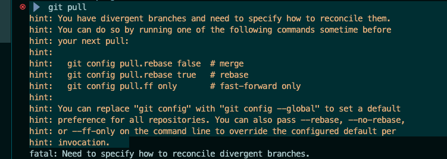

# D `Divergent branch`

## Message d'erreur après un `git pull`




## Solution

Par défaut on exécute `git pull --no-rebase`

En essayant avec `--ff-only`:

```bash
 >  git pull --ff-only
fatal: Not possible to fast-forward, aborting.
```

Donc il me reste `--rebase`

```bash
> git pull --rebase
Successfully rebased and updated refs/heads/master.
```

Puis après un petit `git push` et tout est revenu à la normal.