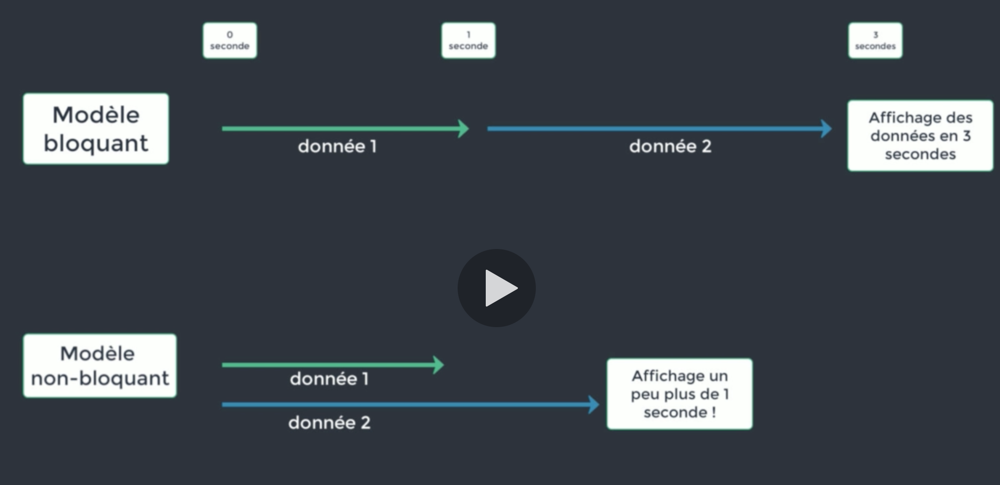
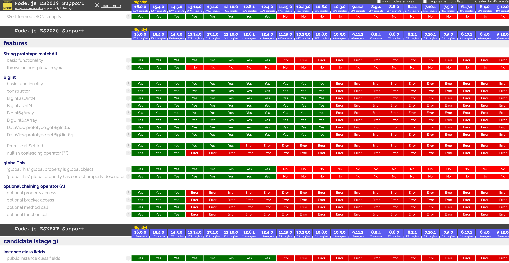
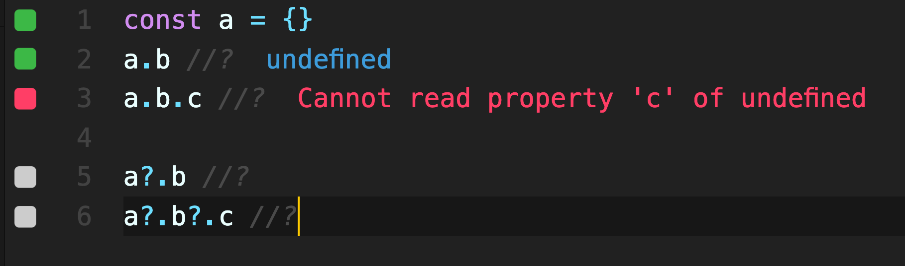
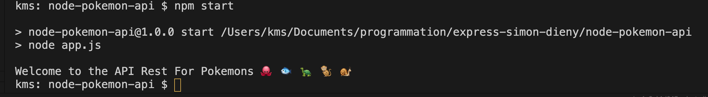
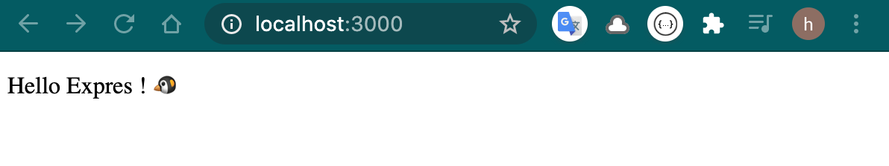

# 01 `Nodejs`

- moteur `V8`

Fondateur Ryan Dahl

Vitesse de `V8` => compilation `just in time` convertit directement en code machine sans passer par un interprète. 

Avec `V8` absence de code intermédiaire.

Les autres navigateurs se sont alignés depuis.

Architecture non-bloquante.

Fonctionnement basé sur les événements.




## Voire l'implémentation des différentes versions d'Ecmascript

### `node.green`

https://node.green/



### `??` operator

```js
null ?? 42 //? 42
undefined ?? 42 //? 42

false ?? 'coco' //? false

NaN ?? 'coco' //? NaN

'' ?? 'something' //? ''
```

Cet opérateur est très intéressant lorsqu'on souhaite voire si un champ est `null` ou vide `''` ou à `false`.

Seul `null` et `undefined` renvoient la deuxième opérande.

## Operator `?`



Permet d'éviter la levé d'erreur en cas de propriété pas encore définie `undefined`.


## `package.json`

```bash
npm init
```

```json
{
    "name": "node-pokemon-api",
    "version": "1.0.0",
    "description": "An API Rest to retrieve Pokemons",
    "main": "app.js",
    "scripts": {
        "start": "node app.js"
    },
    "author": "Hukar The Awesome",
    "license": "ISC"
}
```



`nmp start` est un alias de `npm run start`


## Installer `Express Js`

```bash
npm i express
```

`package.json` dépendances du projet

`package-lock.json` dépendances des dépendances du projet


## Hello `Express`

`End Point` chargé d'afficher le message.

```js
const express = require('express')
const PORT = 3000

console.log('Welcome to the API Rest For Pokemons 🐙 🐟 🐢 🐒 🐌')

const app = express()

app.get('/', (req, res) => res.send('Hello Expres ! 🐧'))

app.listen(PORT, console.log.call(null, `App is running on port ${PORT}`))
```



## `nodemon`

```bash
npm i nodemon -D
```

```json
// package.json

// ...
    "dependencies": {
        "express": "^4.17.1"
    },
    "devDependencies": {
        "nodemon": "^2.0.7"
    }
}
```

On modifie le `script` de démarrage :

```json
"scripts": {
        "start": "nodemon app.js"
    },
```

