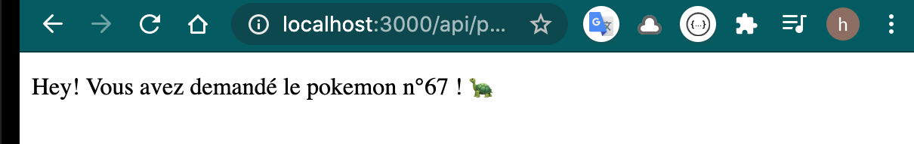

# 02 Les routes

## `app.verbHTTP(chemin, function(request, response) { ... })`

Cet description est celle d'un `end point` dans `Express`.

```js
app.get('/users', (req,res) = { ... })
```

```js
app.get('/api/pokemons/1', (req, res) => res.send('hello, Bulbizar !!'))
```


## Passage de paramètres

### `req.params.id`

```js
app.get('/api/pokemons/:id', (req, res) => {
    res.send(`Hey! Vous avez demandé le pokemon n°${req.params.id} ! 🐢`)
})
```



## Passages de plusieurs paramètres

### `app.get('/api/pokemons/:id/:type', ... )`

```js
app.get('/api/pokemons/:id/:type', (req, res) => {
    const id = req.params.id
    const type = req.params.type
    res.send(`Hey! Vous avez demandé le pokemon n°${id} de type ${type} ! 🐢`)
})
```

```
http://localhost:3000/api/pokemons/67/aqua
```


Les paramètres sont **toujours** des chaînes de caractères.

Donc `req.params.id` est un `string`.


## Mock-DB

On utilise un fichier plat pour stocker les `pokemons` :

`mock-pokemons.js`

On le charge dans le code comme ça :

```js
const pokemons = require('./mock-pokemon')
```

le fichier ayant lui-même `module.exports = pokemons` à la fin, `pokemons` étant un tableau d'objets `pokemon` :

```js
{
    id: 12,        
    name: 'Groupix',        
    hp: 17,        
    cp: 8,        
    picture: 'https://assets.pokemon.com/assets/cms2/img/pokedex/detail/037.png',        
    types: ['Feu'],        
    created: new Date(),        
 },	
```

```js
app.get('/api/pokemons/:id/', (req, res) => {
    const id = req.params.id
    const pokemon = pokemons.find((pokemon) => pokemon.id == id)
    if (pokemon) {
        res.send(
            `Hey! Vous avez demandé le pokemon n°${id} de nom ${pokemon.name} ! 🐢`
        )
    } else {
        res.status(404)
        res.send('pokemon non repertorié')
    }
})
```

Le `if` permet de gérer les cas où l'`id` demandé n'existe pas.

`res.status(404)` permet d'envoyer un code de status ici `404 : Not Found`.

