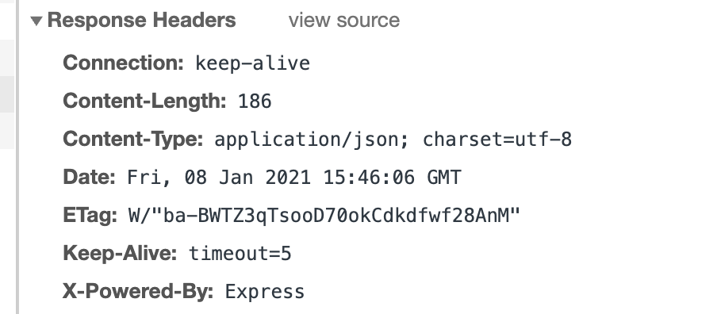

# 03 renvoyer du `Json`

## Réponses `HTTP`


Le type `MIME` : `application/json` (pour une page web c'est `text/html`)

## `res.json`

Transforme la réponse en `json` valide et ajoute le type `MIME` `application/json` :



```js
app.get('/api/pokemons/:id/', (req, res) => {
    const id = parseInt(req.params.id)
    const pokemon = pokemons.find((pokemon) => pokemon.id === id)
    if (pokemon) {
        res.json(pokemon)
    } else {
        res.status(404)
        res.send('pokemon non repertorié')
    }
})
```


## `helpers.js`

```js
const success = (message, data) => {
  return {
    message: message,
    data: data,
  }
}

exports.success
```


