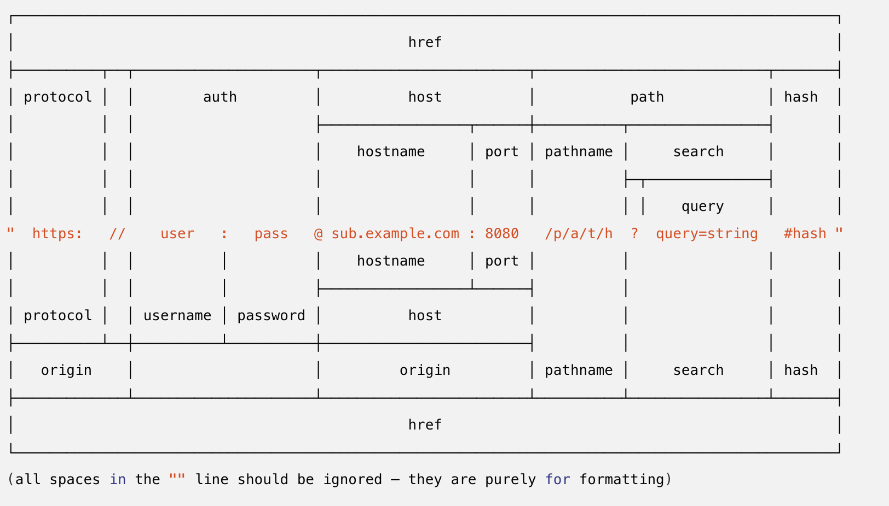

# 18 `router`

## Voire les code de status

### `http.STATUS_CODES`

```js
> http.STATUS_CODES
{
  '100': 'Continue',
  '101': 'Switching Protocols',
  '102': 'Processing',
  '103': 'Early Hints',
  '200': 'OK',
  '201': 'Created',
  '202': 'Accepted',
  '203': 'Non-Authoritative Information',
  '204': 'No Content',
  '205': 'Reset Content',
  '206': 'Partial Content',
  '207': 'Multi-Status',
  '208': 'Already Reported',
  '226': 'IM Used',
  '300': 'Multiple Choices',
  '301': 'Moved Permanently',
  '302': 'Found',
  '303': 'See Other',
  '304': 'Not Modified',
  '305': 'Use Proxy',
  '307': 'Temporary Redirect',
  '308': 'Permanent Redirect',
  '400': 'Bad Request',
  '401': 'Unauthorized',
  '402': 'Payment Required',
  '403': 'Forbidden',
  '404': 'Not Found',
  '405': 'Method Not Allowed',
  '406': 'Not Acceptable',
  '407': 'Proxy Authentication Required',
  '408': 'Request Timeout',
  '409': 'Conflict',
  '410': 'Gone',
  '411': 'Length Required',
  '412': 'Precondition Failed',
  '413': 'Payload Too Large',
  '414': 'URI Too Long',
  '415': 'Unsupported Media Type',
  '416': 'Range Not Satisfiable',
  '417': 'Expectation Failed',
  '418': "I'm a Teapot",
  '421': 'Misdirected Request',
  '422': 'Unprocessable Entity',
  '423': 'Locked',
  '424': 'Failed Dependency',
  '425': 'Unordered Collection',
  '426': 'Upgrade Required',
  '428': 'Precondition Required',
  '429': 'Too Many Requests',
  '431': 'Request Header Fields Too Large',
  '451': 'Unavailable For Legal Reasons',
  '500': 'Internal Server Error',
  '501': 'Not Implemented',
  '502': 'Bad Gateway',
  '503': 'Service Unavailable',
  '504': 'Gateway Timeout',
  '505': 'HTTP Version Not Supported',
  '506': 'Variant Also Negotiates',
  '507': 'Insufficient Storage',
  '508': 'Loop Detected',
  '509': 'Bandwidth Limit Exceeded',
  '510': 'Not Extended',
  '511': 'Network Authentication Required'
}
```

## redirection

On peut enregistrer une redirection avec `res.writeHead`

```js
case "/":
            res.writeHead(301, { Location: "/secret" });
            break;
```

Tout le routeur :

```js
const server = require("http").createServer();
const fs = require("fs");

server.on("request", (req, res) => {
  const url = req.url;

  console.log(url);

  const person = {
    name: "tony",
    age: 42,
    hobbies: ["tennis", "golf", "guns"],
  };

  switch (url) {
    case "/api":
      res.writeHead(200, { "Content-Type": "application/json" });
      res.write(JSON.stringify(person));
      break;
    case "/home":
    case "/about":
    case "/secret":
      res.writeHead(200, { "Content-Type": "text/html" });
      res.write(fs.readFileSync(`.${url}.html`));
      break;
    case "/":
      res.writeHead(301, { Location: "/secret" });
      break;
    default:
      res.writeHead(404, { "Content-Type": "text/plain" });
      res.write("404 Page Not Found\n");
      break;
  }
  res.end();
});

const PORT = process.env.NODE_PORT || 8000;
server.listen(PORT, () => console.log(`server listenning on ${PORT}`));
```

## Travailler avec les `url`

Le module `URL` permet de travailler avec les `path `:



### `url.parse`

```js
> url.parse("http://www.titi.com/titi/toto?name=titi&age=67#search")
Url {
  protocol: 'http:',
  slashes: true,
  auth: null,
  host: 'www.titi.com',
  port: null,
  hostname: 'www.titi.com',
  hash: '#search',
  search: '?name=titi&age=67',
  query: 'name=titi&age=67',
  pathname: '/titi/toto',
  path: '/titi/toto?name=titi&age=67',
  href: 'http://www.titi.com/titi/toto?name=titi&age=67#search'
}
```

### parser aussi la `query string` : `url.parse(<url>, true)`

```js
> url.parse("http://www.titi.com/titi/toto?name=titi&age=67#search", true)
Url {
  protocol: 'http:',
  slashes: true,
  auth: null,
  host: 'www.titi.com',
  port: null,
  hostname: 'www.titi.com',
  hash: '#search',
  search: '?name=titi&age=67',
  query: [Object: null prototype] { name: 'titi', age: '67' },
  pathname: '/titi/toto',
  path: '/titi/toto?name=titi&age=67',
  href: 'http://www.titi.com/titi/toto?name=titi&age=67#search'
}
```

On obtient un objet : `query: [Object: null prototype] { name: 'titi', age: '67' },`.

On peut alors facilement avoir accès à un élément de la `query` :

```js
> url.parse("http://www.titi.com/titi/toto?name=titi&age=67#search", true).query.name
'titi'
```

## fonction inverse `url.format`

On donne un objet `URL` et on obtient une `url` valide.

```js
> url.format({
...   protocol: 'http:',
...   slashes: true,
...   auth: null,
...   host: 'www.titi.com',
...   port: null,
...   hostname: 'www.titi.com',
...   hash: '#search',
...   search: '?name=titi&age=67',
...   query: 'name=titi&age=67',
...   pathname: '/titi/toto',
...   path: '/titi/toto?name=titi&age=67'})

'http://www.titi.com/titi/toto?name=titi&age=67#search'
```

## Juste la query : `querystring`

```js
> querystring.stringify({ name: 'tintin milou', age: 56 })
'name=tintin%20milou&age=56'
```

`querystring.stringify` échape les caractères spéciaux par défaut.

### Et vice versa

```js
> querystring.parse('?name=gégé&specie=pork')
[Object: null prototype] { '?name': 'gégé', specie: 'pork' }
```
