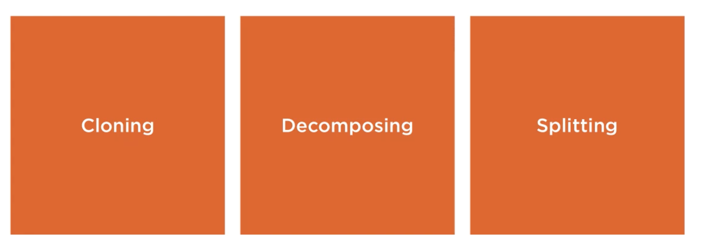
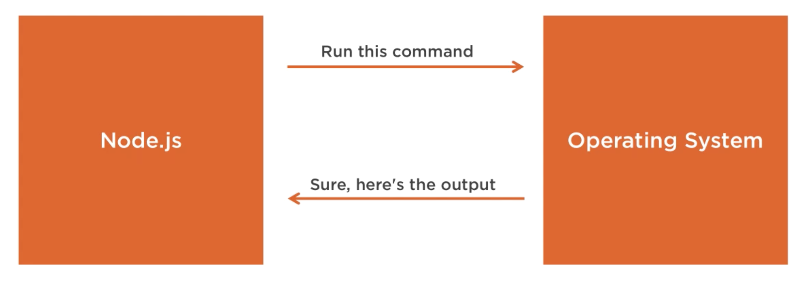
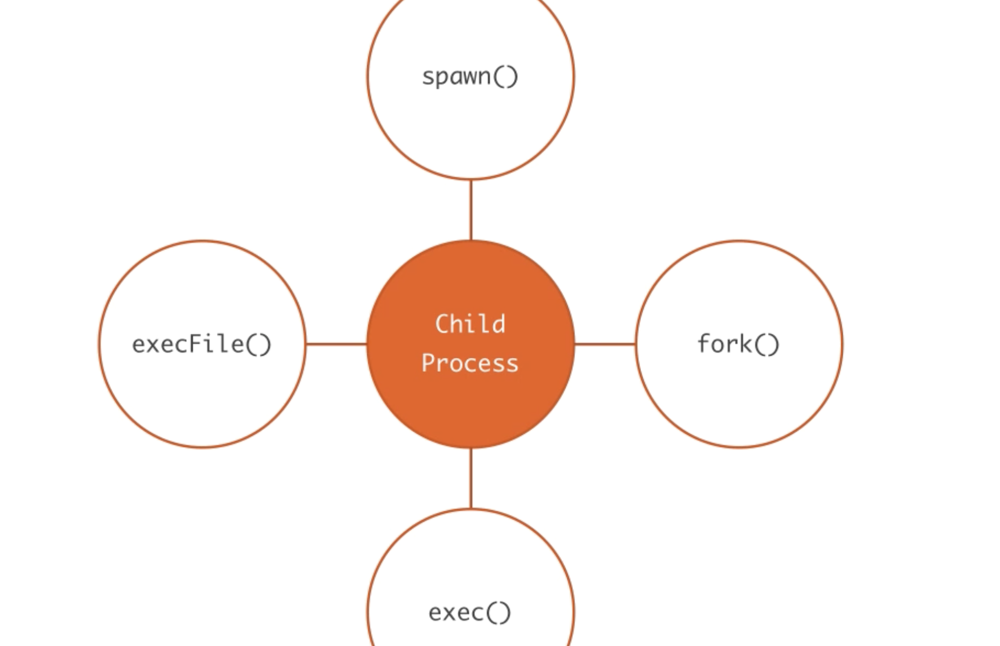

# 26 Child Process

## `scalability`

La stratégie étudié sera `cloning`

`decomposing` : micro services.

`splitting` : horizontal partitioning.

Le module `child process` utilise des `stream` pour communiquer avec l'OS.

Le module `child process` contient quatre fonctions :

#### `spawn` `fork` `exec` `execFile`.
