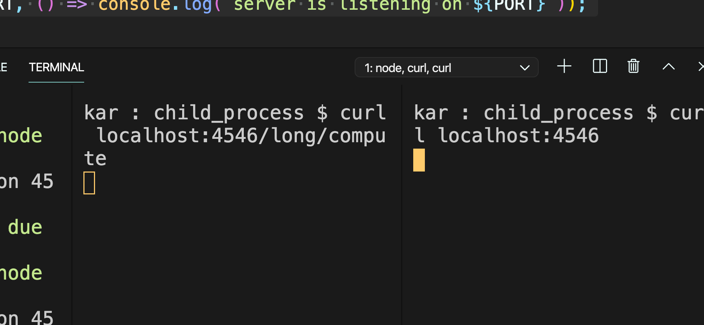
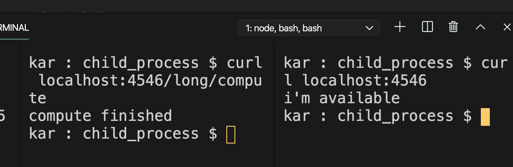
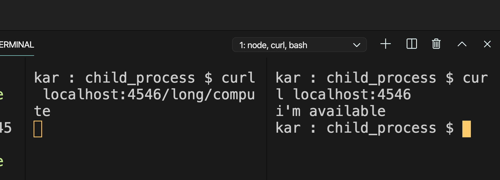
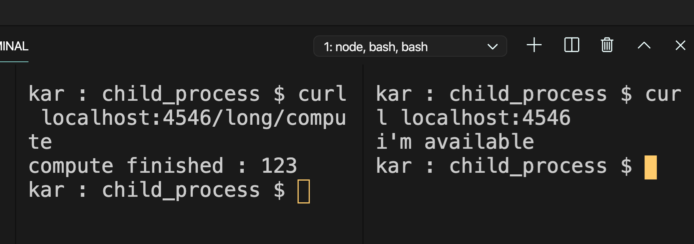

# 29 `fork`

`fork` fest un dérivé de `spawn` , il permet d'échanger des message entre le `parent` et le `child` grâce à la méthode `send` et une interface similaire à `EventEmitter` en passant par le processus général `process`.

`parent.js`

```js
const { fork } = require("child_process");

const forked = fork("child.js");

forked.send("hello koko");

forked.on("message", (msg) => {
  console.log(`message from child : ${msg}`);
});
```

`child.js`

```js
process.on("message", (msg) => {
  console.log(`message from parent : ${msg}`);
});

process.send("yo boy !!");
```

```bash
node parent.js
message from parent : hello koko
message from child : yo boy !!
```

### chez le `parent`

`const forked = fork("child.js")` crée un processus enfant.

`forked.send` permet d'envoyer des messages au processus enfant.

`forked.on("message", msg => {})` reçoit les messages du processus enfant.

### chez le `child`

On utilise `process`.

`process.send` pour envoyer.

`process.on` pour recevoir.

## Cas réel

Cas d'un traitement serveur très long :

```js
const server = require("http").createServer();

function longCompute() {
  for (let i = 0; i < 10e9; i++);
}

server.on("request", (req, res) => {
  if (req.url === "/long/compute") {
    res.writeHead(200, { "Content-Type": "text/plain" });
    longCompute();
    res.end("compute finished\n");
  }

  res.end("i'm available");
});

const PORT = process.env.NODE_PORT;

server.listen(PORT, () => console.log(`server is listening on ${PORT}`));
```

Deux personnes font des requêtes différentes, une sensée donner une réponse immédiate, l'autre sur `/long/compute` demandant un long calcul.



Comme le long calcul est demandé juste avant la réponse rapide, celle-ci est bloquée jusqu'à la fin du calcul.



### Utilisation de `fork` pour résoudre ce problème

`long.js`

```js
function longCompute() {
  for (let i = 0; i < 9 * 10e8; i++);
}

process.on("message", (msg) => {
  if (msg === "start") {
    longCompute();
    process.send(123);
  }
});
```

`server.js`

```js
const server = require("http").createServer();
const { fork } = require("child_process");

server.on("request", (req, res) => {
  if (req.url === "/long/compute") {
    const forked = fork("long.js");
    res.writeHead(200, { "Content-Type": "text/plain" });
    forked.send("start");
    forked.on("message", (msg) => {
      res.end(`compute finished : ${msg}\n`);
    });
  } else {
    res.end("i'm available\n");
  }
});

const PORT = process.env.NODE_PORT;

server.listen(PORT, () => console.log(`server is listening on ${PORT}`));
```

Maintenant le `else` est obligatoire pour isoler les deux `.end()`.



On voit que l'autre `url` n'est plus en attente et est servie tout de suite.

 
