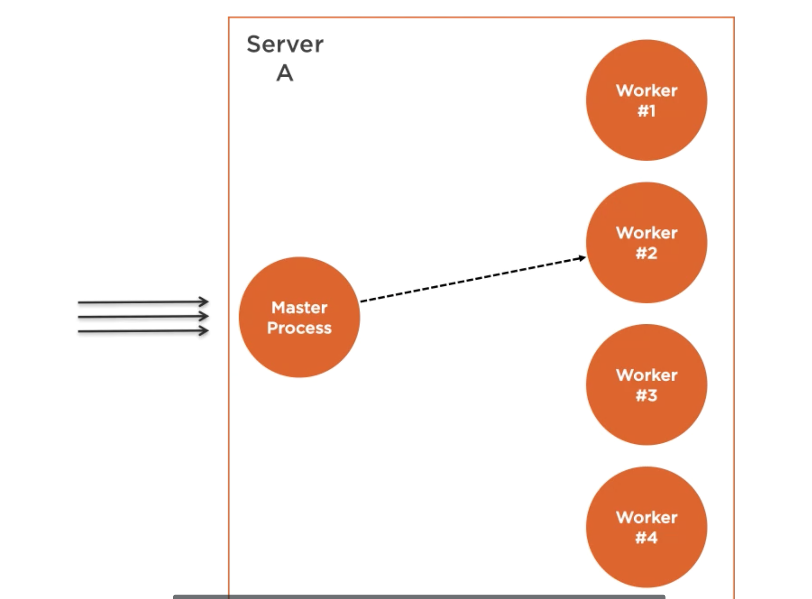

# 30 `scalability`

## Cluster module


Basé sur la fonction `fork`, cela permet de gérer un `load-balancing` avec autant de cœur que disponible.

Le `cluster module` implémente la stratégie du `cloning`, mais seulement sur une machine.

Un processus `master` dispatch les tâches vers des processus `worker`:



C'est un algorithme de `round-robin` (tourniquet) qui gère le dispatch.

`round-robin algorithm`: chaque processus passe un égal nombre de fois devant le `master`.

## Load-balancing un serveur `http`

Utilisation de l'utilitaire `ab`

### Du manuel `man ab`

> NOM
> `ab` - Outil de benchmarking du serveur HTTP Apache
>
> RÉSUMÉ
> `ab` est un outil de benchmarking de votre Apache Hypertext Transfer Protocol (HTTP). Il est conçu pour vous donner une idée de la façon dont votre installation actuelle d'Apache fonctionne. Cela vous montre notamment le nombre de requêtes par seconde que votre installation Apache est capable de servir.

`server.js`

```js
const server = require("http").createServer();

const pid = process.pid;

function longComputation() {
  for (let i = 0; 6 * i < 10e7; i++);
}

server.on("request", (req, res) => {
  longComputation(); // simulation occupation CPU
  res.end(`handled by process ${pid}`);
});

const PORT = process.env.NODE_PORT;
server.listen(PORT, () =>
  console.log(`server pid : ${pid} is listening on ${PORT}`)
);
```

```bash
ab -c100 -t20 http://localhost:4546/
```

```bash
Concurrency Level:      100
Time taken for tests:   20.084 seconds
Complete requests:      1556
Failed requests:        0
Total transferred:      158004 bytes
HTML transferred:       38304 bytes
Requests per second:    77.48 [#/sec] (mean)
Time per request:       1290.725 [ms] (mean)
Time per request:       12.907 [ms] (mean, across all concurrent requests)
Transfer rate:          7.68 [Kbytes/sec] received
```

#### `-c` concurence

Nombre de demandes multiples à effectuer en même temps. La valeur par défaut est de une demande à la fois.

#### `-t` délai

Nombre maximal de secondes à consacrer au benchmarking. Ce qui implique un `-n 50000` en interne. Utilisez ceci pour benchmarker le serveur dans un délai total déterminé. Par défaut, il n'y a pas de délai.

## Création d'un `cluster`

`cluster.js`

```js
const cluster = require("cluster");
const os = require("os");

if (cluster.isMaster) {
  const cpus = os.cpus().length;

  console.log(`Forking for ${cpus} cpus`);
  for (let i = 0; i < cpus; i++) {
    cluster.fork();
  }
} else {
  console.log(`cluster is a worker : ${cluster.isWorker}`);
  require("./server2");
}
```

```bash
node cluster.js
Forking for 12 cpus
server pid : 44124 is listening on 4546
server pid : 44126 is listening on 4546
server pid : 44125 is listening on 4546
server pid : 44128 is listening on 4546
# ...
```

Chaque processus a sa propre `pile d'exécution` et sa propre `event-loop`.

#### on re-benchmark avec `ab`

```bash
ab -c100 -t20 http://localhost:4546/
```

```bash
Concurrency Level:      100
Time taken for tests:   20.003 seconds
Complete requests:      8748
Failed requests:        0
Total transferred:      867240 bytes
HTML transferred:       210240 bytes
Requests per second:    437.34 [#/sec] (mean)
Time per request:       228.653 [ms] (mean)
Time per request:       2.287 [ms] (mean, across all concurrent requests)
Transfer rate:          42.34 [Kbytes/sec] received
```

`Requests per second:`

- sans `cluster` : 77.48
- avec `cluster` : 437.34

C'est 5 fois plus.
