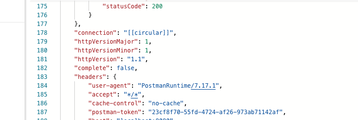

# 01 HTTP

On utilise `Postman` pour tester les requêtes :

```js
const http = require("http");

const server = http.createServer((req, res) => {
    res.writeHead(200, { "Content-Type": "application/json" });

    const getCircularReplacer = () => {
        const seen = new WeakSet();
        return (key, value) => {
            if (typeof value === "object" && value !== null) {
                if (seen.has(value)) {
                    return "[[circular]]";
                }
                seen.add(value);
            }
            return value;
        };
    };

    res.end(JSON.stringify(req, getCircularReplacer()));
    
});

const PORT = process.env.PORT || 8080;

server.listen(PORT, () => console.log(`server running on port:${PORT}`));
```



On voit le `user-agent` est `PostmanRuntime/7.17.1`.

## Configurer le header `res.setHeader`

```js
res.setHeader("Content-Type", "application/json");
res.setHeader("X-Powered-By", "nodejs");
res.setHeader("X-Hukar-Say", "aligato");
```

On peut créer des customs headers.

## Renvoyer du `json`

```js
const http = require("http");

const todos = [
    {
        userId: 1,
        id: 1,
        title: "delectus aut autem",
        completed: false
    },
    // ...
];

const server = http.createServer((req, res) => {
    res.setHeader("Content-Type", "application/json");

    res.end(
        JSON.stringify({
            success: true,
            data: todos
        })
    );
});

const PORT = process.env.PORT || 4545;

server.listen(PORT, console.log(`server running on[${PORT}]`));

```

#### `JSON.stringify` et

####  `setHeader("Content-Type","application/json)`

