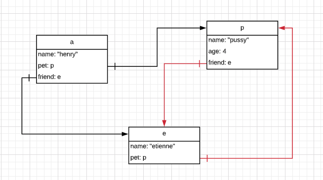

# 02 Référence circulaire

Avec la méthode `JSON.stringify`, on peut avoir un problème de référence circulaire.

```js
let p = {
    name: "pussy",
    age: 4
}

let e = {
    name: "etienne",
    pet: p
}

p.friend = e;

let a = {
    name: "henry",
    pet: p,
    friend: e,
}

console.log(JSON.stringify(a));
```

On voit qu'il y a une référence circulaire :



On obtient une erreur de `JSON.stringify` :

```bash
Converting circular structure to JSON 
    --> starting at object with constructor 'Object' 
    |     property 'friend' -> object with constructor 'Object' 
    --- property 'pet' closes the circle 
  at ​quokka.js:19:0​
```

## Fonction de remplacement

`JSON.stringify` prend en deuxième argument une fonction de remplacement :

```js
const list = [
    {
        name: "Julie",
        color: "blue"
    },
    {
        name: "Max",
        color: "pink"
    },
    {
        name: "Bob",
        color: "red"
    },
];

const replacer = (key, value) => {
    if (key == "name")
        return "hey";
    return value;
};

JSON.stringify(list, replacer);
```

```bash
[{"name":"hey","color":"blue"},{"name":"hey","color":"pink"},{"name":"hey","color":"red"}] 
```

On peut dire que si un objet est trouvé plusieurs fois, il représente un risque de référence circulaire.

On le remplacera alors par le mot `"[[circular]]"`.

Bien faire attention que le `circularReplacer` est une `factory`, si ce n'était pas le cas le `WeakSet` serait initialisé à chaque passage, ce qui n'a pas de sens.

```js
const circularReplacer = () => {
    const seen = new WeakSet();

    return (key, value) => {
        if (typeof value === "object" && value !== null) {
            if (seen.has(value)) {
                return "[[circular]]";
            }

            seen.add(value);
        }

        return value;
    };
};

console.log(JSON.stringify(a, circularReplacer()));
```

```bash
{"name":"henry","pet":{"name":"pussy","age":4,"friend":{"name":"etienne","pet":"[[circular]]"}},"friend":"[[circular]]"}
```

`WeakSet` se sont des ensembles ne contenant que des références d'objet.

Si l'unique référence est dans le `WeakSet`, l'objet sera nettoyé par le ramasse miette.

`weak` signifie faible, le lien vers la valeur est faible pour le ramasse-miette.

Cela sert a éviter que les fonctions récursives ne s'appelle à l'infini à cause des références circulaires.

trois méthode utiles :

1. `add`
2. `has`
3. `delete`

