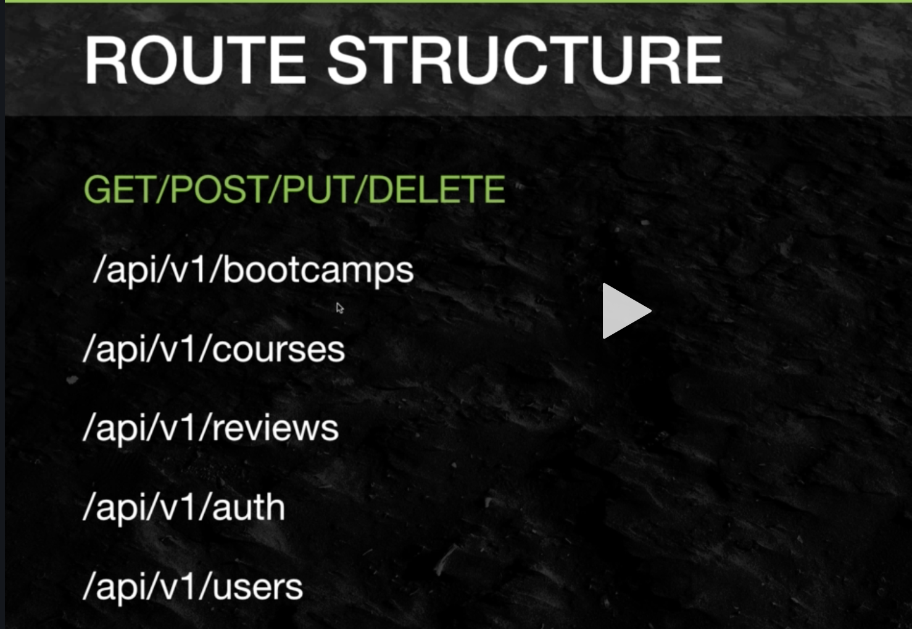

# 07 Les routes dans express

```js
app.get("/api/v1/bootcamps", (req, res) => {
  res.send("<h1>hello express </h1>");
});
```

Avec `Express` , le `Content-Type` est ajouté automatiquement

```js
res.send({ name: "rico" });
// ou bien
res.json({ name: "rico" });
```

`send` parse directement en `json` et ajoute le bon `Content-Type`

`json` est un alias dédié à l'envoie de `json`

```js
// envoie un status et un plain/text du status dans le body
res.sendStatus(400);

// status + data
res.status(400).send({ name: "michel" });
```

Avec `sendStatus` , le `body` est composé d'un texte du status ("Bad Request" par exemple).

## Structure de l'`api`

Il est important de versioner ses `api`, c'est un contrat, si celui-ci doit être modifié, il faut pouvoir changer de version.



## Paramètre dans l'`url`

```js
app.put("/api/v1/bootcamps/:id", (req, res) => {
  res.status(200).json({
    success: true,
    msg: `update bootcamp ${req.params.id}`,
  });
});
```

On ajoute un paramètre dans l'`url` grâce aux `:id`

On le récupère avec `req.params.monparam`

### `app.put`

### `app.delete`
