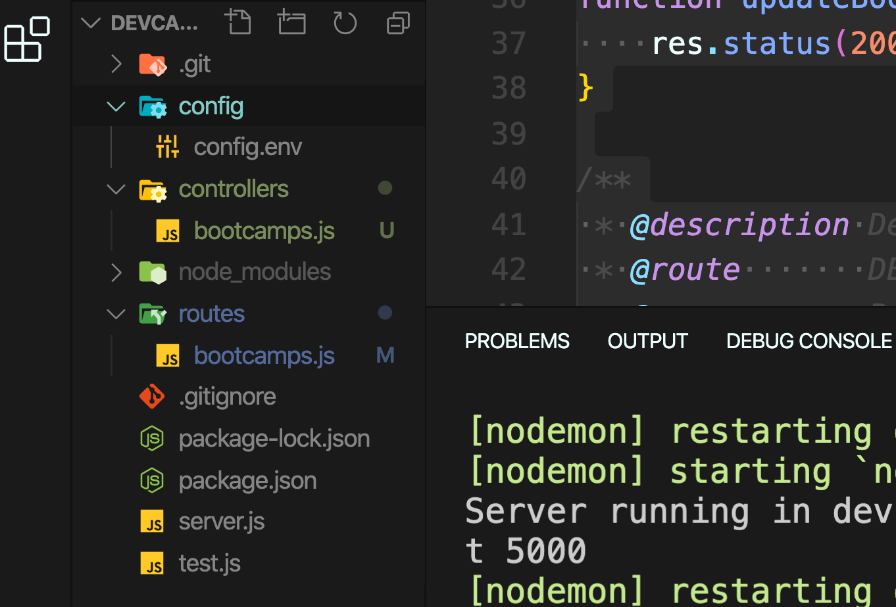

# 09 Créer ses contrôleur

On va créer un dossier `controllers` avec dedans un fichier `bootcamps.js` :



`bootcamps.js`

```js
/**
 * @description Get all bootcamps
 * @route       GET /api/v1/bootcamps
 * @access      Public
 */
function getBootcamps(req, res, next) {
  res.status(200).json({ success: true, msg: "Show all bootcamps" });
}

/**
 * @description Get one bootcamp
 * @route       GET /api/v1/bootcamps/:id
 * @access      Public
 */
function getBootcamp(req, res, next) {
  res.status(200).json({
    success: true,
    msg: `Show bootcamp ${req.params.id}`,
  });
}

/**
 * @description Create bootcamp
 * @route       POST /api/v1/bootcamps
 * @access      Private
 */
function createBootcamp(req, res, next) {
  res.status(200).json({ success: true, msg: "Add bootcamp" });
}

/**
 * @description Update one bootcamp
 * @route       PUT /api/v1/bootcamps/:id
 * @access      Private
 */
function updateBootcamp(req, res, next) {
  res.status(200).json(`Update bootcamp ${req.params.id}`);
}

/**
 * @description Delete one bootcamp
 * @route       DELETE /api/v1/bootcamps/:id
 * @access      Private
 */
function deleteBootcamp(req, res, next) {
  res.status(200).json(`Delete bootcamps ${req.params.id}`);
}

module.exports = {
  getBootcamps,
  getBootcamp,
  createBootcamp,
  updateBootcamp,
  deleteBootcamp,
};
```

Chaque fonction prend trois paramètres `req`, `res` et `next`.

Du coup on _refactore_ `routes.js` :

`routes.js`

```js
const express = require("express");
const {
  getBootcamps,
  getBootcamp,
  createBootcamp,
  updateBootcamp,
  deleteBootcamp,
} = require("../controllers/bootcamps");

const router = express.Router();

router.route("/").get(getBootcamps).post(createBootcamp);

router
  .route("/:id")
  .get(getBootcamp)
  .put(updateBootcamp)
  .delete(deleteBootcamp);

module.exports = router;
```

De cette façon la logique est uniquement dans `controllers/bootcamps.js`.
