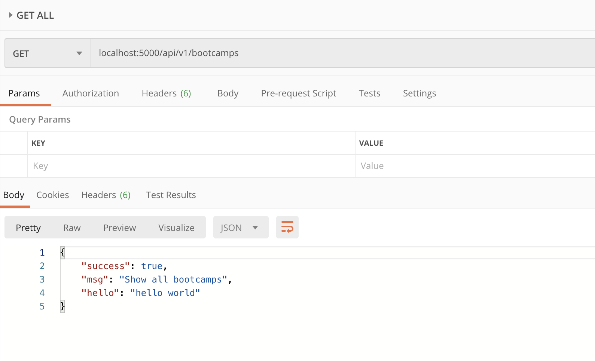

# 10 `Middleware`

Un `middleware` est une fonction qui reçoit `request` et `response` en argument et qui appele le prochain `middleware` avec la fonction `next`.

## Créons un `middleware`

`logger.js`

```js
module.exports = function logger(req, res, next) {
  req.hello = "hello world";
  console.log("Middleware ran");
  next();
};
```

### `function middlewareFunction(req, res, next) { ... }`

## Mise en place dans `server.js`

```js
const express = require("express");
const dotenv = require("dotenv");
const logger = require("./logger");

// Routes file
const bootcamps = require("./routes/bootcamps");

// Load variable
dotenv.config({ path: "./config/config.env" });

const app = express();

// Use middleware
app.use(logger);

// Mount router
app.use("/api/v1/bootcamps", bootcamps);

const PORT = process.env.PORT || process.env.NODE_PORT;
app.listen(
  PORT,
  console.log(`Server running in ${process.env.NODE_ENV} mode on port ${PORT}`)
);
```

Lorsqu'on lance une requête via `postman` on a :

```bash
Server running in devlopment mode on port 5000
Middleware ran
```

## Utilisation dans un contrôleur

`controllers/bootcamps.js`

```js
/**
 * @description Get all bootcamps
 * @route       GET /api/v1/bootcamps
 * @access      Public
 */
function getBootcamps(req, res, next) {
  res
    .status(200)
    .json({ success: true, msg: "Show all bootcamps", hello: req.hello });
}
```



## `next()`

La fonction `next` passe le relais au prochain `middleware`.

## Amélioration de `logger.js`

```js
/**
 * @description Logs request to console
 * @param {Request} req
 * @param {Response} res
 * @param {Function} next
 */
function logger(req, res, next) {
  req.hello = "hello world";
  console.log(
    `${req.method} ${req.protocol}://${req.get("Host")}${req.originalUrl}`
  );
  console.log(`${req.get("User-Name")} : ${req.ip}`);
  next();
}

module.exports = logger;
```

```bash
DELETE http://localhost:5000/api/v1/bootcamps/19
Michel Toto : ::1
```

Ce `logger` pourrait facilement enregistrer ses `logs` dans un fichier.

On peut mettre depuis le `front-end` le `User-Name` dans le header de la requête.

`req.get("Header-Name")` récupère un `header` par son nom.

`req.method` : `DELETE`

`req.protocol` : `http`

`req.get("Host")` : `localhost:5000`

`req.originalUrl` : `/api/v1/bootcamps/19`

## Utilisation d'un `middleware` externe : `morgan`

```bash
npm i morgan
```

`server.js`

```js
const morgan = require("morgan");

// ...

// Dev logs middleware
if (process.env.NODE_ENV === "devlopment") {
  app.use(morgan("dev"));
}
```

`process.env.NODE_ENV` nous permet de cibler des `logs` pour l'environnement de développement.
