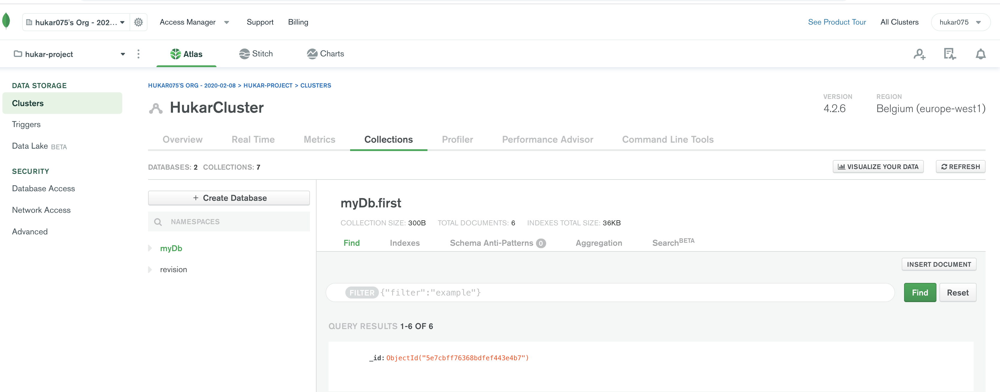
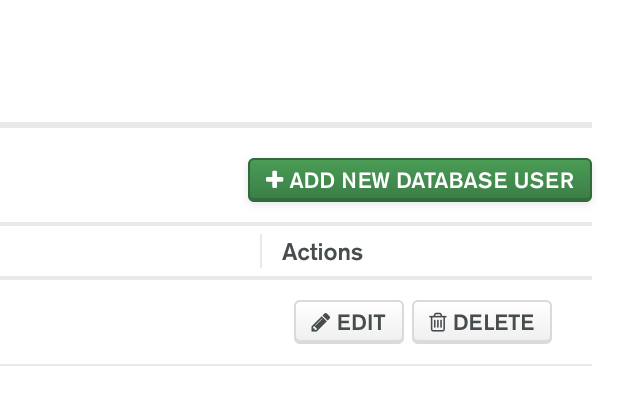
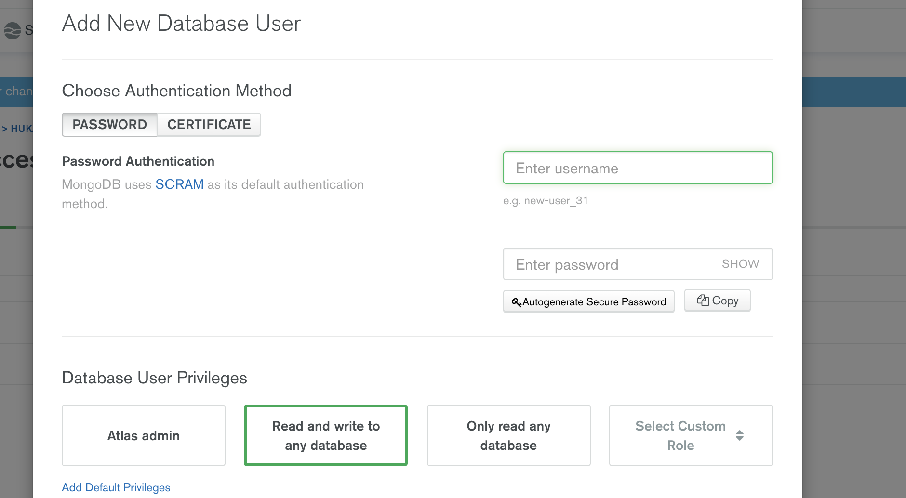
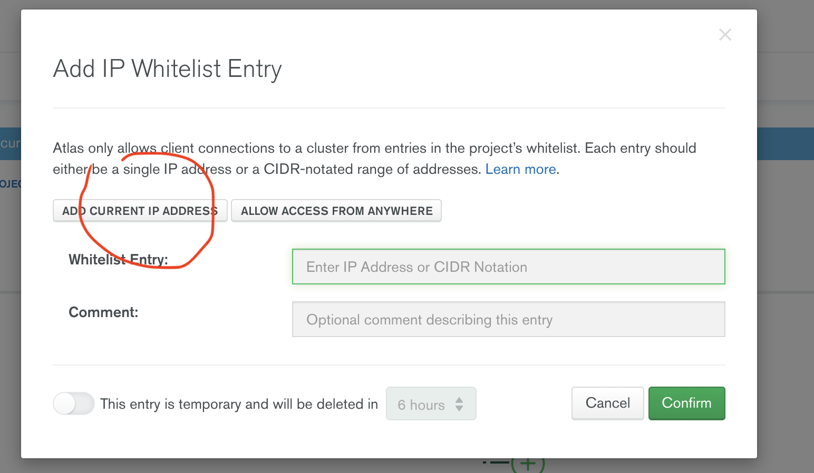
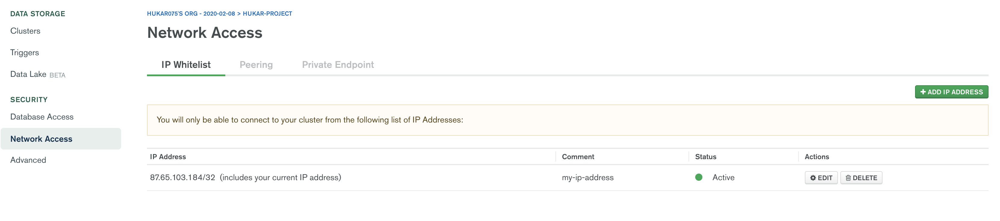
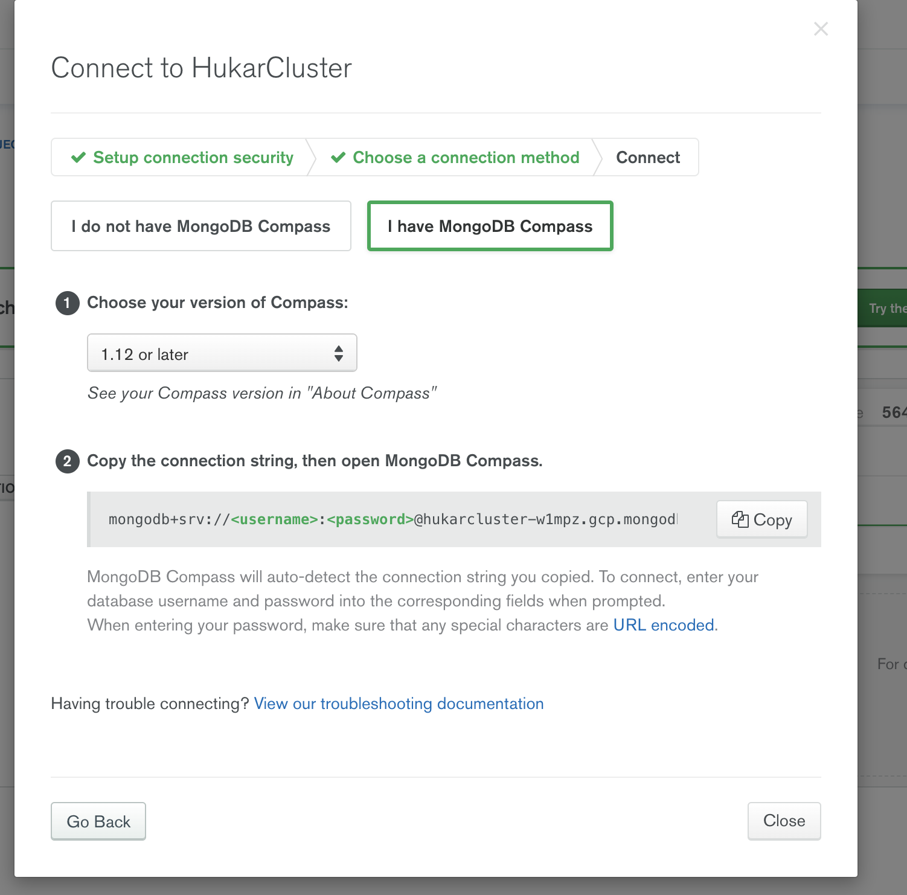

# 11 MongoDb et Mongo ATLAS

Il faut créer un cluster :

Puis ajouter un nouvel utilisateur :

___

___

---

**name**: hukarTraversy

**pwd**: hukarTraversy

## Configurer la white list d'`IP`

Pour ce cours, n'authoriser que mon adresse :

---

## Se connecter depuis `Compass`

Il suffit de remplacer `username` et `password` par ses credentials.
