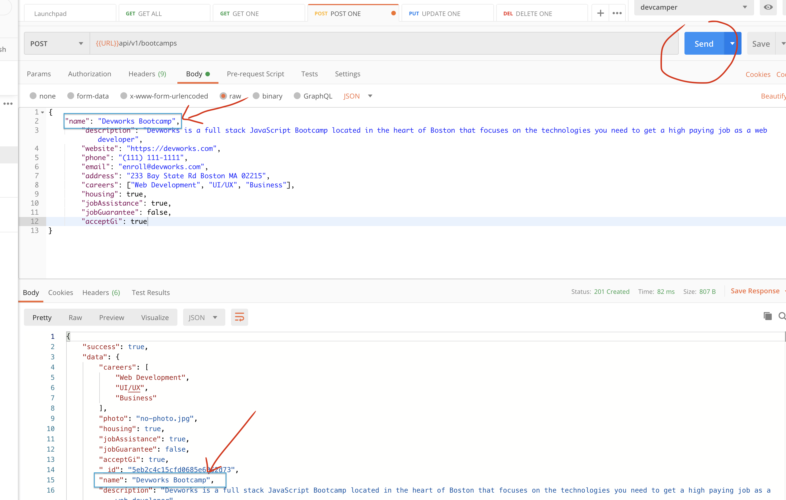
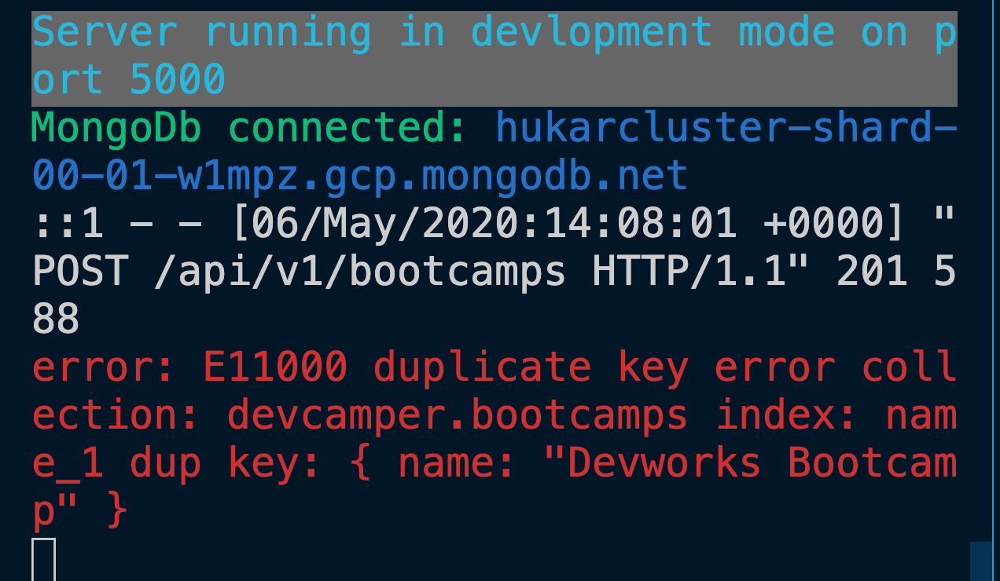
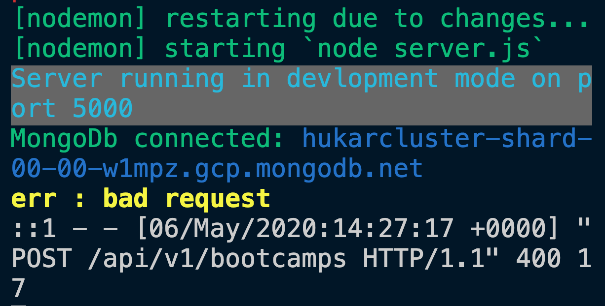

# 15 CRUD `create`

```js
console.log(req.body);
```

```bash
undefined
```

Pour pouvoir récupérer le `body` de la `request`, il faut utiliser un `body-parser`:

`server.js`

```js
// ...
const app = express();

// Body Parser
app.use(express.json());

// ...
```

```js
console.log(req.body);
```

```bash
{
  name: 'Devworks Bootcamp',
  description: 'Devworks is a full stack JavaScript Bootcamp located in the heart of Boston that focuses on the technologies you need to get a high paying job as a web developer',
  website: 'https://devworks.com',
  phone: '(111) 111-1111',
  email: 'enroll@devworks.com',
  address: '233 Bay State Rd Boston MA 02215',
  careers: [ 'Web Development', 'UI/UX', 'Business' ],
  housing: true,
  jobAssistance: true,
  jobGuarantee: false,
  acceptGi: true
}
```

## `Create`

`controllers/bootcamps.js`

```js
const Bootcamp = require("../models/Bootcamp");

// ...

/**
 * @description Create bootcamp
 * @route       POST /api/v1/bootcamps
 * @access      Private
 */
async function createBootcamp(req, res, next) {
  const bootcamp = await Bootcamp.create(req.body);

  // 201 status for create
  res.status(201).json({ success: true, data: bootcamp });
}
```

Si j'essaye de soumettre via `postman` deux fois la même requête :



On crée une erreur, car le champ `name` est censé être unique :

```js
name: {
        type: String,
        // required: true,
        required: [true, "Please add a name"],
        unique: true,
        trim: true,
        maxlength: [50, "Name can not be more than 50 characters"],
    },
```



L'application crash et l'erreur est gérer de manière globale grâce au code :

```js
const server = app.listen(/* ... */);

process.on("unhandledRejection", (err, promise) => {
  console.log(`error: ${err.message}`.red);
  server.close(() => process.exit(1));
});
```

Avec `async/await` on peut utiliser `try and catch` pour gérer les erreurs de manière plus ciblée :

```js
async function createBootcamp(req, res, next) {
  try {
    const bootcamp = await Bootcamp.create(req.body);
    // 201 status for create
    res.status(201).json({ success: true, data: bootcamp });
  } catch (error) {
    console.log("err : bad request".yellow.bold);
    res.status(400).json({ success: false });
  }
}
```




L'application ne crash plus.
