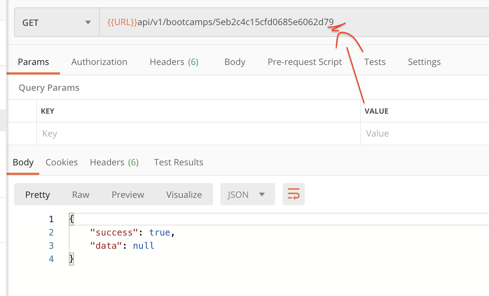
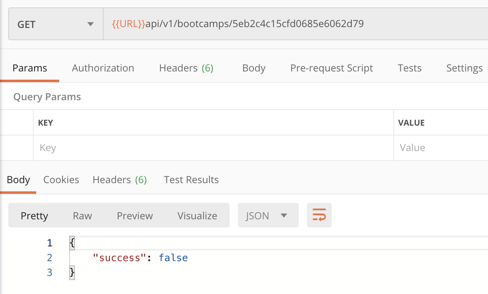
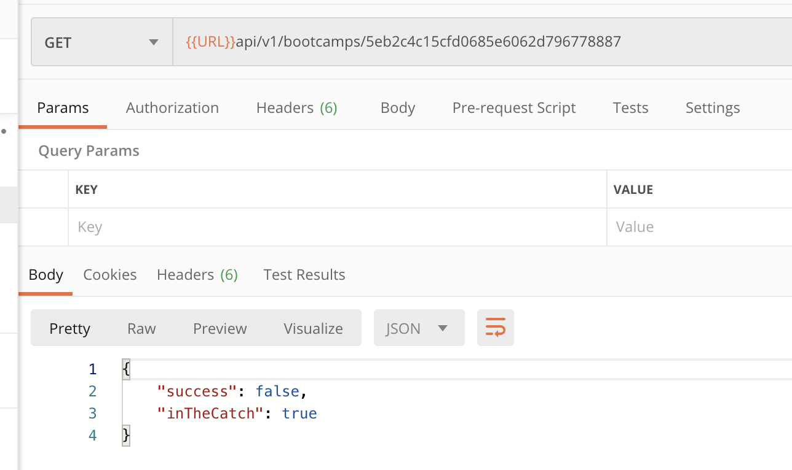

# crud `read`

## get all

### `Model.find()`

```js
async function getBootcamps(req, res, next) {
  try {
    const bootcamps = await Bootcamp.find();

    res.status(200).json({
      success: true,
      data: bootcamps,
    });
  } catch (error) {
    console.log("error : bad request", error);
  }
}
```

Toujours utiliser `async/await` pour des requête asynchrones.

## get one

### `Model.findById()`

```js
async function getBootcamp(req, res, next) {
  try {
    // const bootcamp = await Bootcamp.find({ _id: req.params.id });
    const bootcamp = await Bootcamp.findById(req.params.id);
    res.status(200).json({
      success: true,
      data: bootcamp,
    });
  } catch (error) {
    console.log("error: bad request", error);
    res.status(400).json({ success: false });
  }
}
```

On peut aussi utiliser `Model.find`:

```js
const bootcamp = await Bootcamp.find({ _id: req.params.id });
```

### Gestion des erreurs

Si l'`_id` est du bon format mais n'existe pas dans la collection, on a :



On modifie le dernier nombre, et la réponse est `success: true`.

### Correction du problème

```js
const bootcamp = await Bootcamp.findById(req.params.id);

if (!bootcamp) {
  return res.status(400).json({ success: false });
}
res.status(200).json({
  success: true,
  data: bootcamp,
});
```

#### ! bien mettre le `return` sinon erreur : `error: Cannot set headers after they are sent to the client`.



Si l'`_id` n'a pas le bon format, on entre dans le `catch`:

```js
try {
  // ...
} catch (error) {
  console.log("error: bad request", error);
  res.status(400).json({ success: false, inTheCatch: true });
}
```


