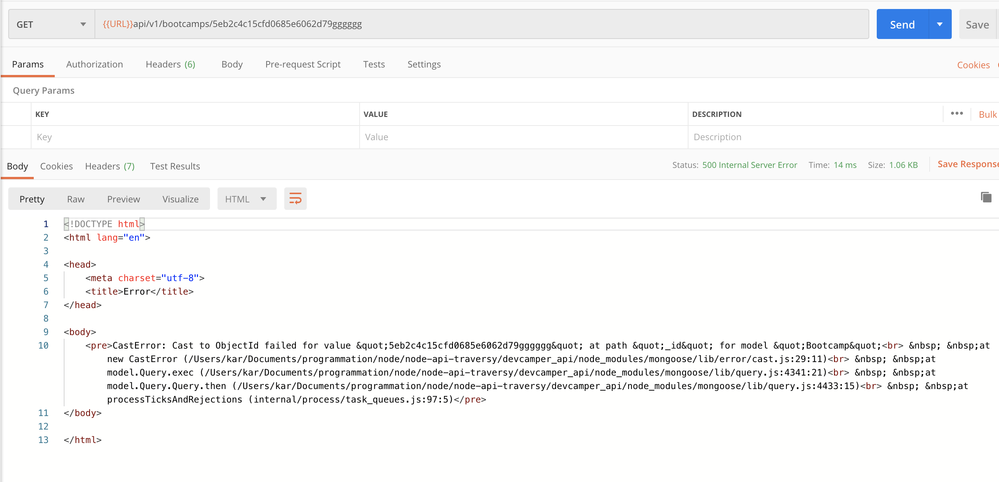
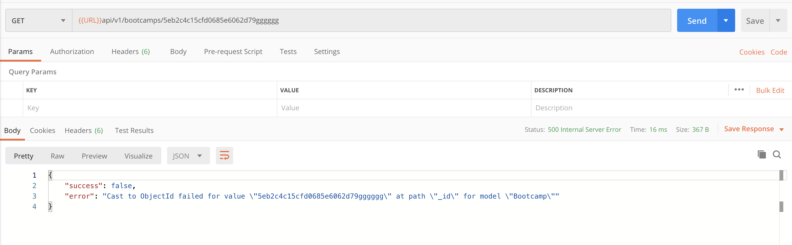

# 01 `Middleware` pour gérer les erreurs

#### ! les `middleware` sont exécutés de manière linéaire, l'ordre d'appelle compte.

On peut passer l'erreur à la fonction `next` d'un `middleware`.

```js
async function getBootcamp(req, res, next) {
  try {
    // const bootcamp = await Bootcamp.find({ _id: req.params.id });
    const bootcamp = await Bootcamp.findById(req.params.id);
    if (!bootcamp) {
      return res.status(400).json({ success: false });
    }
    res.status(200).json({
      success: true,
      data: bootcamp,
    });
  } catch (error) {
    next(error);
    // res.status(400).json({ success: false, inTheCatch: true });
  }
}
```

Maintenant on obtient une erreur automatique :



le `status` est de `500`, mais la réponse est en `html`.

## Création d'un `middleware` pour gérer les erreurs

`middleware/error.js`

```js
const colors = require("colors");

function errorHandler(err, req, res, next) {
  // log to console for dev
  console.log(err.stack.red);

  res.status(500).json({
    success: false,
    error: err.message,
  });
}

module.exports = errorHandler;
```

On envoie `err.message`.

## Ajout dans `server.js`

```js
// ...
const errorHandler = require("./middleware/error");

// ...

// error handler
app.use(errorHandler);

const PORT = process.env.PORT || 8080;
// ...
```

## Test avec `Postman`



Ona bien un `json` en retour toujours avec le status `500`.
