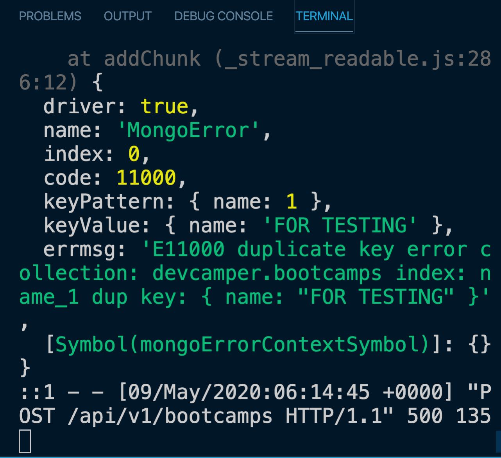
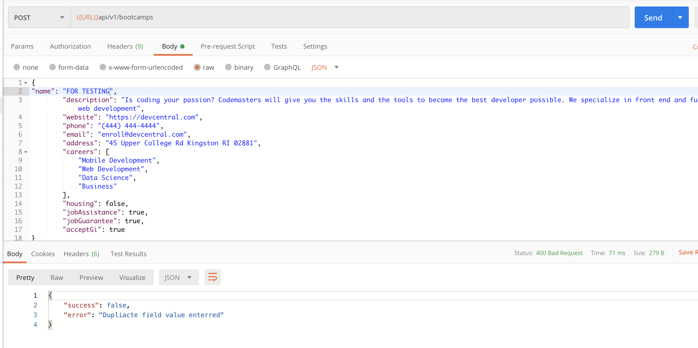
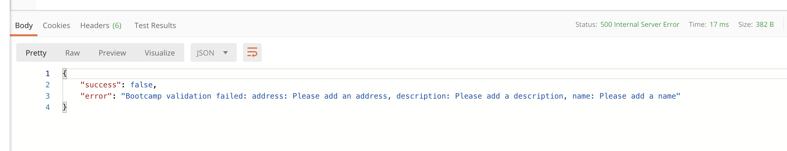

# 03 `Mongoose` gestion des erreurs

L'idéal c'est d'instancier les _Custom Error_ dans le middleware `error.js`.

On a donc dans `/middleware/error.js`

```js
const colors = require("colors");
const ErrorResponse = require("../utils/ErrorResponse");

function errorHandler(err, req, res, next) {
  // ne copie pas les propriété héritées de Error comme message
  let error = { ...err };

  // il faut donc copié message 'à la main'
  error.message = err.message;

  // log to console for dev
  console.log(err.stack.red);

  // Mongoose bad ObjectId
  if (error.name === "CastError") {
    const message = `Resource not found, id was not correctly formated : ${err.value}`;
    error = new ErrorResponse(message, 404);
  }

  res.status(error.statusCode || 500).json({
    success: false,
    error: error.message || "server error",
  });
}

module.exports = errorHandler;
```

- On copie l'erreur reçu ainsi que son message car celui-ci est contenu par le prototype.
- On regarde le nom de l'erreur `error.name` et on instancie une `ErrorResponse` approprié.
- On envoie la réponse d'erreur.

## Dans le controleur `controllers/bootcamps.js`

exemple avec `updateBootcamp`

```js
async function updateBootcamp(req, res, next) {
  try {
    console.log("_id :", req.params.id);
    const bootcamp = await Bootcamp.findByIdAndUpdate(req.params.id, req.body, {
      new: true,
      runValidators: true,
    });

    if (!bootcamp) {
      return next(
        new ErrorResponse(`bootcamp with id : ${req.params.id} not found`, 404)
      );
    }

    res.status(200).json({
      success: true,
      data: bootcamp,
    });
  } catch (error) {
    next(error);
  }
}
```

On utilise `next` pour passer l'erreur.

Si L'`id` est bien formaté mais n'existe pas, on crée une `ErrorResponse` personnalisée.

L'erreur est interceptée par le `middleware` `error.js`.

## Duplicate field

On essaye de créer deux documents de même nom, le nom doit être unique dans le `Schema`:

```js
name: {
        type: String,
        // required: true,
        required: [true, "Please add a name"],
        unique: true,
        trim: true,
        maxlength: [50, "Name can not be more than 50 characters"],
    },
```

Pour pouvoir utiliser les champs de l'erreur, on va utiliser `console.log(error)` :



On voit que le code erreur pour un champ dupliqué est `11000`.

### Dans `middleware/error.js`

On essaye de traiter les cas particulier dans notre gestionnaire d'erreur.

```js
function errorHandler(err, req, res, next) {
  // ...

  // Mongoose Duplicate Key
  if (error.code === 11000) {
    const message = "Duplicate field value enterred";
    error = new ErrorResponse(message, 400); // 400 = bad request
  }
  // ...
}
```

On applique la même logique que précédemment.



## Erreur Validation



On reçoit un ensemble d'erreurs :

```js
const error = {
  errors: {
    address: {
      message: "Please add an address",
      name: "ValidatorError",
      properties: {
        /* ... */
      },
      kind: "required",
      path: "address",
      value: undefined,
      reason: undefined,
    },
    description: {
      message: "Please add a description",
      name: "ValidatorError",
      properties: {
        /* ... */
      },
      kind: "required",
      path: "description",
      value: undefined,
      reason: undefined,
    },
  },
  _message: "Bootcamp validation failed",
  name: "ValidationError",
};
```

On va modifier notre `middleware/error.json` :

```js
// Mongoose validation error
if (error.name === "ValidationError") {
  const message = Object.values(error.errors).map((err) => err.message);

  error = new ErrorResponse(message, 400);
}
```

`Object.values` nous donne :

```js
[
  {
    message: "Please add an address",
    name: "ValidatorError",
    properties: {
      /* ... */
    },
    kind: "required",
    path: "address",
    value: undefined,
    reason: undefined,
  },
  {
    message: "Please add a description",
    name: "ValidatorError",
    properties: {
      /* ... */
    },
    kind: "required",
    path: "description",
    value: undefined,
    reason: undefined,
  },
];
```

Avec `map` on obtient finalement :

```js
["Please add an address", "Please add a description"];
```

En interne la class `Error` utilise `String(message)` et `String(name)` pour caster le `name` et le `message`, `error.message` est donc une chaîne de caractères (et non plus un tableau) :


