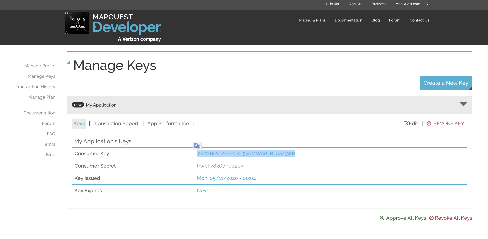

# 06 GeoJSON Location

## Utilisation de MapQuest

login k.meshoub@gmail.com ou hukar

pwd: h*99V*



`config/config.env`

```bash
# ...

GEOCODER_PROVIDER=mapquest
GEOCODER_API_KEY=YVVkReY1ZPPR4Vg5yoMWArUBJUazl38B
```

## `node-geocoder`

```bash
npm i node-geocoder
```

### Création de `utils/geocoder.js`

```js
const NodeGeocoder = require("node-geocoder");

const options = {
  provider: process.env.GEOCODER_PROVIDER,
  httpAdaptater: "https",
  apiKey: process.env.GEOCODER_API_KEY,
  formatter: null,
};

const geocoder = NodeGeocoder(options);

module.exports = geocoder;
```

## Utilisation dans le `Schema`

`models/Bootcamp.js`

```js
// ...
const geocoder = require("../utils/geocoder");
// ...

// Geocode and Create Location field
BootcampSchema.pre("save", async function (next) {
  const loc = await geocoder.geocode(this.address);

  this.location = {
    type: "Point",
    coordinates: [loc[0].longitude, loc[0].latitude],
    formattedAddress: loc[0].formattedAddress,
    street: loc[0].streetName,
    city: loc[0].city,
    state: loc[0].stateCode,
    country: loc[0].countryCode,
    zipcode: loc[0].zipcode,
  };

  // do not save address in DB
  this.address = undefined;

  next();
});
```

On enregistre un document avec une adresse :

```json
{
  // ...
  "address": "233 Bay State Rd Boston MA 02215"
  // ...
}
```

et grâce au `middleware` on récupère en DB :

```json
{
  "location": {
    "type": "Point",
    "coordinates": [-71.104028, 42.350846],
    "formattedAddress": "233 Bay State Rd, Boston, MA 02215-1405, US",
    "street": "233 Bay State Rd",
    "city": "Boston",
    "state": "MA",
    "country": "US",
    "zipcode": "02215-1405"
  }
  // ...
}
```

Le champ `address` pourtant `required` a disparu de l'enregistrement.

Le mettre à `undefined` a permis de ne pas l'enregistrer.

## Test avec mon adresse

```json
"address": "avenue sept bonniers 25 1180 uccle",
```

```json
"location": {
            "type": "Point",
            "coordinates": [
                4.337614,
                50.813488
            ],
            "formattedAddress": "Avenue des Sept Bonniers - Zevenbunderslaan, Uccle - Ukkel, Brussels-Capital 1180, BE",
            "street": "Avenue des Sept Bonniers - Zevenbunderslaan",
            "city": "Uccle - Ukkel",
            "state": "Brussels-Capital",
            "country": "BE",
            "zipcode": "1180"
        },
```
