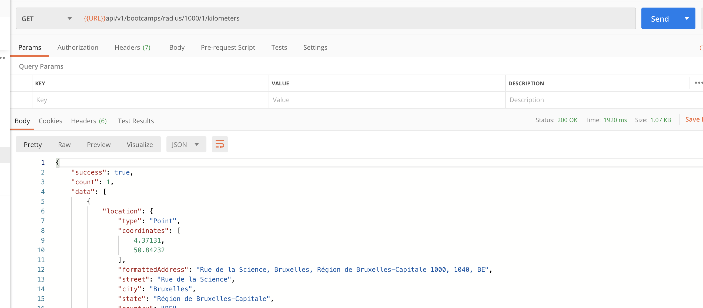
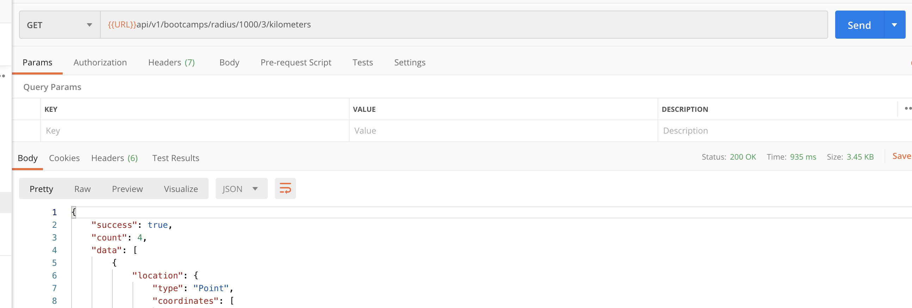
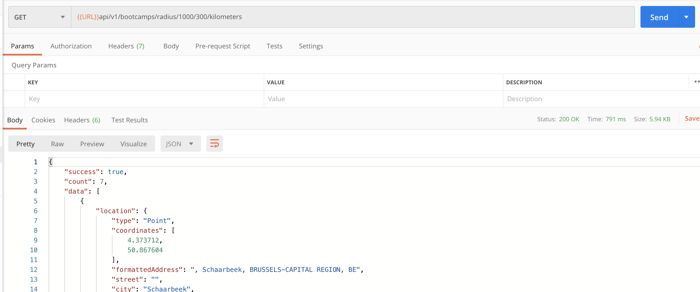

# 08 geospatial query

On veut récupérer les `bootcamps` dans les environ de ...

MongoDB propose des utilitaires pour travailler avec la géolocalisation :

https://docs.mongodb.com/manual/geospatial-queries/

https://docs.mongodb.com/manual/reference/geojson/

`location` définie un objet de type `GeoJSON`.

```json
location: {
        // GeoJSON
        type: {
            type: String,
            enum: ["Point"],
        },
        coordinates: {
            type: [Number],
            index: "2dsphere",
        },
        formattedAddress: String,
        street: String,
        city: String,
        state: String,
        country: String,
        zipcode: String,
    }
```

## Créer un contrôleur

`controllers/bootcamps.js`

```js
// ...
const Bootcamp = require("../models/Bootcamp");
const geocoder = require("../utils/geocoder");
const asyncHandler = require("../middleware/async");

/**
 * @description Get bootcamp within a radius
 * @route       GET /api/v1/bootcamps/radius/:zipcode/:distance/:unit
 * @access      Private
 */
const getBootcampsInRadius = asyncHandler(async (req, res, next) => {
    const { zipcode, distance, unit } = req.params;

    // get latitude and longitude from geocoder
    const loc = await geocoder.geocode(zipcode);
    console.log(loc);
    const latitude = loc[0].latitude;
    const longitude = loc[0].longitude;

    // calcul radius using radian
    // divide dist by radius of the earth
    // radius of th earth 6 378 km / 3 963 mi
    let radius = 0;
    switch (unit) {
        case "kilometers":
            radius = distance / 6378;
            break;
        case "miles":
            radius = distance / 3963;
            break;
        default:
            radius = distance / 6378;
    }

    const bootcamps = await Bootcamp.find({
        // longitude first
        location: {
            $geoWithin: { $centerSphere: [[longitude, latitude], radius] },
        },
    });

    res.status(200).json({
        success: true,
        count: bootcamps.length,
        data: bootcamps,
    });
});

module.exports = { /* ... */, getBootcampsInRadius, };
```

On _wrap_ dans notre `asyncHandler` pour la gestion des erreurs asynchrones.

On utilise `geocoder.geocode(<zipcode>)` pour récupérer la longitude et la latitude grâce au code postal.

Ensuite on utilise des utilitaires fournis par MongoDB, `$geoWithin` et `$centerspher` pour grosso-modo calculer la distance dans laquelle on cherche des résultats.

## Modifier les routes

`routes/bootcamps.js`

```js
router.route("/radius/:zipcode/:distance/:unit").get(getBootcampsInRadius);
```

## Tester la route

Je part de `1000` Bruxelles

Je vais faire une recherche dans un rayon de :

### 1 km



On obtient un seul résultat.

### 3 km



Maintenant 4 résultats

### 300km

### 

7 résultats

## Remarque

Je ne suis pas convaincu par la pertinence des adresses trouvées par MapQuest par exemple :


