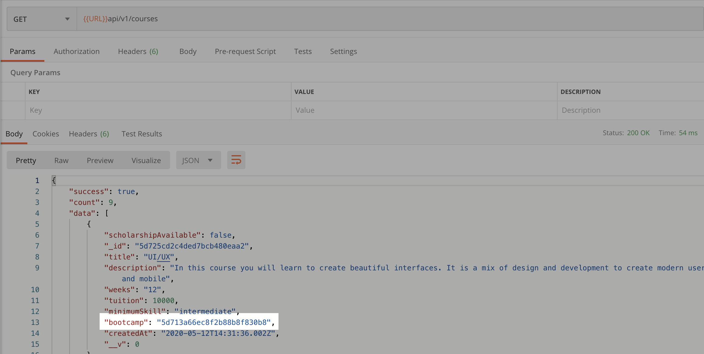
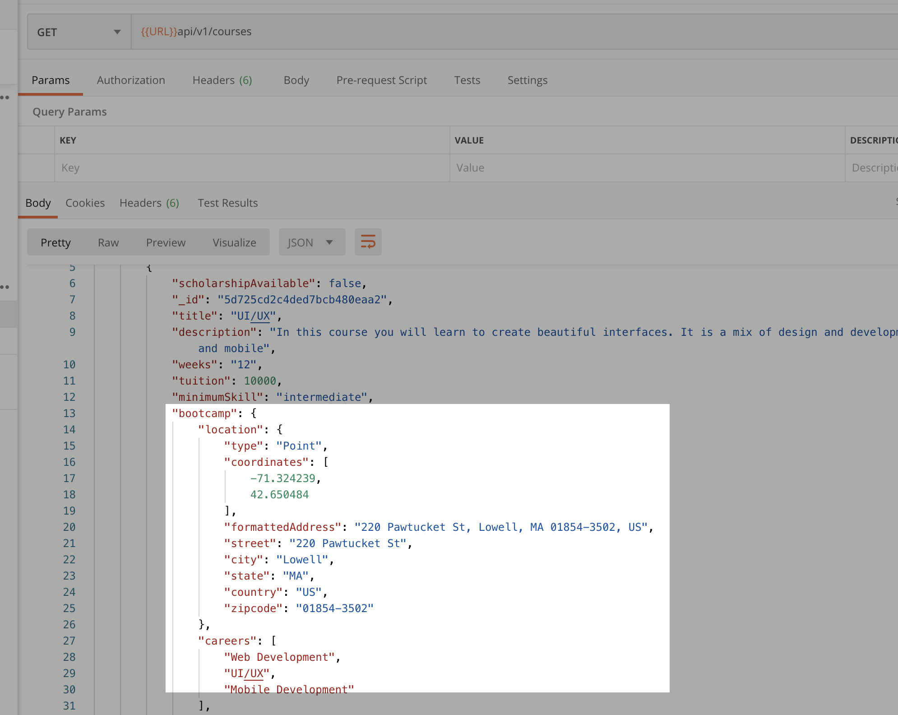
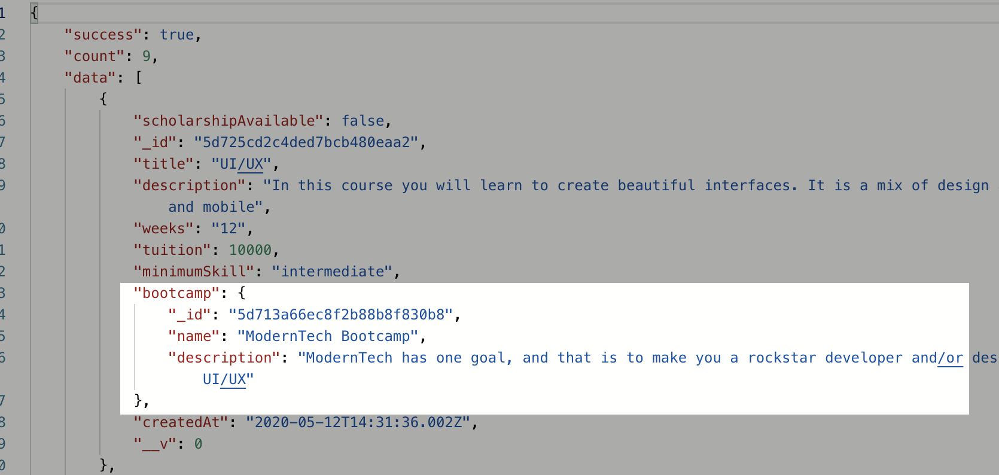

# 14 `populate`

On souhaite parfois intégrer les données d'un élément référencé.

Par exemple, chaque `course` aun `bootcamp`.

Il suffit d'ajouter la méthode `populate` sur le `Model`.

Il faut aussi importer le modèle concerné.

`controllers/courses.js`

```js
const Bootcamp = require("../models/Bootcamp");
// ...

exports.getCourses = asyncHandler(async (req, res, next) => {
  let query;

  if (req.params.bootcampId) {
    query = Course.find({ bootcamp: req.params.bootcampId });
  } else {
    query = Course.find().populate("bootcamp");
  }
  // ...
});
```

**Avant**



**Après**



On a maintenant tout le `bootcamp` et non plus seulement son `_id`.

## Seulement quelques champs

Si on veut seulement quelques champs :

`controllers/courses.js`

```js
query = Course.find().populate({
  path: "bootcamp",
  select: "name description",
});
```


