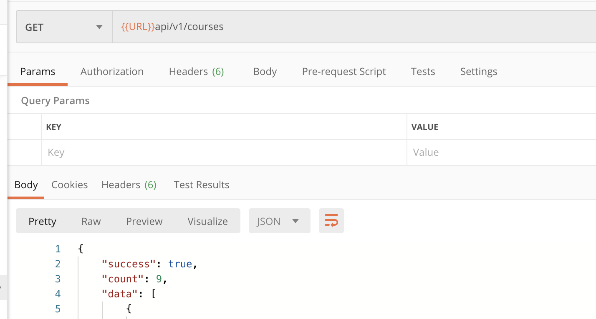
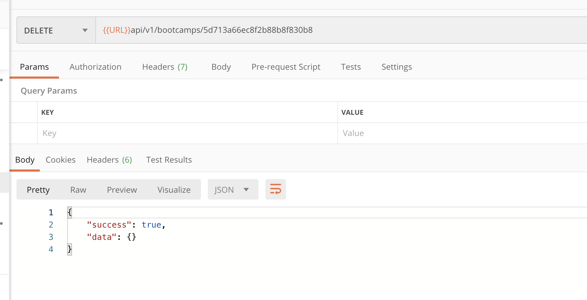
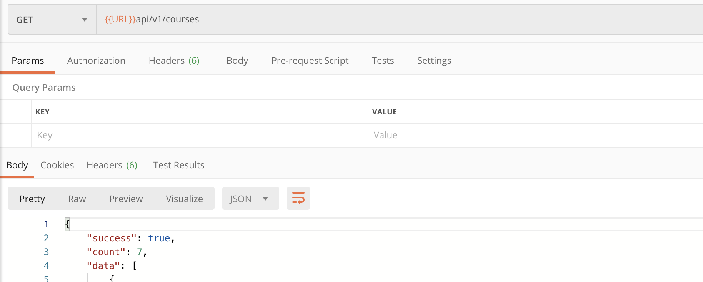

# 16 Suppression en cascade

Si un `bootcamp` est supprimé, les `courses` associés doivent être supprimés aussi.

## Modification du `Model`

`models/Bootcamp.js`

```js
// ...

// cascade delete courses when a bootcamp is deleted
BootcampSchema.pre("remove", async function (next) {
  console.log(
    `courses was deleted from boocamp ${this.name} : ${this._id}`.red.inverse
  );
  await this.model("Course").deleteMany({ bootcamp: this._id });
  next();
});

// reverse populate with virtuals
BootcampSchema.virtual(/* ... */);

module.exports = mongoose.model("Bootcamp", BootcampSchema);
```

On intervient sur l'événement `"remove"`.

Ce `middleware` est exécuté avant que le `bootcamp` soit supprimé, comme ça on dispose encore de son `_id`.

## Modification du contrôleur

`Bootcamp.findByIdAndDelete` ne déclenche pas l'événement `"remove"`, on doit donc un peu réécrire `deleteBootcamp`.

`controllers/bootcamps.js`

```js
const deleteBootcamp = asyncHandler(async (req, res, next) => {
  const bootcamp = await Bootcamp.findById(req.params.id);

  if (!bootcamp) {
    return next(
      new ErrorResponse(`bootcamp with id ${req.params.id} not found`),
      404
    );
  }

  bootcamp.remove(); // déclenche l'événement "remove"

  res.status(200).json({
    success: true,
    data: {},
  });
});
```

## Vérification

### Nombre de cours au départ : 9



### Suppression d'un `bootcamp`



### Nouveau nombre de cours : 7




