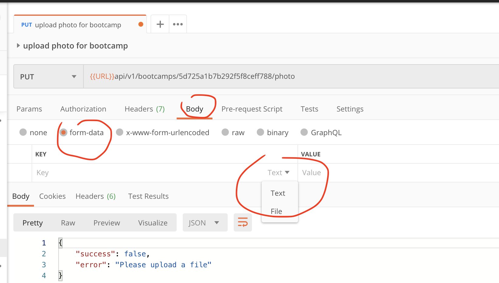
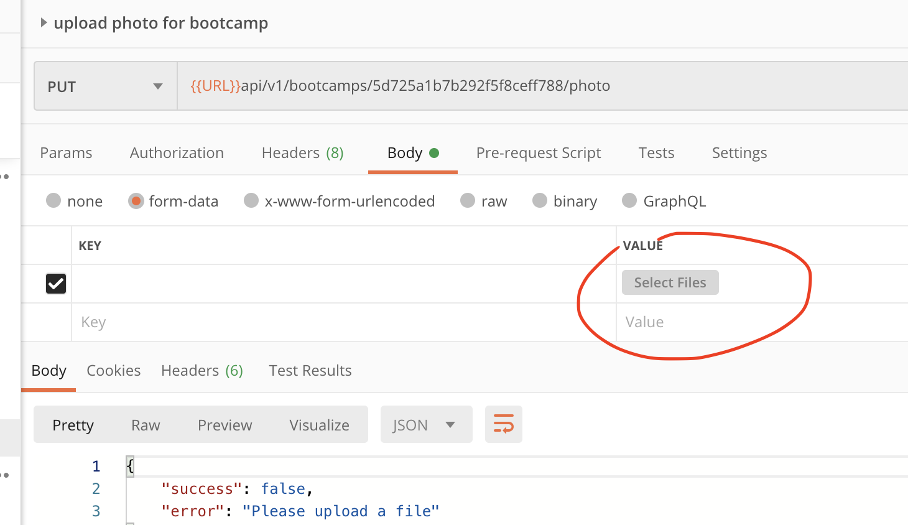
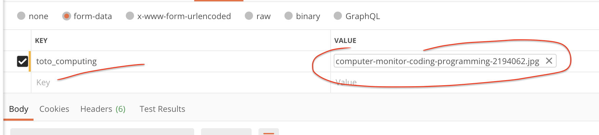
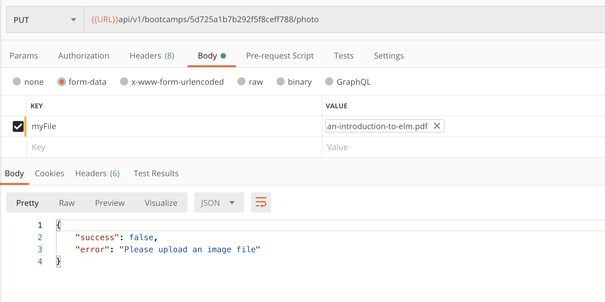

# 20 Téléchargement de fichiers

## express-fileupload

```bash
npm i express-fileupload
```

https://www.npmjs.com/package/express-fileupload

## Inclure le `middleware` dans `server.js`

```js
// ...
const fileupload = require("express-fileupload");
// ...

// Dev logs middleware
if (process.env.NODE_ENV === "devlopment") {
  app.use(morgan("common"));
}

// file upload
app.use(fileupload());

// Mount router
// ...
```

Juste avant de monter les routes.

## Création d'un controleur

`controllers/bootcamps.js`

```js
/**
 * @description upload photo for bootcamp
 * @route       PUT /api/v1/bootcamps/:id/photo
 * @access      Private
 */
const bootcampPhotoUpload = asyncHandler(async (req, res, next) => {
  const bootcamp = await Bootcamp.findById(req.params.id);

  if (!bootcamp) {
    return next(
      new ErrorResponse(`bootcamp with id ${req.params.id} not found`),
      404
    );
  }

  if (!req.file) {
    return next(new ErrorResponse(`Please upload a file`, 400));
  }

  console.log(req.file);
});
```

### Utilisation de `Postman` pour simuler l'envoie d'un fichier







### `req.files`

```json
{
  toto_computing: {
    name: 'computer-monitor-coding-programming-2194062.jpg',
    data: <Buffer ff d8 ff e0 00 10 4a 46 49 46 00 01 01 01 00 48 00 48 00 00 ff e2 0c 58 49 43 43 5f 50 52 4f 46 49 4c 45 00 01 01 00 00 0c 48 4c 69 6e 6f 02 10 00 00 ... 5527466 more bytes>,
    size: 5527516,
    encoding: '7bit',
    tempFilePath: '',
    truncated: false,
    mimetype: 'image/jpeg',
    md5: 'a87cf6848f121d7d649d0104ea289714',
    mv: [Function: mv]
  }
}
```

## Ajouter la route `routes/bootcamps.js`

```js
router.route("/:id/photo").put(bootcampPhotoUpload);
```

## Vérification du type MIME

`controllers/bootcamps.js`

```js
const bootcampPhotoUpload = asyncHandler(async (req, res, next) => {
  // ...

  const myFile = req.files.myFile;

  // Make sure the file is an image
  if (!myFile.mimetype.startsWith("image")) {
    return next(new ErrorResponse("Please upload an image file", 400));
  }
});
```



`.startsWith()` est une fonction javascript :

https://developer.mozilla.org/fr/docs/Web/JavaScript/Reference/Objets_globaux/String/startsWith

## Vérification du poids du fichier

Le chemin et le poids maximum d'une image sont des données à mettre dans `config.env`.

`config/config.env`

```bash
# ...

FILE_UPLOAD_PATH=./public/uploads
MAX_FILE_UPLOAD=1000000
```

### Modification de `controllers/bootcamps.js`

```js
// check file size
if (myFile.size > process.env.MAX_FILE_UPLOAD) {
  return next(new ErrorResponse("Please the file is too big"), 400);
}
```

## Renommer l'image

L'image doit avoir un nom unique, on peut utiliser l'`id` du `bootcamp` qui lui est unique.

```js
// create custom filename
myFile.name = `photo_${bootcamp._id}${path.parse(myFile.name).ext}`;
```

## Enregistrement du fichier

```js
myFile.mv(`${process.env.FILE_UPLOAD_PATH}/${myFile.name}`, async (err) => {
  if (err) {
    console.log(err);
    return next(new ErrorResponse("Problem with file upload"), 500);
  }

  await Bootcamp.findByIdAndUpdate(req.params.id, {
    photo: myFile.name,
  });

  res.status(200).json({
    success: true,
    data: myFile.name,
  });
});
```

La méthode `.mv(<path>,<callback>)` permet d'enregistrer le fichier.

Dans la fonction `callback`, on met à jour le nom de la photo dans son `bootcamp`.

## Rendre le dossier `public` `static`

Dans `server.js` :

```js
const path = require("path");

// ...

// file upload
app.use(fileupload());

// set static folder
app.use(express.static(path.join(__dirname, "public")));

// Mount router
app.use("/api/v1/bootcamps", bootcamps);
// ...
```

Cela permet d'accéder à la photo via une url de type :

`https://monsite.be/uploads/<nom_de_la_photo.jpg>`


