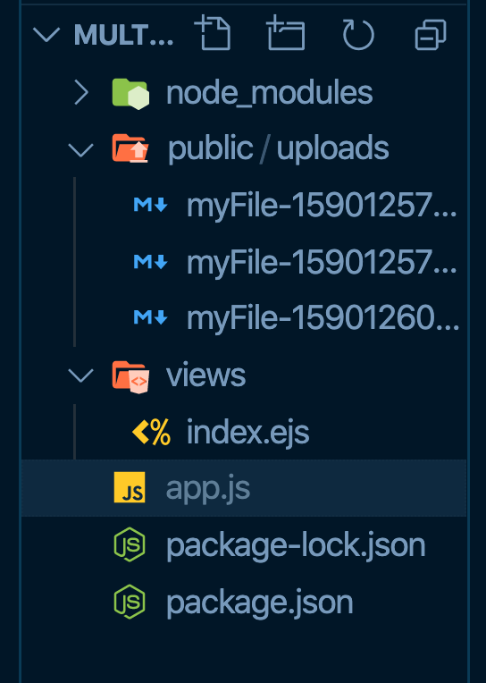
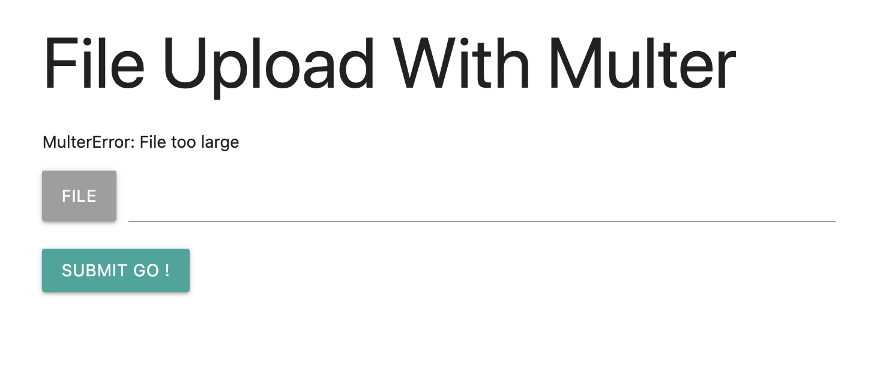
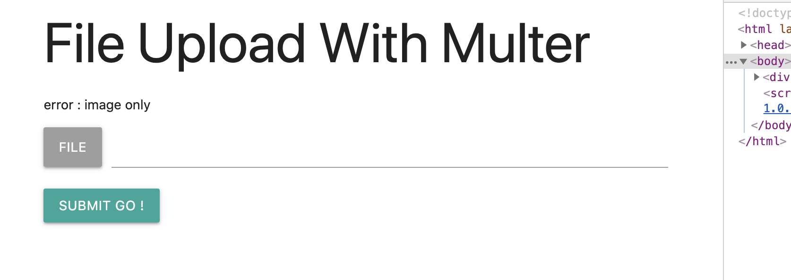

# Multer Brad Traversy

Utilisation de `multer` et `ejs` comme moteur de template.

`materialize` est la librairie `css`.

## `index.esj`

```ejs
<!DOCTYPE html>
<html lang="en">
<head>
    <meta charset="UTF-8">
    <meta name="viewport" content="width=device-width, initial-scale=1.0">
    <title>File Upload With Multer</title>
    <!--Import Google Icon Font-->
    <link href="https://fonts.googleapis.com/icon?family=Material+Icons" rel="stylesheet">
    <link rel="stylesheet" href="https://cdnjs.cloudflare.com/ajax/libs/materialize/1.0.0/css/materialize.min.css">
</head>
<body>
    <div class="container">
        <h1>File Upload With Multer</h1>
        <%= typeof msg !== "undefined" ? msg : "" %>
        <form action="/upload" method="POST" enctype="multipart/form-data">
            <div class="file-field input-field">
              <div class="btn grey">
                <span>File</span>
                <input name="myFile" type="file">
              </div>
              <div class="file-path-wrapper">
                <input class="file-path validate" type="text">
              </div>
            </div>
            <button type="submit" class="btn">Submit Go !</button>
          </form>
    </div>

    <script src="https://cdnjs.cloudflare.com/ajax/libs/materialize/1.0.0/js/materialize.min.js"></script>
</body>
</html>
```

### `<form action="/upload" method="POST" enctype="multipart/form-data">`

`action` défini la route.

`method` le verbe `HTTP`.

`enctype` type de contenu de l'élément `<form>`, pour l'upload : `multipart/form-data`.

`<%= %>` langage de template d'`EJS`.

## `app.js`

```js
const express = require("express");
const ejs = require("ejs");
const multer = require("multer");
const path = require("path");

// Set storage engine
const storage = multer.diskStorage({
  destination: "./public/uploads",
  filename: function (req, file, cb) {
    cb(
      null,
      `${file.fieldname}-${Date.now()}${path.extname(file.originalname)}`
    );
  },
});

// Init upload
const upload = multer({
  storage: storage,
}).single("myFile");

// Init app
const app = express();

// Set view engine EJS
app.set("view engine", "ejs");

// Public folder
app.use(express.static("./public"));

app.get("/", (req, res) => res.render("index"));

app.post("/upload", (req, res) => {
  upload(req, res, (error) => {
    if (error) {
      return res.render("index", {
        msg: error,
      });
    }

    console.log(req.file);
    res.send("test");
  });
});

const PORT = process.env.NODE_PORT || 3000;

app.listen(PORT, console.log.bind(null, `hello multer on port ${PORT}`));
```

`multer.diskStorage` nous permet de créer un moteur d'enregistrement.

`Date.now()` : timestamp.

`upload` la fonction à proprement parlé d'enregistrement.

## Anatomie de `file`

```js
{
  fieldname: 'myFile',
  originalname: 'connection.md',
  encoding: '7bit',
  mimetype: 'text/markdown',
  destination: './public/uploads',
  filename: 'myFile-1590128875370.md',
  path: 'public/uploads/myFile-1590128875370.md',
  size: 160
}
```

## arborescence



## Contrôle de la taille

```js
// Init upload
const upload = multer({
  storage: storage,
  limits: { fileSize: 10 }, // 10.485.760 = 10 MB
}).single("myFile");
```



## Contrôle de l'extension et du type mime

```js
// Init upload
const upload = multer({
  storage: storage,
  limits: { fileSize: 1485760 }, // 1.485.760 = 1 MB
  fileFilter: function (req, file, cb) {
    checkFileType(file, cb);
  },
}).single("myFile");

// Check file type
function checkFileType(file, cb) {
  const filetypes = /jpg|jpeg|png|gif/i;

  // check file extension
  const extname = filetypes.test(path.extname(file.originalname));

  // check mime type
  const mimetype = filetypes.test(file.mimetype);

  if (extname && mimetype) {
    return cb(null, true);
  }

  cb("error : image only");
}
```

`fileFilter` prend une fonction qui retourne soit `(null, true)` soit `"error message"`.

`checkFileType` teste le type mime et l'extension grâce à une expression régulière et la méthode javascript `.test`.



## Vérifier qu'il y ait une image

```js
app.post("/upload", (req, res) => {
  upload(req, res, (error) => {
    console.log(req.file, typeof req.file);

    if (error) {
      return res.render("index", {
        msg: error,
      });
    }

    // check file exists
    if (req.file === undefined) {
      return res.render("index", {
        msg: "Error: No file selected",
      });
    }

    res.render("index", {
      msg: "file uploaded",
    });
  });
});
```

S'il n'y a pas de fichier joint, `req.file` vaut `undefined`.

## Affichage de l'image

